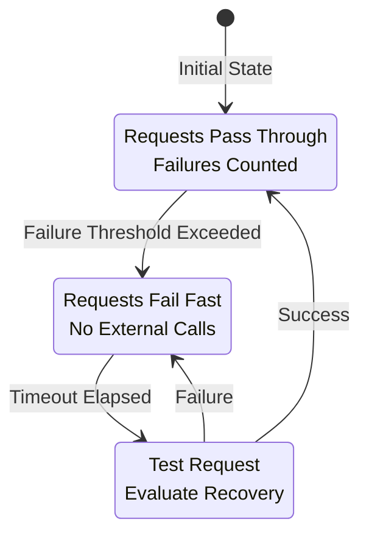
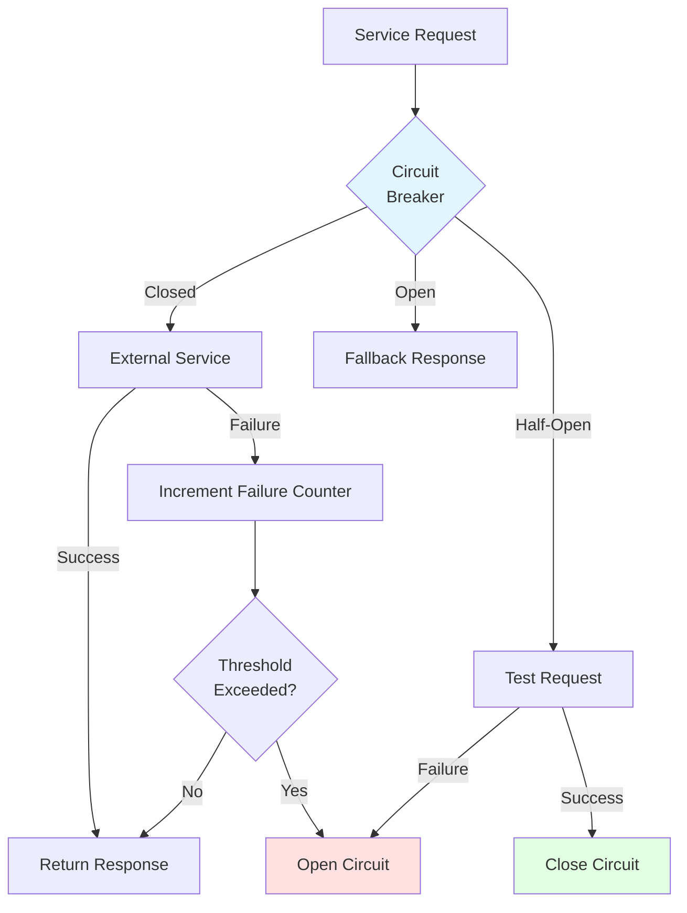
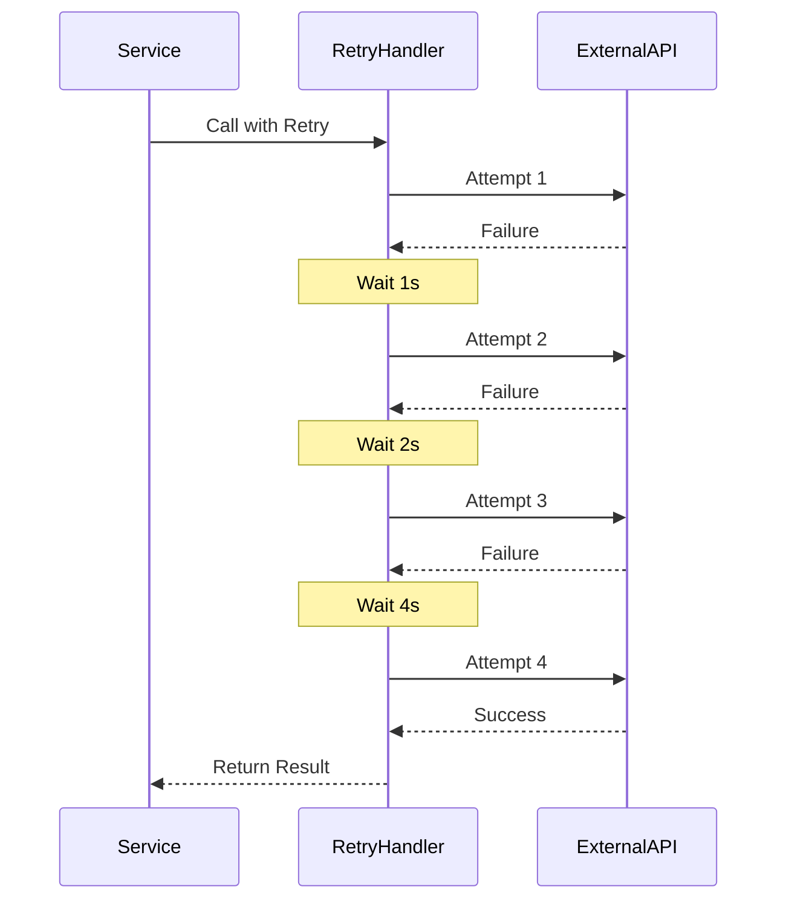
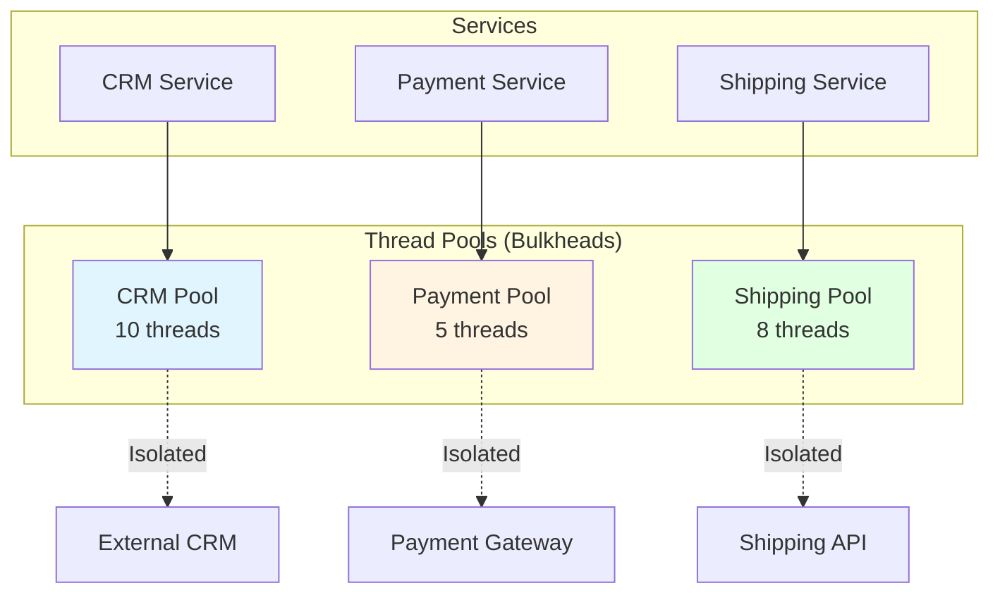
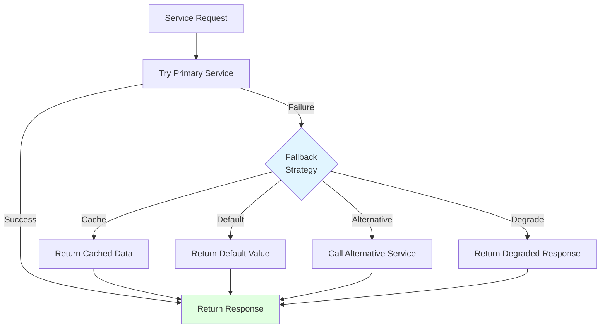

# Circuit Breaker and Resilience Patterns

**Document Type**: Integration Architecture  
**Category**: Resilience and Fault Tolerance  
**Last Updated**: December 2024

---

## Overview

Circuit breaker patterns prevent cascading failures when integrating with external systems. This document covers resilience patterns including circuit breakers, retry logic, fallback strategies, and bulkheads to build robust integrations.

---

## Circuit Breaker Pattern

### Circuit Breaker States



### Circuit Breaker Architecture



---

## Implementation

### Circuit Breaker Service

<details>
<summary><strong>CircuitBreaker Implementation</strong></summary>

```java
package com.company.integration.resilience;

import org.apache.ofbiz.base.util.*;
import java.util.concurrent.ConcurrentHashMap;
import java.util.concurrent.atomic.AtomicInteger;
import java.util.concurrent.atomic.AtomicLong;

public class CircuitBreaker {
    
    public enum State {
        CLOSED,
        OPEN,
        HALF_OPEN
    }
    
    private static final String module = CircuitBreaker.class.getName();
    private static final ConcurrentHashMap<String, CircuitBreaker> instances = new ConcurrentHashMap<>();
    
    private final String name;
    private final int failureThreshold;
    private final long timeout;
    private final int halfOpenMaxAttempts;
    
    private volatile State state = State.CLOSED;
    private final AtomicInteger failureCount = new AtomicInteger(0);
    private final AtomicInteger successCount = new AtomicInteger(0);
    private final AtomicLong lastFailureTime = new AtomicLong(0);
    private final AtomicInteger halfOpenAttempts = new AtomicInteger(0);
    
    private CircuitBreaker(String name, int failureThreshold, long timeout, int halfOpenMaxAttempts) {
        this.name = name;
        this.failureThreshold = failureThreshold;
        this.timeout = timeout;
        this.halfOpenMaxAttempts = halfOpenMaxAttempts;
    }
    
    public static CircuitBreaker getInstance(String name) {
        return instances.computeIfAbsent(name, k -> {
            int threshold = UtilProperties.getPropertyAsInteger("circuitbreaker.properties", 
                name + ".failureThreshold", 5);
            long timeout = UtilProperties.getPropertyAsLong("circuitbreaker.properties", 
                name + ".timeout", 60000);
            int halfOpenAttempts = UtilProperties.getPropertyAsInteger("circuitbreaker.properties", 
                name + ".halfOpenAttempts", 3);
            
            return new CircuitBreaker(name, threshold, timeout, halfOpenAttempts);
        });
    }
    
    public <T> T execute(CircuitBreakerCallable<T> callable) throws CircuitBreakerException {
        if (state == State.OPEN) {
            if (System.currentTimeMillis() - lastFailureTime.get() > timeout) {
                // Transition to half-open
                state = State.HALF_OPEN;
                halfOpenAttempts.set(0);
                Debug.logInfo("Circuit breaker [" + name + "] transitioning to HALF_OPEN", module);
            } else {
                throw new CircuitBreakerException("Circuit breaker [" + name + "] is OPEN");
            }
        }
        
        try {
            T result = callable.call();
            onSuccess();
            return result;
            
        } catch (Exception e) {
            onFailure();
            throw new CircuitBreakerException("Circuit breaker call failed", e);
        }
    }
    
    private void onSuccess() {
        failureCount.set(0);
        successCount.incrementAndGet();
        
        if (state == State.HALF_OPEN) {
            if (halfOpenAttempts.incrementAndGet() >= halfOpenMaxAttempts) {
                state = State.CLOSED;
                Debug.logInfo("Circuit breaker [" + name + "] closed after successful test", module);
            }
        }
    }
    
    private void onFailure() {
        lastFailureTime.set(System.currentTimeMillis());
        int failures = failureCount.incrementAndGet();
        
        if (state == State.HALF_OPEN) {
            state = State.OPEN;
            Debug.logWarning("Circuit breaker [" + name + "] reopened after test failure", module);
            
        } else if (failures >= failureThreshold) {
            state = State.OPEN;
            Debug.logWarning("Circuit breaker [" + name + "] opened after " + failures + " failures", module);
        }
    }
    
    public State getState() {
        return state;
    }
    
    public int getFailureCount() {
        return failureCount.get();
    }
    
    public int getSuccessCount() {
        return successCount.get();
    }
    
    public void reset() {
        state = State.CLOSED;
        failureCount.set(0);
        successCount.set(0);
        halfOpenAttempts.set(0);
        Debug.logInfo("Circuit breaker [" + name + "] manually reset", module);
    }
    
    @FunctionalInterface
    public interface CircuitBreakerCallable<T> {
        T call() throws Exception;
    }
}
```

</details>

### Using Circuit Breaker in Services

<details>
<summary><strong>Service with Circuit Breaker</strong></summary>

```java
public class ResilientIntegrationServices {
    
    public static Map<String, Object> callExternalServiceWithCircuitBreaker(
            DispatchContext dctx, Map<String, ?> context) {
        
        String serviceName = (String) context.get("serviceName");
        Map<String, Object> serviceContext = (Map<String, Object>) context.get("serviceContext");
        
        try {
            CircuitBreaker circuitBreaker = CircuitBreaker.getInstance(serviceName);
            
            // Execute with circuit breaker protection
            Map<String, Object> result = circuitBreaker.execute(() -> {
                // Call external service
                return callExternalService(serviceName, serviceContext);
            });
            
            return result;
            
        } catch (CircuitBreakerException e) {
            Debug.logWarning("Circuit breaker prevented call to " + serviceName + ": " + 
                e.getMessage(), module);
            
            // Return fallback response
            return getFallbackResponse(serviceName, serviceContext);
        }
    }
    
    private static Map<String, Object> callExternalService(String serviceName, Map<String, Object> context) 
            throws Exception {
        // Actual external service call
        // This could throw exceptions on failure
        ExternalServiceClient client = new ExternalServiceClient();
        return client.call(serviceName, context);
    }
    
    private static Map<String, Object> getFallbackResponse(String serviceName, Map<String, Object> context) {
        // Return cached data or default response
        Map<String, Object> fallback = ServiceUtil.returnSuccess("Using fallback response");
        fallback.put("fallback", true);
        fallback.put("message", "External service unavailable, using cached data");
        
        // Try to get cached data
        Object cachedData = getCachedData(serviceName, context);
        if (cachedData != null) {
            fallback.put("data", cachedData);
        }
        
        return fallback;
    }
}
```

</details>

---

## Retry Pattern

### Retry with Exponential Backoff



<details>
<summary><strong>Retry Handler Implementation</strong></summary>

```java
public class RetryHandler {
    
    private static final String module = RetryHandler.class.getName();
    
    public static <T> T executeWithRetry(
            RetryCallable<T> callable,
            int maxAttempts,
            long initialDelay,
            double backoffMultiplier) throws Exception {
        
        int attempt = 0;
        long delay = initialDelay;
        Exception lastException = null;
        
        while (attempt < maxAttempts) {
            attempt++;
            
            try {
                Debug.logInfo("Retry attempt " + attempt + " of " + maxAttempts, module);
                return callable.call();
                
            } catch (Exception e) {
                lastException = e;
                Debug.logWarning("Attempt " + attempt + " failed: " + e.getMessage(), module);
                
                if (attempt < maxAttempts) {
                    // Wait before retry with exponential backoff
                    try {
                        Debug.logInfo("Waiting " + delay + "ms before retry", module);
                        Thread.sleep(delay);
                        delay = (long) (delay * backoffMultiplier);
                    } catch (InterruptedException ie) {
                        Thread.currentThread().interrupt();
                        throw new Exception("Retry interrupted", ie);
                    }
                }
            }
        }
        
        throw new Exception("Max retry attempts exceeded", lastException);
    }
    
    @FunctionalInterface
    public interface RetryCallable<T> {
        T call() throws Exception;
    }
}
```

</details>

### Service with Retry Logic

<details>
<summary><strong>Service Using Retry</strong></summary>

```java
public static Map<String, Object> callExternalServiceWithRetry(
        DispatchContext dctx, Map<String, ?> context) {
    
    String serviceName = (String) context.get("serviceName");
    Map<String, Object> serviceContext = (Map<String, Object>) context.get("serviceContext");
    
    try {
        Map<String, Object> result = RetryHandler.executeWithRetry(
            () -> callExternalService(serviceName, serviceContext),
            3,      // max attempts
            1000,   // initial delay (1 second)
            2.0     // backoff multiplier
        );
        
        return result;
        
    } catch (Exception e) {
        Debug.logError(e, "All retry attempts failed for " + serviceName, module);
        return ServiceUtil.returnError("Service call failed after retries: " + e.getMessage());
    }
}
```

</details>

---

## Timeout Pattern

### Request Timeout

<details>
<summary><strong>Timeout Handler</strong></summary>

```java
public class TimeoutHandler {
    
    private static final String module = TimeoutHandler.class.getName();
    
    public static <T> T executeWithTimeout(
            TimeoutCallable<T> callable,
            long timeoutMillis) throws TimeoutException, Exception {
        
        ExecutorService executor = Executors.newSingleThreadExecutor();
        Future<T> future = executor.submit(() -> callable.call());
        
        try {
            return future.get(timeoutMillis, TimeUnit.MILLISECONDS);
            
        } catch (java.util.concurrent.TimeoutException e) {
            future.cancel(true);
            throw new TimeoutException("Operation timed out after " + timeoutMillis + "ms");
            
        } finally {
            executor.shutdown();
        }
    }
    
    @FunctionalInterface
    public interface TimeoutCallable<T> {
        T call() throws Exception;
    }
}
```

</details>

---

## Bulkhead Pattern

### Resource Isolation



<details>
<summary><strong>Bulkhead Implementation</strong></summary>

```java
public class BulkheadExecutor {
    
    private static final String module = BulkheadExecutor.class.getName();
    private static final Map<String, ExecutorService> executors = new ConcurrentHashMap<>();
    
    public static ExecutorService getExecutor(String name, int poolSize) {
        return executors.computeIfAbsent(name, k -> {
            Debug.logInfo("Creating bulkhead executor [" + name + "] with " + poolSize + " threads", module);
            return Executors.newFixedThreadPool(poolSize);
        });
    }
    
    public static <T> Future<T> submit(String bulkheadName, Callable<T> task) {
        int poolSize = UtilProperties.getPropertyAsInteger("bulkhead.properties", 
            bulkheadName + ".poolSize", 10);
        
        ExecutorService executor = getExecutor(bulkheadName, poolSize);
        return executor.submit(task);
    }
    
    public static void shutdown() {
        for (Map.Entry<String, ExecutorService> entry : executors.entrySet()) {
            Debug.logInfo("Shutting down bulkhead executor: " + entry.getKey(), module);
            entry.getValue().shutdown();
        }
        executors.clear();
    }
}
```

</details>

---

## Fallback Pattern

### Fallback Strategies



<details>
<summary><strong>Fallback Service</strong></summary>

```java
public class FallbackServices {
    
    public static Map<String, Object> getProductPriceWithFallback(
            DispatchContext dctx, Map<String, ?> context) {
        
        Delegator delegator = dctx.getDelegator();
        LocalDispatcher dispatcher = dctx.getDispatcher();
        String productId = (String) context.get("productId");
        
        try {
            // Try primary pricing service (external)
            Map<String, Object> result = dispatcher.runSync("getExternalProductPrice", context);
            
            if (ServiceUtil.isSuccess(result)) {
                return result;
            }
            
        } catch (Exception e) {
            Debug.logWarning("Primary pricing service failed: " + e.getMessage(), module);
        }
        
        // Fallback 1: Try cached price
        BigDecimal cachedPrice = getCachedPrice(productId);
        if (cachedPrice != null) {
            Debug.logInfo("Using cached price for product: " + productId, module);
            Map<String, Object> result = ServiceUtil.returnSuccess();
            result.put("price", cachedPrice);
            result.put("source", "cache");
            return result;
        }
        
        // Fallback 2: Use local database price
        try {
            GenericValue productPrice = EntityQuery.use(delegator)
                .from("ProductPrice")
                .where("productId", productId, "productPriceTypeId", "DEFAULT_PRICE")
                .orderBy("-fromDate")
                .filterByDate()
                .queryFirst();
            
            if (productPrice != null) {
                Debug.logInfo("Using local database price for product: " + productId, module);
                Map<String, Object> result = ServiceUtil.returnSuccess();
                result.put("price", productPrice.getBigDecimal("price"));
                result.put("source", "local");
                return result;
            }
            
        } catch (GenericEntityException e) {
            Debug.logError(e, "Error getting local price", module);
        }
        
        // Fallback 3: Return default price
        Debug.logWarning("All pricing sources failed, using default price", module);
        Map<String, Object> result = ServiceUtil.returnSuccess();
        result.put("price", new BigDecimal("0.00"));
        result.put("source", "default");
        return result;
    }
}
```

</details>

---

## Monitoring and Metrics

### Circuit Breaker Metrics

<details>
<summary><strong>Metrics Collection Service</strong></summary>

```java
public static Map<String, Object> getCircuitBreakerMetrics(DispatchContext dctx, Map<String, ?> context) {
    String circuitBreakerName = (String) context.get("name");
    
    CircuitBreaker cb = CircuitBreaker.getInstance(circuitBreakerName);
    
    Map<String, Object> metrics = new HashMap<>();
    metrics.put("name", circuitBreakerName);
    metrics.put("state", cb.getState().toString());
    metrics.put("failureCount", cb.getFailureCount());
    metrics.put("successCount", cb.getSuccessCount());
    
    Map<String, Object> result = ServiceUtil.returnSuccess();
    result.put("metrics", metrics);
    return result;
}
```

</details>

---

## Configuration

### Circuit Breaker Configuration

```properties
# circuitbreaker.properties

# QuickBooks integration
quickbooks.failureThreshold=5
quickbooks.timeout=60000
quickbooks.halfOpenAttempts=3

# Salesforce integration
salesforce.failureThreshold=3
salesforce.timeout=30000
salesforce.halfOpenAttempts=2

# Stripe integration
stripe.failureThreshold=5
stripe.timeout=45000
stripe.halfOpenAttempts=3
```

### Bulkhead Configuration

```properties
# bulkhead.properties

# Thread pool sizes for different integrations
crm.poolSize=10
payment.poolSize=5
shipping.poolSize=8
accounting.poolSize=5
```

---

## Official References

- [Circuit Breaker Pattern - Martin Fowler](https://martinfowler.com/bliki/CircuitBreaker.html)
- [Release It! - Michael Nygard](https://pragprog.com/titles/mnee2/release-it-second-edition/)
- [Resilience4j Documentation](https://resilience4j.readme.io/)

---

## Related Documentation

- [External Service Adapters](external-service-adapters.md)
- [Data Synchronization](data-synchronization.md)
- [Event-Driven Integration](event-driven-integration.md)

---

## Summary

Resilience patterns are essential for robust external integrations. Implement circuit breakers to prevent cascading failures, use retry with exponential backoff for transient errors, apply timeouts to prevent hanging requests, isolate resources with bulkheads, and provide fallback strategies for graceful degradation. Monitor circuit breaker states and metrics to maintain system health.
