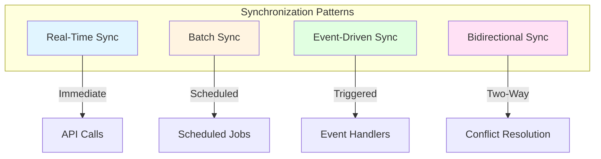
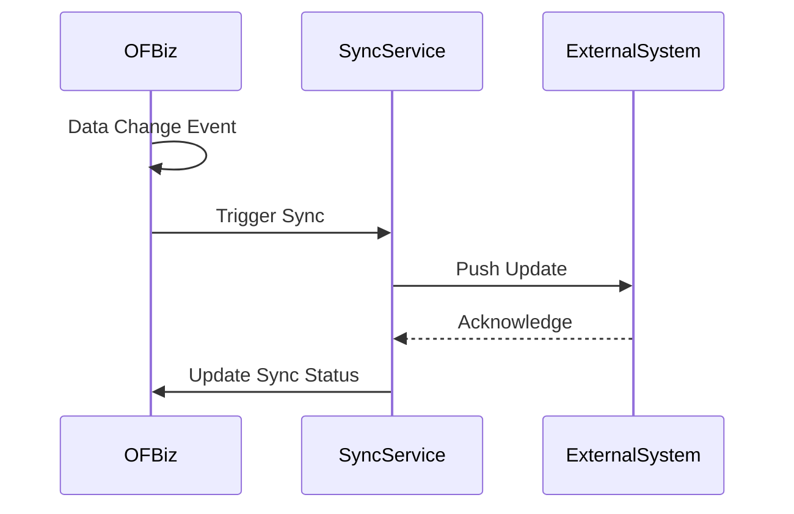
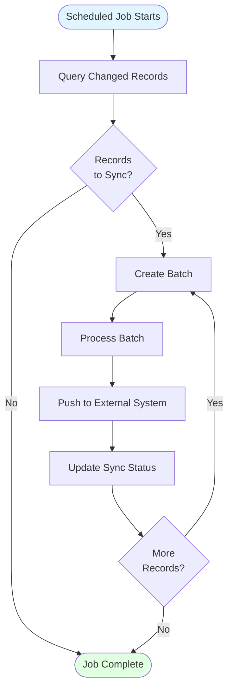
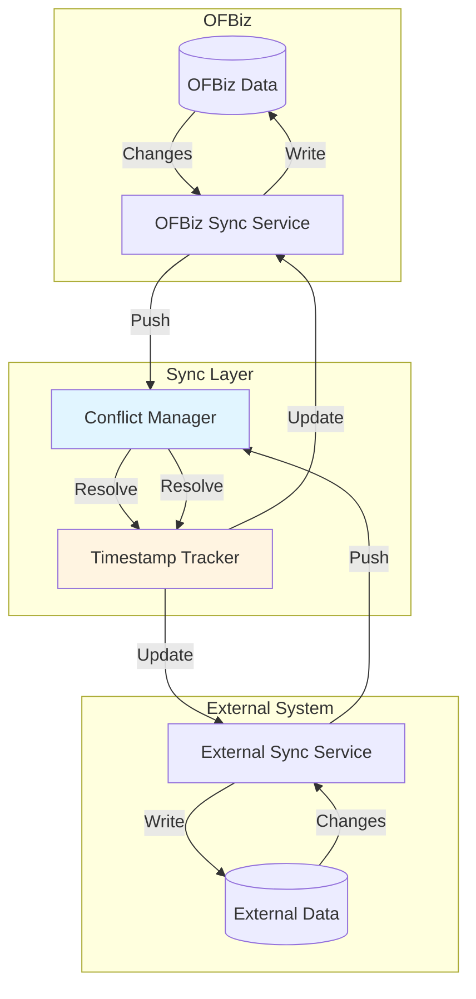
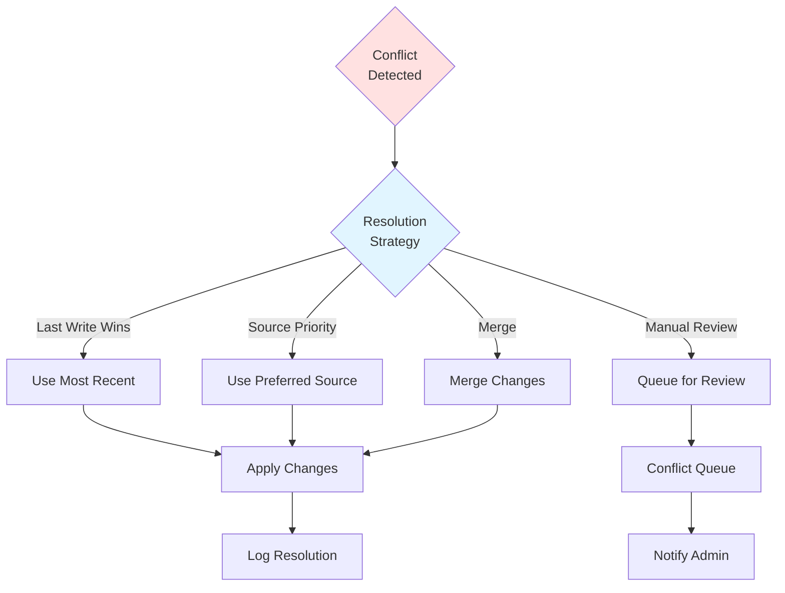
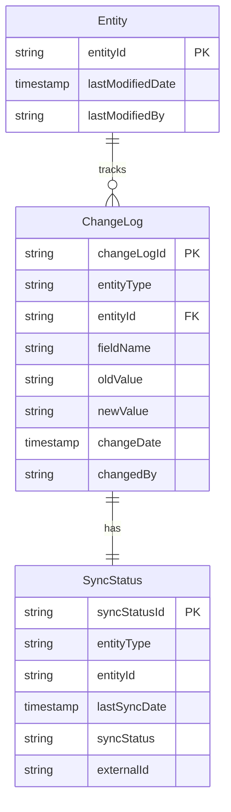

# Data Synchronization Patterns

**Document Type**: Integration Architecture  
**Category**: Data Consistency Patterns  
**Last Updated**: December 2024

---

## Overview

Data synchronization ensures consistency between OFBiz and external systems. This document covers synchronization patterns, conflict resolution strategies, and implementation approaches for maintaining data integrity across distributed systems.

---

## Synchronization Patterns

### Pattern Overview



---

## Real-Time Synchronization

### Push-Based Real-Time Sync



<details>
<summary><strong>Real-Time Sync Implementation</strong></summary>

```java
public class RealTimeSyncServices {
    
    public static Map<String, Object> syncPartyRealTime(DispatchContext dctx, Map<String, ?> context) {
        Delegator delegator = dctx.getDelegator();
        LocalDispatcher dispatcher = dctx.getDispatcher();
        GenericValue party = (GenericValue) context.get("party");
        
        try {
            // Get sync configuration
            String syncEnabled = UtilProperties.getPropertyValue("sync.properties", "party.sync.enabled");
            if (!"true".equals(syncEnabled)) {
                return ServiceUtil.returnSuccess("Sync disabled");
            }
            
            // Prepare sync data
            Map<String, Object> syncData = new HashMap<>();
            syncData.put("partyId", party.getString("partyId"));
            syncData.put("externalId", party.getString("externalId"));
            syncData.put("lastModified", party.getTimestamp("lastModifiedDate"));
            
            // Get person/group details
            if ("PERSON".equals(party.getString("partyTypeId"))) {
                GenericValue person = delegator.findOne("Person", 
                    UtilMisc.toMap("partyId", party.getString("partyId")), false);
                syncData.put("firstName", person.getString("firstName"));
                syncData.put("lastName", person.getString("lastName"));
            }
            
            // Push to external system
            Map<String, Object> pushResult = dispatcher.runSync("pushToExternalCRM", syncData);
            
            if (ServiceUtil.isSuccess(pushResult)) {
                // Record sync success
                createSyncLog(delegator, party.getString("partyId"), "SUCCESS", null);
                return ServiceUtil.returnSuccess("Party synced successfully");
            } else {
                // Record sync failure
                String errorMsg = ServiceUtil.getErrorMessage(pushResult);
                createSyncLog(delegator, party.getString("partyId"), "FAILED", errorMsg);
                return ServiceUtil.returnError("Sync failed: " + errorMsg);
            }
            
        } catch (Exception e) {
            Debug.logError(e, "Real-time sync error", module);
            return ServiceUtil.returnError("Sync error: " + e.getMessage());
        }
    }
    
    private static void createSyncLog(Delegator delegator, String entityId, String status, String errorMsg) 
            throws GenericEntityException {
        GenericValue syncLog = delegator.makeValue("SyncLog");
        syncLog.set("syncLogId", delegator.getNextSeqId("SyncLog"));
        syncLog.set("entityType", "Party");
        syncLog.set("entityId", entityId);
        syncLog.set("syncStatus", status);
        syncLog.set("errorMessage", errorMsg);
        syncLog.set("syncTimestamp", UtilDateTime.nowTimestamp());
        syncLog.create();
    }
}
```

</details>

### ECA-Triggered Real-Time Sync

```xml
<!-- Real-time sync via ECA -->
<eca entity="Party" operation="create-store" event="return">
    <condition field-name="externalId" operator="is-not-empty"/>
    <action service="syncPartyRealTime" mode="async">
        <field-map field-name="party" from-field="instance"/>
    </action>
</eca>
```

---

## Batch Synchronization

### Scheduled Batch Sync



<details>
<summary><strong>Batch Sync Implementation</strong></summary>

```java
public class BatchSyncServices {
    
    public static Map<String, Object> batchSyncParties(DispatchContext dctx, Map<String, ?> context) {
        Delegator delegator = dctx.getDelegator();
        LocalDispatcher dispatcher = dctx.getDispatcher();
        
        int batchSize = 100;
        int totalSynced = 0;
        int totalFailed = 0;
        
        try {
            // Get last sync timestamp
            Timestamp lastSync = getLastSyncTimestamp(delegator, "Party");
            
            // Query parties modified since last sync
            EntityCondition condition = EntityCondition.makeCondition(
                UtilMisc.toList(
                    EntityCondition.makeCondition("lastModifiedDate", EntityOperator.GREATER_THAN, lastSync),
                    EntityCondition.makeCondition("externalId", EntityOperator.NOT_EQUAL, null)
                ),
                EntityOperator.AND
            );
            
            EntityListIterator partyIterator = delegator.find("Party", condition, null, null, null, null);
            
            List<GenericValue> batch = new ArrayList<>();
            GenericValue party;
            
            while ((party = partyIterator.next()) != null) {
                batch.add(party);
                
                if (batch.size() >= batchSize) {
                    // Process batch
                    Map<String, Object> batchResult = processBatch(dispatcher, batch);
                    totalSynced += (Integer) batchResult.get("synced");
                    totalFailed += (Integer) batchResult.get("failed");
                    
                    batch.clear();
                }
            }
            
            // Process remaining records
            if (!batch.isEmpty()) {
                Map<String, Object> batchResult = processBatch(dispatcher, batch);
                totalSynced += (Integer) batchResult.get("synced");
                totalFailed += (Integer) batchResult.get("failed");
            }
            
            partyIterator.close();
            
            // Update last sync timestamp
            updateLastSyncTimestamp(delegator, "Party", UtilDateTime.nowTimestamp());
            
            Map<String, Object> result = ServiceUtil.returnSuccess(
                "Batch sync complete: " + totalSynced + " synced, " + totalFailed + " failed"
            );
            result.put("totalSynced", totalSynced);
            result.put("totalFailed", totalFailed);
            return result;
            
        } catch (Exception e) {
            Debug.logError(e, "Batch sync error", module);
            return ServiceUtil.returnError("Batch sync error: " + e.getMessage());
        }
    }
    
    private static Map<String, Object> processBatch(LocalDispatcher dispatcher, List<GenericValue> batch) {
        int synced = 0;
        int failed = 0;
        
        for (GenericValue party : batch) {
            try {
                Map<String, Object> syncContext = UtilMisc.toMap("party", party);
                Map<String, Object> result = dispatcher.runSync("syncPartyRealTime", syncContext);
                
                if (ServiceUtil.isSuccess(result)) {
                    synced++;
                } else {
                    failed++;
                }
            } catch (Exception e) {
                Debug.logError(e, "Error syncing party: " + party.getString("partyId"), module);
                failed++;
            }
        }
        
        return UtilMisc.toMap("synced", synced, "failed", failed);
    }
}
```

</details>

### Scheduled Job Configuration

```xml
<!-- Batch sync job -->
<service name="batchSyncParties" engine="java"
         location="com.company.integration.BatchSyncServices" 
         invoke="batchSyncParties">
    <description>Batch sync parties to external CRM</description>
</service>

<!-- Schedule job to run every hour -->
<job-sandbox job-id="BATCH_SYNC_PARTIES" job-name="Batch Sync Parties">
    <run-time>
        <frequency frequency-type="HOURLY" interval-number="1"/>
    </run-time>
    <service service-name="batchSyncParties"/>
</job-sandbox>
```

---

## Bidirectional Synchronization

### Two-Way Sync Architecture



<details>
<summary><strong>Bidirectional Sync Implementation</strong></summary>

```java
public class BidirectionalSyncServices {
    
    public static Map<String, Object> syncBidirectional(DispatchContext dctx, Map<String, ?> context) {
        Delegator delegator = dctx.getDelegator();
        LocalDispatcher dispatcher = dctx.getDispatcher();
        
        String entityType = (String) context.get("entityType");
        String entityId = (String) context.get("entityId");
        
        try {
            // Get local data
            GenericValue localEntity = getLocalEntity(delegator, entityType, entityId);
            Timestamp localTimestamp = localEntity.getTimestamp("lastModifiedDate");
            
            // Get external data
            Map<String, Object> externalData = getExternalEntity(dispatcher, entityType, entityId);
            Timestamp externalTimestamp = (Timestamp) externalData.get("lastModified");
            
            // Compare timestamps
            int comparison = localTimestamp.compareTo(externalTimestamp);
            
            if (comparison > 0) {
                // Local is newer - push to external
                return dispatcher.runSync("pushToExternal", UtilMisc.toMap(
                    "entityType", entityType,
                    "entityId", entityId,
                    "data", localEntity
                ));
                
            } else if (comparison < 0) {
                // External is newer - pull from external
                return dispatcher.runSync("pullFromExternal", UtilMisc.toMap(
                    "entityType", entityType,
                    "entityId", entityId,
                    "data", externalData
                ));
                
            } else {
                // Same timestamp - check for conflicts
                if (hasConflict(localEntity, externalData)) {
                    return resolveConflict(dctx, localEntity, externalData);
                } else {
                    return ServiceUtil.returnSuccess("Data in sync");
                }
            }
            
        } catch (Exception e) {
            Debug.logError(e, "Bidirectional sync error", module);
            return ServiceUtil.returnError("Sync error: " + e.getMessage());
        }
    }
}
```

</details>

---

## Conflict Resolution

### Conflict Resolution Strategies



<details>
<summary><strong>Conflict Resolution Implementation</strong></summary>

```java
public class ConflictResolutionServices {
    
    public static Map<String, Object> resolveConflict(DispatchContext dctx, Map<String, ?> context) {
        Delegator delegator = dctx.getDelegator();
        
        GenericValue localEntity = (GenericValue) context.get("localEntity");
        Map<String, Object> externalData = (Map<String, Object>) context.get("externalData");
        String strategy = (String) context.get("strategy");
        
        try {
            switch (strategy) {
                case "LAST_WRITE_WINS":
                    return resolveLastWriteWins(localEntity, externalData);
                    
                case "SOURCE_PRIORITY":
                    String preferredSource = UtilProperties.getPropertyValue(
                        "sync.properties", "conflict.preferred.source");
                    return resolveSourcePriority(localEntity, externalData, preferredSource);
                    
                case "MANUAL_REVIEW":
                    return queueForManualReview(delegator, localEntity, externalData);
                    
                case "MERGE":
                    return mergeChanges(localEntity, externalData);
                    
                default:
                    return ServiceUtil.returnError("Unknown conflict resolution strategy: " + strategy);
            }
            
        } catch (Exception e) {
            Debug.logError(e, "Conflict resolution error", module);
            return ServiceUtil.returnError("Resolution error: " + e.getMessage());
        }
    }
    
    private static Map<String, Object> resolveLastWriteWins(
            GenericValue localEntity, Map<String, Object> externalData) {
        
        Timestamp localTime = localEntity.getTimestamp("lastModifiedDate");
        Timestamp externalTime = (Timestamp) externalData.get("lastModified");
        
        if (localTime.after(externalTime)) {
            // Local wins - push to external
            return ServiceUtil.returnSuccess("Local version selected (newer)");
        } else {
            // External wins - pull from external
            return ServiceUtil.returnSuccess("External version selected (newer)");
        }
    }
    
    private static Map<String, Object> resolveSourcePriority(
            GenericValue localEntity, Map<String, Object> externalData, String preferredSource) {
        
        if ("LOCAL".equals(preferredSource)) {
            return ServiceUtil.returnSuccess("Local version selected (source priority)");
        } else {
            return ServiceUtil.returnSuccess("External version selected (source priority)");
        }
    }
    
    private static Map<String, Object> queueForManualReview(
            Delegator delegator, GenericValue localEntity, Map<String, Object> externalData) 
            throws GenericEntityException {
        
        // Create conflict record
        GenericValue conflict = delegator.makeValue("SyncConflict");
        conflict.set("conflictId", delegator.getNextSeqId("SyncConflict"));
        conflict.set("entityType", localEntity.getEntityName());
        conflict.set("entityId", localEntity.getPrimaryKey().toString());
        conflict.set("localData", localEntity.toString());
        conflict.set("externalData", externalData.toString());
        conflict.set("status", "PENDING");
        conflict.set("createdDate", UtilDateTime.nowTimestamp());
        conflict.create();
        
        return ServiceUtil.returnSuccess("Conflict queued for manual review: " + conflict.getString("conflictId"));
    }
    
    private static Map<String, Object> mergeChanges(
            GenericValue localEntity, Map<String, Object> externalData) {
        
        // Merge non-conflicting fields
        // This is application-specific logic
        
        return ServiceUtil.returnSuccess("Changes merged");
    }
}
```

</details>

---

## Change Tracking

### Change Detection



<details>
<summary><strong>Change Tracking Service</strong></summary>

```java
public static Map<String, Object> trackEntityChange(DispatchContext dctx, Map<String, ?> context) {
    Delegator delegator = dctx.getDelegator();
    GenericValue entity = (GenericValue) context.get("entity");
    GenericValue oldEntity = (GenericValue) context.get("oldEntity");
    
    try {
        // Compare fields
        for (String fieldName : entity.getAllKeys()) {
            Object newValue = entity.get(fieldName);
            Object oldValue = oldEntity != null ? oldEntity.get(fieldName) : null;
            
            if (!Objects.equals(newValue, oldValue)) {
                // Log change
                GenericValue changeLog = delegator.makeValue("ChangeLog");
                changeLog.set("changeLogId", delegator.getNextSeqId("ChangeLog"));
                changeLog.set("entityType", entity.getEntityName());
                changeLog.set("entityId", entity.getPrimaryKey().toString());
                changeLog.set("fieldName", fieldName);
                changeLog.set("oldValue", oldValue != null ? oldValue.toString() : null);
                changeLog.set("newValue", newValue != null ? newValue.toString() : null);
                changeLog.set("changeDate", UtilDateTime.nowTimestamp());
                changeLog.create();
            }
        }
        
        return ServiceUtil.returnSuccess("Changes tracked");
        
    } catch (GenericEntityException e) {
        return ServiceUtil.returnError("Error tracking changes: " + e.getMessage());
    }
}
```

</details>

---

## Sync Status Management

### Sync Status Tracking

<details>
<summary><strong>Sync Status Service</strong></summary>

```java
public static Map<String, Object> updateSyncStatus(DispatchContext dctx, Map<String, ?> context) {
    Delegator delegator = dctx.getDelegator();
    
    String entityType = (String) context.get("entityType");
    String entityId = (String) context.get("entityId");
    String status = (String) context.get("status");
    String externalId = (String) context.get("externalId");
    
    try {
        // Find existing sync status
        List<GenericValue> existing = delegator.findByAnd("SyncStatus",
            UtilMisc.toMap("entityType", entityType, "entityId", entityId), null, false);
        
        GenericValue syncStatus;
        
        if (UtilValidate.isNotEmpty(existing)) {
            syncStatus = existing.get(0);
        } else {
            syncStatus = delegator.makeValue("SyncStatus");
            syncStatus.set("syncStatusId", delegator.getNextSeqId("SyncStatus"));
            syncStatus.set("entityType", entityType);
            syncStatus.set("entityId", entityId);
        }
        
        syncStatus.set("lastSyncDate", UtilDateTime.nowTimestamp());
        syncStatus.set("syncStatus", status);
        syncStatus.set("externalId", externalId);
        
        if (syncStatus.get("syncStatusId") == null) {
            syncStatus.create();
        } else {
            syncStatus.store();
        }
        
        return ServiceUtil.returnSuccess("Sync status updated");
        
    } catch (GenericEntityException e) {
        return ServiceUtil.returnError("Error updating sync status: " + e.getMessage());
    }
}
```

</details>

---

## Official References

- [Data Synchronization Patterns](https://martinfowler.com/articles/patterns-of-distributed-systems/)
- [Conflict-Free Replicated Data Types](https://crdt.tech/)

---

## Related Documentation

- [Event-Driven Integration](event-driven-integration.md)
- [External Service Adapters](external-service-adapters.md)
- [Circuit Breaker Patterns](circuit-breaker-patterns.md)

---

## Summary

Data synchronization requires careful consideration of timing, conflict resolution, and consistency guarantees. Use real-time sync for critical data, batch sync for bulk operations, and implement robust conflict resolution strategies. Track changes and sync status to maintain data integrity across distributed systems.
