# Enterprise Integration Patterns in OFBiz

**Document Type**: Integration Architecture  
**Category**: Integration Patterns  
**Last Updated**: December 2024

---

## Overview

This document describes how Enterprise Integration Patterns (EIP) from Gregor Hohpe and Bobby Woolf are implemented and can be applied in Apache OFBiz for system integration. OFBiz naturally implements many of these patterns through its service engine, ECA/SECA mechanisms, and entity engine.

---

## Message Construction Patterns

### Message Pattern

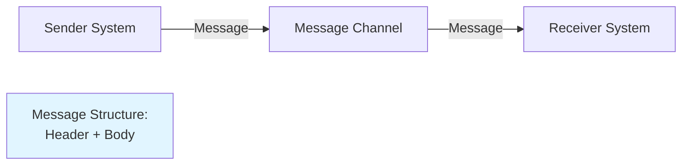

**OFBiz Implementation**: Service context maps serve as messages

```java
// Service call as message
Map<String, Object> message = UtilMisc.toMap(
    "orderId", "10000",
    "statusId", "ORDER_APPROVED",
    "timestamp", UtilDateTime.nowTimestamp()
);

dispatcher.runAsync("processOrder", message);
```

### Command Message Pattern

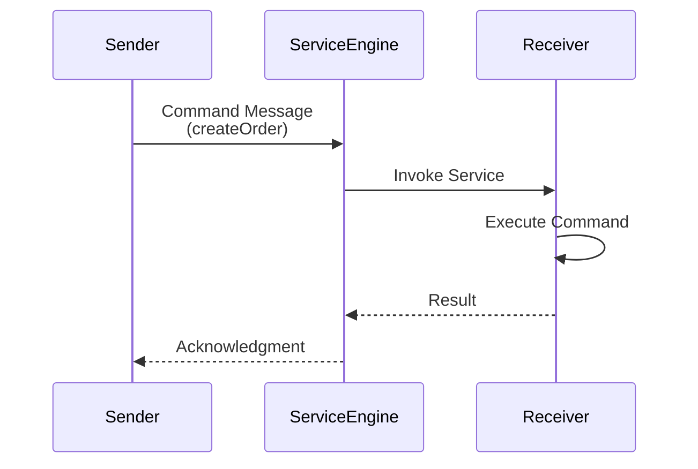

**OFBiz Implementation**: Service invocations are command messages

<details>
<summary><strong>Command Message Example</strong></summary>

```xml
<!-- Service definition as command -->
<service name="createOrder" engine="java"
         location="org.apache.ofbiz.order.order.OrderServices" 
         invoke="createOrder">
    <description>Command: Create Order</description>
    <attribute name="orderTypeId" type="String" mode="IN"/>
    <attribute name="orderItems" type="List" mode="IN"/>
    <attribute name="orderId" type="String" mode="OUT"/>
</service>
```

```java
// Sending command message
Map<String, Object> command = UtilMisc.toMap(
    "orderTypeId", "SALES_ORDER",
    "orderItems", orderItemsList
);

Map<String, Object> result = dispatcher.runSync("createOrder", command);
String orderId = (String) result.get("orderId");
```

</details>

### Event Message Pattern

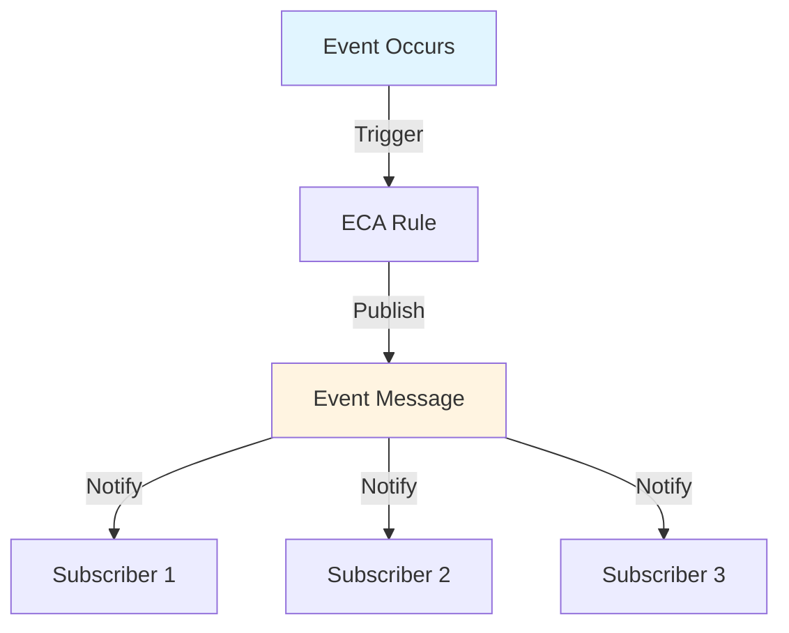

**OFBiz Implementation**: ECA/SECA rules publish event messages

<details>
<summary><strong>Event Message Example</strong></summary>

```xml
<!-- ECA rule publishes event message -->
<eca entity="OrderHeader" operation="store" event="return">
    <condition field-name="statusId" operator="equals" value="ORDER_APPROVED"/>
    <action service="sendOrderApprovedNotification" mode="async"/>
    <action service="reserveInventory" mode="async"/>
    <action service="authorizePayment" mode="async"/>
</eca>
```

</details>

---

## Message Routing Patterns

### Content-Based Router

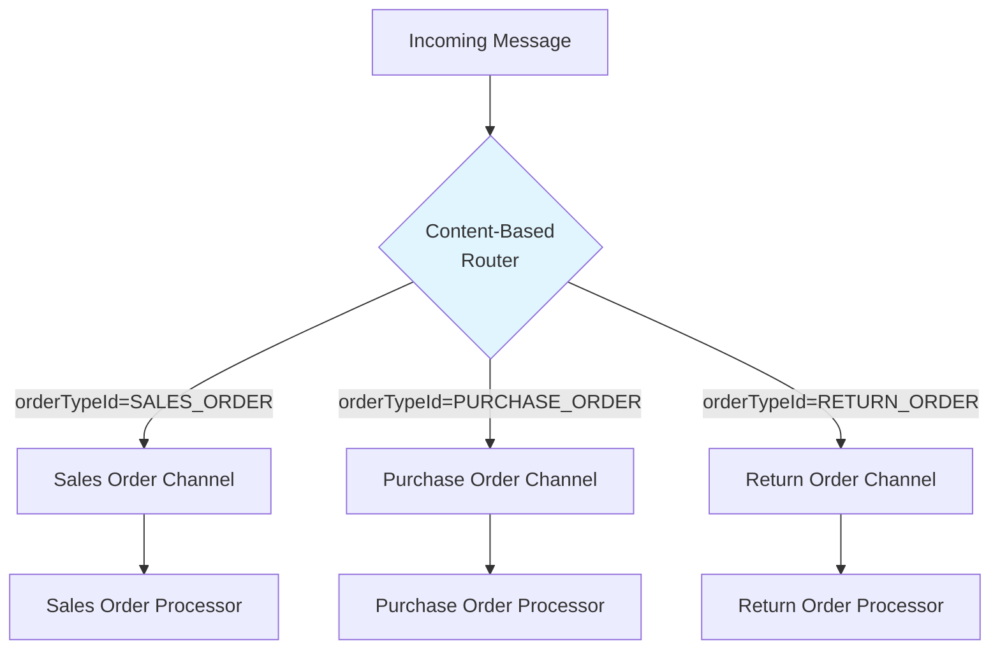

**OFBiz Implementation**: Service routing based on context

<details>
<summary><strong>Content-Based Router Service</strong></summary>

```java
public static Map<String, Object> routeOrder(DispatchContext dctx, Map<String, ?> context) {
    LocalDispatcher dispatcher = dctx.getDispatcher();
    String orderTypeId = (String) context.get("orderTypeId");
    
    try {
        String targetService;
        
        // Content-based routing
        switch (orderTypeId) {
            case "SALES_ORDER":
                targetService = "processSalesOrder";
                break;
            case "PURCHASE_ORDER":
                targetService = "processPurchaseOrder";
                break;
            case "RETURN_ORDER":
                targetService = "processReturnOrder";
                break;
            default:
                return ServiceUtil.returnError("Unknown order type: " + orderTypeId);
        }
        
        // Route to appropriate service
        return dispatcher.runSync(targetService, context);
        
    } catch (GenericServiceException e) {
        return ServiceUtil.returnError("Routing error: " + e.getMessage());
    }
}
```

</details>

### Message Filter

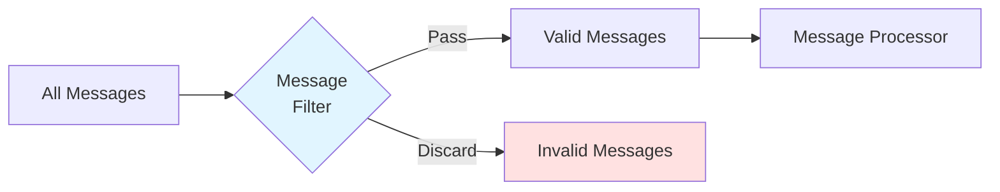

**OFBiz Implementation**: ECA conditions act as filters

```xml
<!-- Message filter using ECA conditions -->
<eca entity="OrderHeader" operation="create" event="return">
    <!-- Filter: Only process orders above $100 -->
    <condition field-name="grandTotal" operator="greater" value="100.00"/>
    <action service="processHighValueOrder" mode="async"/>
</eca>

<eca entity="OrderHeader" operation="create" event="return">
    <!-- Filter: Only process approved orders -->
    <condition field-name="statusId" operator="equals" value="ORDER_APPROVED"/>
    <action service="fulfillOrder" mode="async"/>
</eca>
```

### Recipient List

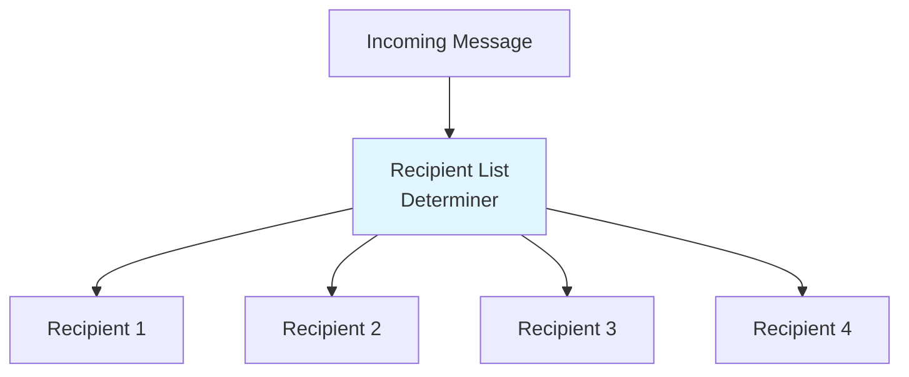

**OFBiz Implementation**: Multiple ECA actions or service groups

```xml
<!-- Recipient list pattern -->
<eca entity="OrderHeader" operation="create" event="return">
    <condition field-name="statusId" operator="equals" value="ORDER_CREATED"/>
    <!-- Send to multiple recipients -->
    <action service="notifyCustomer" mode="async"/>
    <action service="notifySalesTeam" mode="async"/>
    <action service="notifyWarehouse" mode="async"/>
    <action service="notifyAccounting" mode="async"/>
</eca>
```

---

## Message Transformation Patterns

### Message Translator

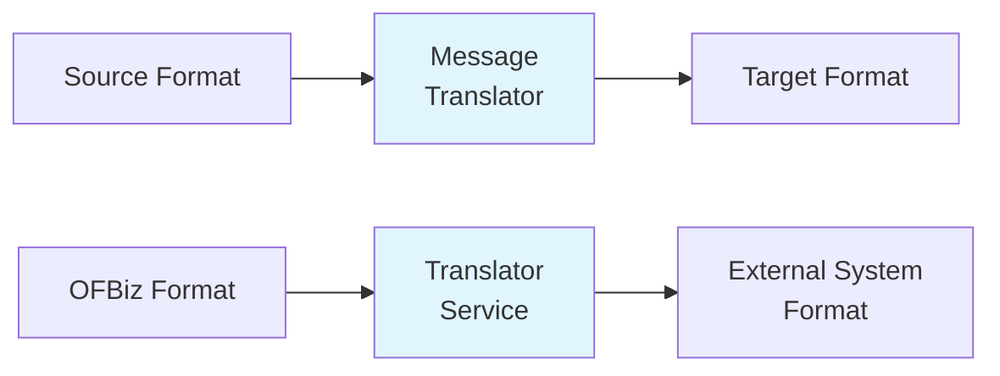

**OFBiz Implementation**: Transformation services

<details>
<summary><strong>Message Translator Service</strong></summary>

```java
public static Map<String, Object> translateOrderToExternalFormat(DispatchContext dctx, Map<String, ?> context) {
    Delegator delegator = dctx.getDelegator();
    String orderId = (String) context.get("orderId");
    
    try {
        // Get OFBiz order data
        GenericValue orderHeader = delegator.findOne("OrderHeader", 
            UtilMisc.toMap("orderId", orderId), false);
        List<GenericValue> orderItems = orderHeader.getRelated("OrderItem", null, null, false);
        
        // Translate to external format
        Map<String, Object> externalOrder = new HashMap<>();
        externalOrder.put("external_order_id", orderId);
        externalOrder.put("order_date", orderHeader.getTimestamp("orderDate").toString());
        externalOrder.put("total_amount", orderHeader.getBigDecimal("grandTotal"));
        externalOrder.put("currency", orderHeader.getString("currencyUom"));
        
        List<Map<String, Object>> externalItems = new ArrayList<>();
        for (GenericValue item : orderItems) {
            Map<String, Object> externalItem = new HashMap<>();
            externalItem.put("sku", item.getString("productId"));
            externalItem.put("qty", item.getBigDecimal("quantity"));
            externalItem.put("price", item.getBigDecimal("unitPrice"));
            externalItems.add(externalItem);
        }
        externalOrder.put("line_items", externalItems);
        
        Map<String, Object> result = ServiceUtil.returnSuccess();
        result.put("externalOrder", externalOrder);
        return result;
        
    } catch (GenericEntityException e) {
        return ServiceUtil.returnError("Translation error: " + e.getMessage());
    }
}
```

</details>

### Envelope Wrapper

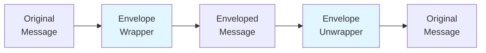

**OFBiz Implementation**: Service context wrapping

```java
// Wrap message with envelope
public static Map<String, Object> wrapMessageWithEnvelope(DispatchContext dctx, Map<String, ?> context) {
    Map<String, Object> payload = (Map<String, Object>) context.get("payload");
    
    // Create envelope
    Map<String, Object> envelope = new HashMap<>();
    envelope.put("messageId", UUID.randomUUID().toString());
    envelope.put("timestamp", UtilDateTime.nowTimestamp());
    envelope.put("source", "ofbiz");
    envelope.put("version", "1.0");
    envelope.put("payload", payload);
    
    Map<String, Object> result = ServiceUtil.returnSuccess();
    result.put("envelope", envelope);
    return result;
}
```

---

## Message Endpoint Patterns

### Polling Consumer

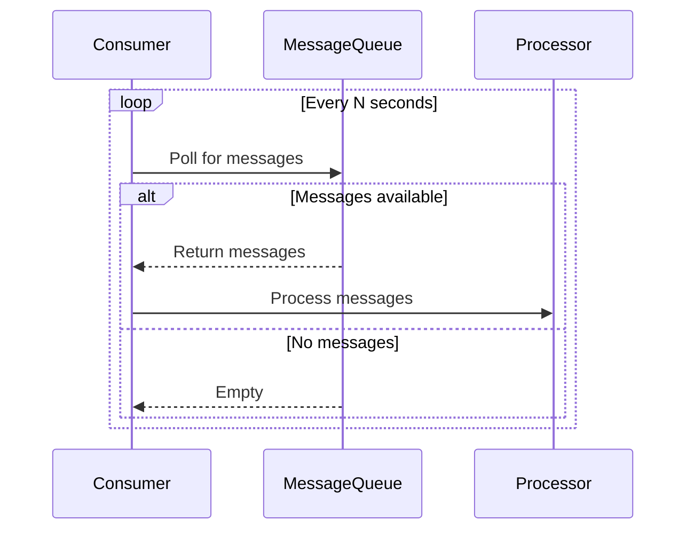

**OFBiz Implementation**: Scheduled jobs poll for work

```xml
<!-- Polling consumer as scheduled job -->
<service name="pollExternalOrderQueue" engine="java"
         location="com.company.integration.PollingServices" 
         invoke="pollExternalOrderQueue">
    <description>Poll external system for new orders</description>
</service>

<!-- Schedule polling -->
<job-sandbox job-id="POLL_ORDERS" job-name="Poll External Orders">
    <run-time>
        <frequency frequency-type="MINUTELY" interval-number="5"/>
    </run-time>
    <service service-name="pollExternalOrderQueue"/>
</job-sandbox>
```

### Event-Driven Consumer

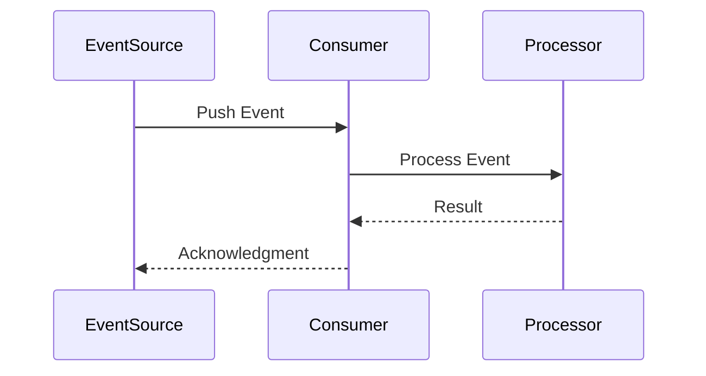

**OFBiz Implementation**: ECA rules as event-driven consumers

```xml
<!-- Event-driven consumer -->
<eca entity="OrderHeader" operation="create" event="return">
    <action service="processNewOrder" mode="async"/>
</eca>
```

---

## System Management Patterns

### Control Bus

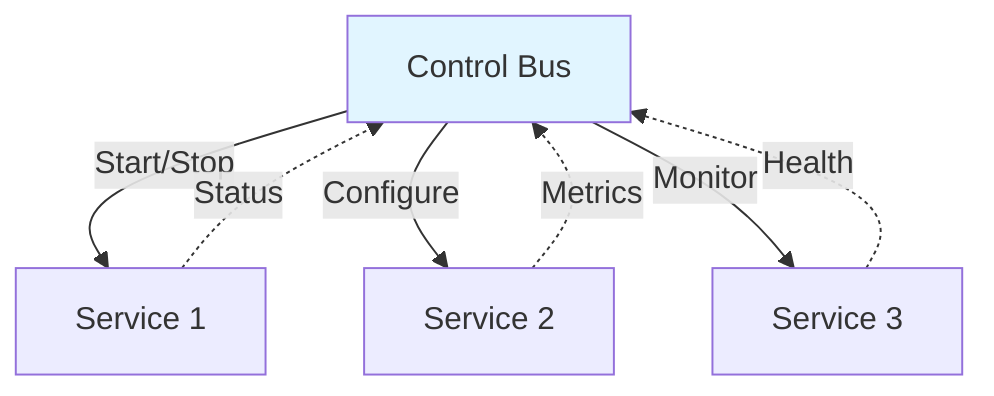

**OFBiz Implementation**: Service management through webtools

- Service engine provides control bus functionality
- Services can be enabled/disabled dynamically
- Service statistics and monitoring available

### Wire Tap

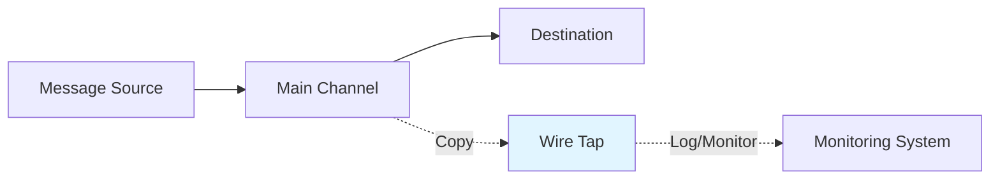

**OFBiz Implementation**: ECA rules for auditing

```xml
<!-- Wire tap for auditing -->
<eca entity="OrderHeader" operation="create-store" event="return">
    <!-- Main processing continues -->
    <action service="auditOrderChange" mode="async"/>
    <action service="logOrderEvent" mode="async"/>
</eca>
```

---

## Official References

- [Enterprise Integration Patterns Book](https://www.enterpriseintegrationpatterns.com/)
- [Apache Camel EIP](https://camel.apache.org/components/latest/eips/enterprise-integration-patterns.html)

---

## Related Documentation

- [ECA/SECA Overview](../../02-framework-core/event-driven-architecture/eca-seca-overview.md)
- [Service Engine Overview](../../02-framework-core/service-engine/overview.md)
- [Event-Driven Integration](event-driven-integration.md)
- [External Service Adapters](external-service-adapters.md)

---

## Summary

OFBiz naturally implements many Enterprise Integration Patterns through its service engine and ECA/SECA mechanisms. The service engine provides message construction and routing, ECA rules enable event-driven processing, and the entity engine supports data transformation. Understanding these patterns helps design robust integrations with external systems.
