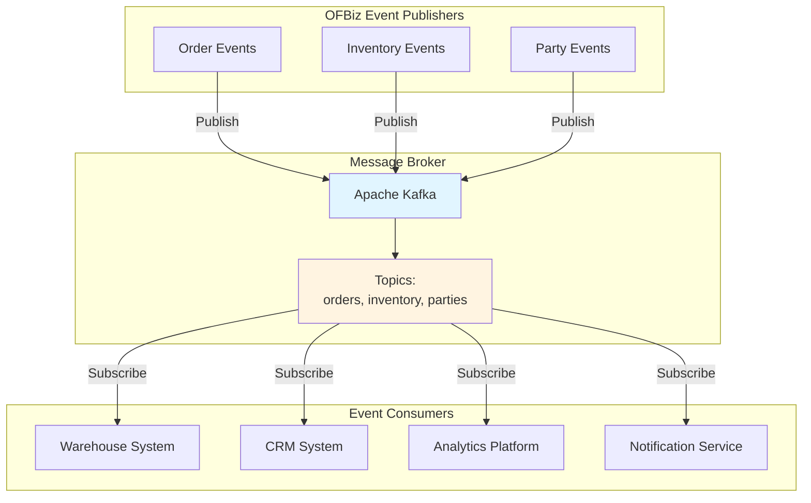
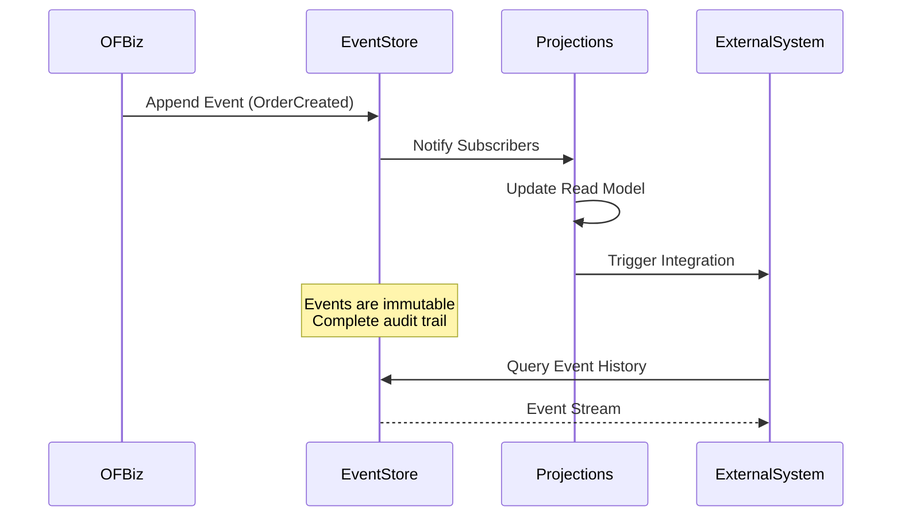
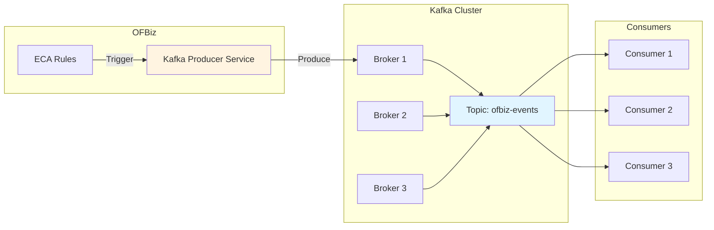
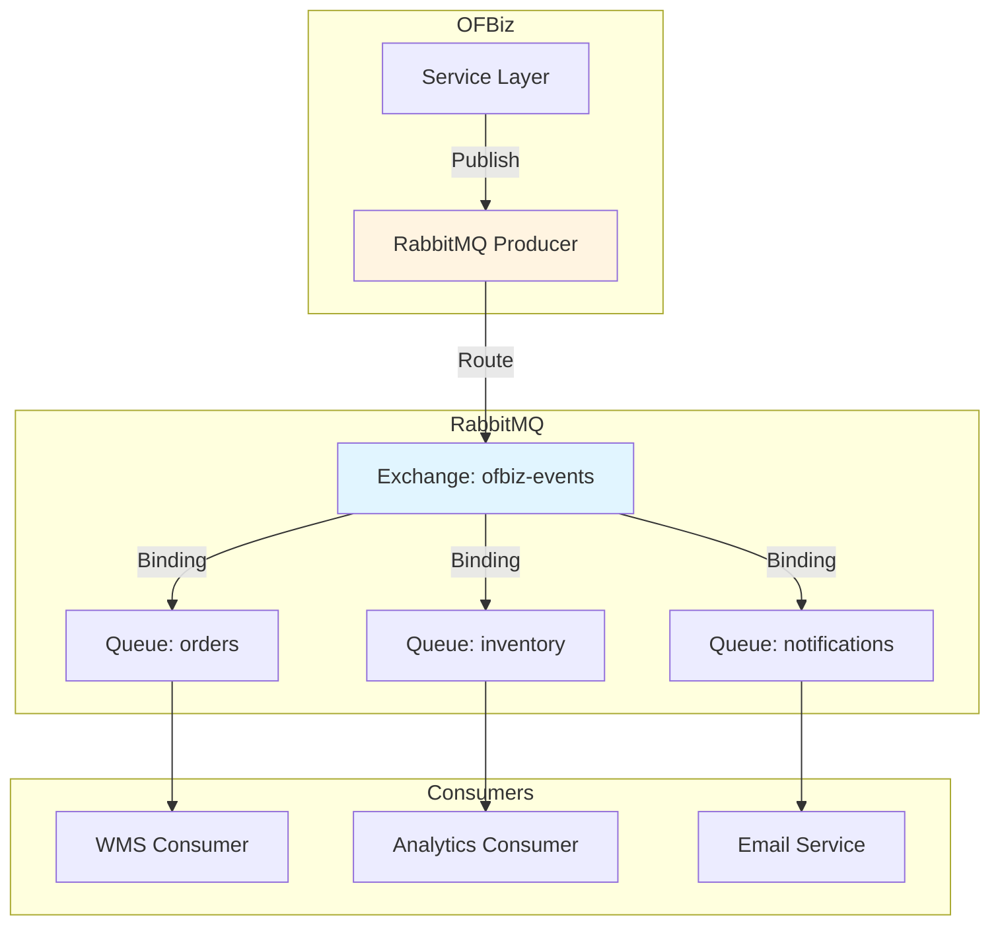
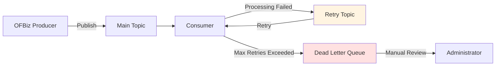

# Event-Driven Integration Architecture

**Document Type**: Integration Architecture  
**Category**: Asynchronous Integration Patterns  
**Last Updated**: December 2024

---

## Overview

Event-driven integration enables loose coupling between OFBiz and external systems through asynchronous message passing. This document covers integration patterns using message brokers like Apache Kafka, RabbitMQ, and how to extend OFBiz's native ECA/SECA mechanisms for external event processing.

---

## Event-Driven Architecture Patterns

### Publish-Subscribe Pattern



### Event Sourcing Pattern



---

## Apache Kafka Integration

### Architecture



### Implementation

<details>
<summary><strong>Kafka Producer Service</strong></summary>

```java
package com.company.integration.kafka;

import org.apache.kafka.clients.producer.*;
import org.apache.ofbiz.base.util.*;
import org.apache.ofbiz.entity.GenericValue;
import org.apache.ofbiz.service.DispatchContext;
import org.apache.ofbiz.service.ServiceUtil;
import java.util.Properties;

public class KafkaIntegrationServices {
    
    public static final String module = KafkaIntegrationServices.class.getName();
    private static KafkaProducer<String, String> producer;
    
    private static synchronized KafkaProducer<String, String> getProducer() {
        if (producer == null) {
            Properties props = new Properties();
            props.put(ProducerConfig.BOOTSTRAP_SERVERS_CONFIG, 
                UtilProperties.getPropertyValue("kafka.properties", "kafka.bootstrap.servers"));
            props.put(ProducerConfig.KEY_SERIALIZER_CLASS_CONFIG, 
                "org.apache.kafka.common.serialization.StringSerializer");
            props.put(ProducerConfig.VALUE_SERIALIZER_CLASS_CONFIG, 
                "org.apache.kafka.common.serialization.StringSerializer");
            props.put(ProducerConfig.ACKS_CONFIG, "all");
            props.put(ProducerConfig.RETRIES_CONFIG, 3);
            
            producer = new KafkaProducer<>(props);
        }
        return producer;
    }
    
    public static Map<String, Object> publishOrderEvent(DispatchContext dctx, Map<String, ?> context) {
        String eventType = (String) context.get("eventType");
        GenericValue orderHeader = (GenericValue) context.get("orderHeader");
        
        try {
            // Build event payload
            Map<String, Object> event = new HashMap<>();
            event.put("eventType", eventType);
            event.put("eventId", UUID.randomUUID().toString());
            event.put("timestamp", UtilDateTime.nowTimestamp().toString());
            event.put("orderId", orderHeader.getString("orderId"));
            event.put("orderTypeId", orderHeader.getString("orderTypeId"));
            event.put("statusId", orderHeader.getString("statusId"));
            event.put("grandTotal", orderHeader.getBigDecimal("grandTotal"));
            event.put("currencyUom", orderHeader.getString("currencyUom"));
            
            String payload = UtilJSON.toJSON(event);
            
            // Publish to Kafka
            String topic = UtilProperties.getPropertyValue("kafka.properties", "kafka.topic.orders");
            ProducerRecord<String, String> record = new ProducerRecord<>(
                topic, 
                orderHeader.getString("orderId"),  // Key for partitioning
                payload
            );
            
            KafkaProducer<String, String> kafkaProducer = getProducer();
            Future<RecordMetadata> future = kafkaProducer.send(record);
            
            // Wait for acknowledgment
            RecordMetadata metadata = future.get();
            
            Debug.logInfo("Event published to Kafka: topic=" + metadata.topic() + 
                ", partition=" + metadata.partition() + 
                ", offset=" + metadata.offset(), module);
            
            return ServiceUtil.returnSuccess("Event published successfully");
            
        } catch (Exception e) {
            Debug.logError(e, "Error publishing event to Kafka", module);
            return ServiceUtil.returnError("Error publishing event: " + e.getMessage());
        }
    }
    
    public static Map<String, Object> publishInventoryEvent(DispatchContext dctx, Map<String, ?> context) {
        String eventType = (String) context.get("eventType");
        GenericValue inventoryItem = (GenericValue) context.get("inventoryItem");
        
        try {
            Map<String, Object> event = new HashMap<>();
            event.put("eventType", eventType);
            event.put("eventId", UUID.randomUUID().toString());
            event.put("timestamp", UtilDateTime.nowTimestamp().toString());
            event.put("inventoryItemId", inventoryItem.getString("inventoryItemId"));
            event.put("productId", inventoryItem.getString("productId"));
            event.put("facilityId", inventoryItem.getString("facilityId"));
            event.put("quantityOnHand", inventoryItem.getBigDecimal("quantityOnHandTotal"));
            event.put("availableToPromise", inventoryItem.getBigDecimal("availableToPromiseTotal"));
            
            String payload = UtilJSON.toJSON(event);
            String topic = UtilProperties.getPropertyValue("kafka.properties", "kafka.topic.inventory");
            
            ProducerRecord<String, String> record = new ProducerRecord<>(
                topic,
                inventoryItem.getString("productId"),
                payload
            );
            
            getProducer().send(record).get();
            
            return ServiceUtil.returnSuccess("Inventory event published");
            
        } catch (Exception e) {
            Debug.logError(e, "Error publishing inventory event", module);
            return ServiceUtil.returnError("Error publishing event: " + e.getMessage());
        }
    }
}
```

</details>

<details>
<summary><strong>ECA Rules for Kafka Publishing</strong></summary>

```xml
<!-- In applications/order/entitydef/eecas.xml -->
<eca entity="OrderHeader" operation="create" event="return">
    <action service="publishOrderEvent" mode="async">
        <field-map field-name="eventType" value="ORDER_CREATED"/>
        <field-map field-name="orderHeader" from-field="instance"/>
    </action>
</eca>

<eca entity="OrderHeader" operation="store" event="return">
    <condition field-name="statusId" operator="not-equals" from-field="oldValue.statusId"/>
    <action service="publishOrderEvent" mode="async">
        <field-map field-name="eventType" value="ORDER_STATUS_CHANGED"/>
        <field-map field-name="orderHeader" from-field="instance"/>
    </action>
</eca>

<!-- In applications/product/entitydef/eecas.xml -->
<eca entity="InventoryItem" operation="store" event="return">
    <condition field-name="quantityOnHandTotal" operator="not-equals" from-field="oldValue.quantityOnHandTotal"/>
    <action service="publishInventoryEvent" mode="async">
        <field-map field-name="eventType" value="INVENTORY_CHANGED"/>
        <field-map field-name="inventoryItem" from-field="instance"/>
    </action>
</eca>
```

</details>

---

## RabbitMQ Integration

### Architecture



### Implementation

<details>
<summary><strong>RabbitMQ Producer Service</strong></summary>

```java
package com.company.integration.rabbitmq;

import com.rabbitmq.client.*;
import org.apache.ofbiz.base.util.*;
import org.apache.ofbiz.service.DispatchContext;
import org.apache.ofbiz.service.ServiceUtil;

public class RabbitMQIntegrationServices {
    
    public static final String module = RabbitMQIntegrationServices.class.getName();
    private static Connection connection;
    private static Channel channel;
    
    private static synchronized Channel getChannel() throws Exception {
        if (connection == null || !connection.isOpen()) {
            ConnectionFactory factory = new ConnectionFactory();
            factory.setHost(UtilProperties.getPropertyValue("rabbitmq.properties", "rabbitmq.host"));
            factory.setPort(Integer.parseInt(UtilProperties.getPropertyValue("rabbitmq.properties", "rabbitmq.port")));
            factory.setUsername(UtilProperties.getPropertyValue("rabbitmq.properties", "rabbitmq.username"));
            factory.setPassword(UtilProperties.getPropertyValue("rabbitmq.properties", "rabbitmq.password"));
            
            connection = factory.newConnection();
            channel = connection.createChannel();
            
            // Declare exchange
            String exchange = UtilProperties.getPropertyValue("rabbitmq.properties", "rabbitmq.exchange");
            channel.exchangeDeclare(exchange, BuiltinExchangeType.TOPIC, true);
        }
        return channel;
    }
    
    public static Map<String, Object> publishToRabbitMQ(DispatchContext dctx, Map<String, ?> context) {
        String routingKey = (String) context.get("routingKey");
        String message = (String) context.get("message");
        
        try {
            Channel ch = getChannel();
            String exchange = UtilProperties.getPropertyValue("rabbitmq.properties", "rabbitmq.exchange");
            
            // Publish message
            AMQP.BasicProperties props = new AMQP.BasicProperties.Builder()
                .contentType("application/json")
                .deliveryMode(2)  // Persistent
                .timestamp(new Date())
                .build();
            
            ch.basicPublish(exchange, routingKey, props, message.getBytes("UTF-8"));
            
            Debug.logInfo("Message published to RabbitMQ: exchange=" + exchange + 
                ", routingKey=" + routingKey, module);
            
            return ServiceUtil.returnSuccess("Message published successfully");
            
        } catch (Exception e) {
            Debug.logError(e, "Error publishing to RabbitMQ", module);
            return ServiceUtil.returnError("Error publishing message: " + e.getMessage());
        }
    }
}
```

</details>

---

## Event Schema Design

### Order Event Schema

```json
{
  "eventId": "uuid",
  "eventType": "ORDER_CREATED | ORDER_APPROVED | ORDER_COMPLETED",
  "timestamp": "ISO8601 timestamp",
  "source": "ofbiz",
  "version": "1.0",
  "data": {
    "orderId": "string",
    "orderTypeId": "string",
    "statusId": "string",
    "orderDate": "ISO8601 timestamp",
    "grandTotal": "decimal",
    "currencyUom": "string",
    "customer": {
      "partyId": "string",
      "name": "string",
      "email": "string"
    },
    "items": [
      {
        "orderItemSeqId": "string",
        "productId": "string",
        "quantity": "decimal",
        "unitPrice": "decimal"
      }
    ]
  }
}
```

### Inventory Event Schema

```json
{
  "eventId": "uuid",
  "eventType": "INVENTORY_CHANGED | INVENTORY_LOW | INVENTORY_OUT_OF_STOCK",
  "timestamp": "ISO8601 timestamp",
  "source": "ofbiz",
  "version": "1.0",
  "data": {
    "inventoryItemId": "string",
    "productId": "string",
    "facilityId": "string",
    "quantityOnHand": "decimal",
    "availableToPromise": "decimal",
    "previousQuantity": "decimal",
    "changeAmount": "decimal"
  }
}
```

---

## Consumer Implementation Example

<details>
<summary><strong>Kafka Consumer (External System)</strong></summary>

```java
// External system consuming OFBiz events
public class OFBizEventConsumer {
    
    public static void main(String[] args) {
        Properties props = new Properties();
        props.put(ConsumerConfig.BOOTSTRAP_SERVERS_CONFIG, "localhost:9092");
        props.put(ConsumerConfig.GROUP_ID_CONFIG, "wms-consumer-group");
        props.put(ConsumerConfig.KEY_DESERIALIZER_CLASS_CONFIG, StringDeserializer.class.getName());
        props.put(ConsumerConfig.VALUE_DESERIALIZER_CLASS_CONFIG, StringDeserializer.class.getName());
        props.put(ConsumerConfig.AUTO_OFFSET_RESET_CONFIG, "earliest");
        
        KafkaConsumer<String, String> consumer = new KafkaConsumer<>(props);
        consumer.subscribe(Arrays.asList("ofbiz-orders", "ofbiz-inventory"));
        
        while (true) {
            ConsumerRecords<String, String> records = consumer.poll(Duration.ofMillis(100));
            
            for (ConsumerRecord<String, String> record : records) {
                System.out.printf("Received event: topic=%s, partition=%d, offset=%d, key=%s%n",
                    record.topic(), record.partition(), record.offset(), record.key());
                
                // Parse event
                JSONObject event = new JSONObject(record.value());
                String eventType = event.getString("eventType");
                
                // Process based on event type
                switch (eventType) {
                    case "ORDER_CREATED":
                        handleOrderCreated(event);
                        break;
                    case "INVENTORY_CHANGED":
                        handleInventoryChanged(event);
                        break;
                    default:
                        System.out.println("Unknown event type: " + eventType);
                }
            }
        }
    }
    
    private static void handleOrderCreated(JSONObject event) {
        JSONObject data = event.getJSONObject("data");
        String orderId = data.getString("orderId");
        
        // Process order in external WMS
        System.out.println("Processing order in WMS: " + orderId);
        // ... WMS-specific logic
    }
    
    private static void handleInventoryChanged(JSONObject event) {
        JSONObject data = event.getJSONObject("data");
        String productId = data.getString("productId");
        double quantity = data.getDouble("quantityOnHand");
        
        // Update inventory in external system
        System.out.println("Updating inventory: product=" + productId + ", quantity=" + quantity);
        // ... Inventory sync logic
    }
}
```

</details>

---

## Error Handling and Retry

### Dead Letter Queue Pattern



---

## Official References

- [Apache Kafka Documentation](https://kafka.apache.org/documentation/)
- [RabbitMQ Documentation](https://www.rabbitmq.com/documentation.html)
- [Event-Driven Architecture Patterns](https://martinfowler.com/articles/201701-event-driven.html)

---

## Related Documentation

- [ECA/SECA Overview](../../02-framework-core/event-driven-architecture/eca-seca-overview.md)
- [Enterprise Integration Patterns](enterprise-integration-patterns.md)
- [External Service Adapters](external-service-adapters.md)
- [Circuit Breaker Patterns](circuit-breaker-patterns.md)

---

## Summary

Event-driven integration enables loose coupling between OFBiz and external systems through asynchronous messaging. Use Kafka for high-throughput event streaming, RabbitMQ for flexible routing, and implement proper error handling with retry and dead letter queue patterns. Extend OFBiz's native ECA/SECA mechanisms to publish events to external message brokers.
