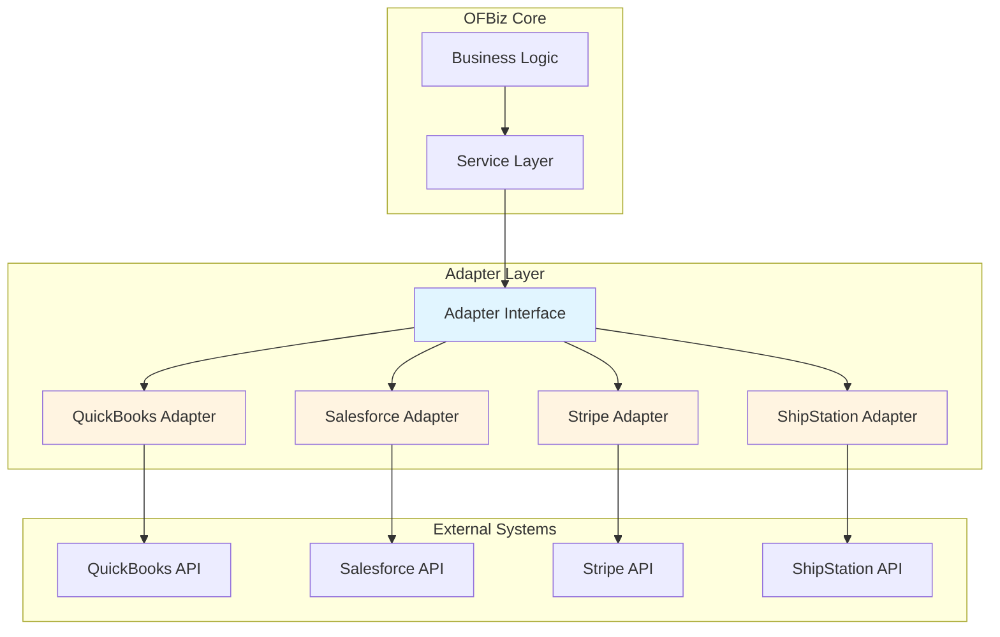

# External Service Adapters

**Document Type**: Integration Architecture  
**Category**: Adapter Pattern Implementation  
**Last Updated**: December 2024

---

## Overview

External service adapters provide a clean abstraction layer between OFBiz and external systems, enabling loose coupling and easier maintenance. This document describes adapter patterns, implementation strategies, and best practices for integrating with external services.

---

## Adapter Pattern Architecture

### Conceptual Architecture



### Benefits of Adapter Pattern

1. **Loose Coupling**: OFBiz code doesn't depend on external API details
2. **Testability**: Mock adapters for testing without external dependencies
3. **Flexibility**: Swap implementations without changing business logic
4. **Maintainability**: External API changes isolated to adapter layer
5. **Reusability**: Adapters can be shared across multiple services

---

## Generic Adapter Interface

### Base Adapter Interface

<details>
<summary><strong>ExternalServiceAdapter Interface</strong></summary>

```java
package com.company.integration.adapter;

import java.util.Map;

/**
 * Base interface for all external service adapters
 */
public interface ExternalServiceAdapter {
    
    /**
     * Initialize the adapter with configuration
     */
    void initialize(Map<String, Object> config) throws AdapterException;
    
    /**
     * Test connectivity to external service
     */
    boolean testConnection() throws AdapterException;
    
    /**
     * Get adapter name/identifier
     */
    String getAdapterName();
    
    /**
     * Get adapter version
     */
    String getAdapterVersion();
    
    /**
     * Cleanup resources
     */
    void shutdown() throws AdapterException;
}
```

</details>

### Accounting Adapter Interface

<details>
<summary><strong>AccountingAdapter Interface</strong></summary>

```java
package com.company.integration.adapter;

import java.math.BigDecimal;
import java.util.List;
import java.util.Map;

/**
 * Interface for accounting system adapters
 */
public interface AccountingAdapter extends ExternalServiceAdapter {
    
    /**
     * Sync customer to external accounting system
     */
    String syncCustomer(Map<String, Object> customerData) throws AdapterException;
    
    /**
     * Create invoice in external system
     */
    String createInvoice(Map<String, Object> invoiceData) throws AdapterException;
    
    /**
     * Record payment in external system
     */
    String recordPayment(Map<String, Object> paymentData) throws AdapterException;
    
    /**
     * Get account balance
     */
    BigDecimal getAccountBalance(String accountId) throws AdapterException;
    
    /**
     * Sync chart of accounts
     */
    List<Map<String, Object>> getChartOfAccounts() throws AdapterException;
}
```

</details>

### CRM Adapter Interface

<details>
<summary><strong>CRMAdapter Interface</strong></summary>

```java
package com.company.integration.adapter;

import java.util.List;
import java.util.Map;

/**
 * Interface for CRM system adapters
 */
public interface CRMAdapter extends ExternalServiceAdapter {
    
    /**
     * Sync contact to CRM
     */
    String syncContact(Map<String, Object> contactData) throws AdapterException;
    
    /**
     * Create opportunity in CRM
     */
    String createOpportunity(Map<String, Object> opportunityData) throws AdapterException;
    
    /**
     * Update opportunity stage
     */
    void updateOpportunityStage(String opportunityId, String stage) throws AdapterException;
    
    /**
     * Get contact by external ID
     */
    Map<String, Object> getContact(String externalId) throws AdapterException;
    
    /**
     * Search contacts
     */
    List<Map<String, Object>> searchContacts(Map<String, Object> criteria) throws AdapterException;
}
```

</details>

---

## Adapter Implementation Example

### QuickBooks Adapter Implementation

<details>
<summary><strong>QuickBooksAdapter Implementation</strong></summary>

```java
package com.company.integration.adapter.impl;

import com.company.integration.adapter.AccountingAdapter;
import com.company.integration.adapter.AdapterException;
import com.intuit.ipp.core.Context;
import com.intuit.ipp.core.ServiceType;
import com.intuit.ipp.data.*;
import com.intuit.ipp.services.DataService;
import com.intuit.ipp.security.OAuth2Authorizer;
import org.apache.ofbiz.base.util.*;

import java.math.BigDecimal;
import java.util.*;

public class QuickBooksAdapter implements AccountingAdapter {
    
    private static final String module = QuickBooksAdapter.class.getName();
    
    private DataService dataService;
    private Map<String, Object> config;
    private boolean initialized = false;
    
    @Override
    public void initialize(Map<String, Object> config) throws AdapterException {
        this.config = config;
        
        try {
            String accessToken = (String) config.get("accessToken");
            String realmId = (String) config.get("realmId");
            
            OAuth2Authorizer oauth = new OAuth2Authorizer(accessToken);
            Context context = new Context(oauth, ServiceType.QBO, realmId);
            
            dataService = new DataService(context);
            initialized = true;
            
            Debug.logInfo("QuickBooks adapter initialized successfully", module);
            
        } catch (Exception e) {
            throw new AdapterException("Failed to initialize QuickBooks adapter: " + e.getMessage(), e);
        }
    }
    
    @Override
    public boolean testConnection() throws AdapterException {
        checkInitialized();
        
        try {
            // Try to query company info
            CompanyInfo companyInfo = dataService.getCompanyInfo();
            return companyInfo != null;
            
        } catch (Exception e) {
            Debug.logError(e, "QuickBooks connection test failed", module);
            return false;
        }
    }
    
    @Override
    public String syncCustomer(Map<String, Object> customerData) throws AdapterException {
        checkInitialized();
        
        try {
            String externalId = (String) customerData.get("externalId");
            
            // Check if customer exists
            Customer customer = null;
            if (UtilValidate.isNotEmpty(externalId)) {
                customer = dataService.findById(new Customer(), externalId);
            }
            
            if (customer == null) {
                // Create new customer
                customer = new Customer();
                customer.setDisplayName((String) customerData.get("name"));
                customer.setGivenName((String) customerData.get("firstName"));
                customer.setFamilyName((String) customerData.get("lastName"));
                customer.setCompanyName((String) customerData.get("companyName"));
                
                // Set email
                EmailAddress email = new EmailAddress();
                email.setAddress((String) customerData.get("email"));
                customer.setPrimaryEmailAddr(email);
                
                // Set phone
                TelephoneNumber phone = new TelephoneNumber();
                phone.setFreeFormNumber((String) customerData.get("phone"));
                customer.setPrimaryPhone(phone);
                
                customer = dataService.add(customer);
                Debug.logInfo("Created QuickBooks customer: " + customer.getId(), module);
                
            } else {
                // Update existing customer
                customer.setDisplayName((String) customerData.get("name"));
                customer.setGivenName((String) customerData.get("firstName"));
                customer.setFamilyName((String) customerData.get("lastName"));
                
                customer = dataService.update(customer);
                Debug.logInfo("Updated QuickBooks customer: " + customer.getId(), module);
            }
            
            return customer.getId();
            
        } catch (Exception e) {
            throw new AdapterException("Failed to sync customer: " + e.getMessage(), e);
        }
    }
    
    @Override
    public String createInvoice(Map<String, Object> invoiceData) throws AdapterException {
        checkInitialized();
        
        try {
            Invoice invoice = new Invoice();
            
            // Set customer reference
            String customerId = (String) invoiceData.get("customerId");
            ReferenceType customerRef = new ReferenceType();
            customerRef.setValue(customerId);
            invoice.setCustomerRef(customerRef);
            
            // Set invoice date
            Date invoiceDate = (Date) invoiceData.get("invoiceDate");
            invoice.setTxnDate(invoiceDate);
            
            // Add line items
            List<Map<String, Object>> items = (List<Map<String, Object>>) invoiceData.get("items");
            List<Line> lines = new ArrayList<>();
            
            for (Map<String, Object> item : items) {
                Line line = new Line();
                line.setDetailType(LineDetailTypeEnum.SALES_ITEM_LINE_DETAIL);
                
                SalesItemLineDetail detail = new SalesItemLineDetail();
                
                // Set item reference
                ReferenceType itemRef = new ReferenceType();
                itemRef.setValue((String) item.get("itemId"));
                detail.setItemRef(itemRef);
                
                detail.setQty(new BigDecimal(item.get("quantity").toString()));
                detail.setUnitPrice(new BigDecimal(item.get("unitPrice").toString()));
                
                line.setSalesItemLineDetail(detail);
                line.setAmount(new BigDecimal(item.get("amount").toString()));
                
                lines.add(line);
            }
            
            invoice.setLine(lines);
            
            // Create invoice
            invoice = dataService.add(invoice);
            
            Debug.logInfo("Created QuickBooks invoice: " + invoice.getId(), module);
            return invoice.getId();
            
        } catch (Exception e) {
            throw new AdapterException("Failed to create invoice: " + e.getMessage(), e);
        }
    }
    
    @Override
    public String recordPayment(Map<String, Object> paymentData) throws AdapterException {
        checkInitialized();
        
        try {
            Payment payment = new Payment();
            
            // Set customer reference
            String customerId = (String) paymentData.get("customerId");
            ReferenceType customerRef = new ReferenceType();
            customerRef.setValue(customerId);
            payment.setCustomerRef(customerRef);
            
            // Set payment amount
            payment.setTotalAmt(new BigDecimal(paymentData.get("amount").toString()));
            
            // Set payment date
            payment.setTxnDate((Date) paymentData.get("paymentDate"));
            
            // Link to invoice
            String invoiceId = (String) paymentData.get("invoiceId");
            if (UtilValidate.isNotEmpty(invoiceId)) {
                Line line = new Line();
                line.setAmount(new BigDecimal(paymentData.get("amount").toString()));
                
                LinkedTxn linkedTxn = new LinkedTxn();
                linkedTxn.setTxnId(invoiceId);
                linkedTxn.setTxnType("Invoice");
                
                line.setLinkedTxn(Arrays.asList(linkedTxn));
                payment.setLine(Arrays.asList(line));
            }
            
            payment = dataService.add(payment);
            
            Debug.logInfo("Recorded QuickBooks payment: " + payment.getId(), module);
            return payment.getId();
            
        } catch (Exception e) {
            throw new AdapterException("Failed to record payment: " + e.getMessage(), e);
        }
    }
    
    @Override
    public BigDecimal getAccountBalance(String accountId) throws AdapterException {
        checkInitialized();
        
        try {
            Account account = dataService.findById(new Account(), accountId);
            return account.getCurrentBalance();
            
        } catch (Exception e) {
            throw new AdapterException("Failed to get account balance: " + e.getMessage(), e);
        }
    }
    
    @Override
    public List<Map<String, Object>> getChartOfAccounts() throws AdapterException {
        checkInitialized();
        
        try {
            String sql = "SELECT * FROM Account";
            QueryResult queryResult = dataService.executeQuery(sql);
            
            List<Map<String, Object>> accounts = new ArrayList<>();
            List<? extends IEntity> entities = queryResult.getEntities();
            
            for (IEntity entity : entities) {
                Account account = (Account) entity;
                
                Map<String, Object> accountMap = new HashMap<>();
                accountMap.put("id", account.getId());
                accountMap.put("name", account.getName());
                accountMap.put("accountType", account.getAccountType());
                accountMap.put("accountNumber", account.getAcctNum());
                accountMap.put("balance", account.getCurrentBalance());
                
                accounts.add(accountMap);
            }
            
            return accounts;
            
        } catch (Exception e) {
            throw new AdapterException("Failed to get chart of accounts: " + e.getMessage(), e);
        }
    }
    
    @Override
    public String getAdapterName() {
        return "QuickBooks Online Adapter";
    }
    
    @Override
    public String getAdapterVersion() {
        return "1.0.0";
    }
    
    @Override
    public void shutdown() throws AdapterException {
        // Cleanup resources if needed
        initialized = false;
        Debug.logInfo("QuickBooks adapter shutdown", module);
    }
    
    private void checkInitialized() throws AdapterException {
        if (!initialized) {
            throw new AdapterException("Adapter not initialized. Call initialize() first.");
        }
    }
}
```

</details>

---

## Adapter Factory Pattern

### Factory for Creating Adapters

<details>
<summary><strong>AdapterFactory Implementation</strong></summary>

```java
package com.company.integration.adapter;

import org.apache.ofbiz.base.util.*;
import java.util.Map;
import java.util.concurrent.ConcurrentHashMap;

public class AdapterFactory {
    
    private static final String module = AdapterFactory.class.getName();
    private static final Map<String, ExternalServiceAdapter> adapterCache = new ConcurrentHashMap<>();
    
    /**
     * Get or create adapter instance
     */
    public static <T extends ExternalServiceAdapter> T getAdapter(
            String adapterType, 
            Class<T> adapterInterface,
            Map<String, Object> config) throws AdapterException {
        
        String cacheKey = adapterType + "_" + config.hashCode();
        
        ExternalServiceAdapter adapter = adapterCache.get(cacheKey);
        
        if (adapter == null) {
            synchronized (AdapterFactory.class) {
                adapter = adapterCache.get(cacheKey);
                
                if (adapter == null) {
                    adapter = createAdapter(adapterType, config);
                    adapterCache.put(cacheKey, adapter);
                }
            }
        }
        
        return adapterInterface.cast(adapter);
    }
    
    private static ExternalServiceAdapter createAdapter(String adapterType, Map<String, Object> config) 
            throws AdapterException {
        
        try {
            String className = UtilProperties.getPropertyValue(
                "adapters.properties", 
                "adapter." + adapterType + ".class"
            );
            
            if (UtilValidate.isEmpty(className)) {
                throw new AdapterException("No adapter class configured for type: " + adapterType);
            }
            
            Class<?> adapterClass = Class.forName(className);
            ExternalServiceAdapter adapter = (ExternalServiceAdapter) adapterClass.newInstance();
            
            adapter.initialize(config);
            
            Debug.logInfo("Created adapter: " + adapterType + " (" + className + ")", module);
            
            return adapter;
            
        } catch (Exception e) {
            throw new AdapterException("Failed to create adapter: " + e.getMessage(), e);
        }
    }
    
    /**
     * Clear adapter cache
     */
    public static void clearCache() {
        for (ExternalServiceAdapter adapter : adapterCache.values()) {
            try {
                adapter.shutdown();
            } catch (Exception e) {
                Debug.logError(e, "Error shutting down adapter", module);
            }
        }
        adapterCache.clear();
    }
}
```

</details>

---

## Using Adapters in Services

### Service Integration

<details>
<summary><strong>Service Using Adapter</strong></summary>

```java
public static Map<String, Object> syncOrderToAccounting(DispatchContext dctx, Map<String, ?> context) {
    Delegator delegator = dctx.getDelegator();
    String orderId = (String) context.get("orderId");
    
    try {
        // Get order data
        GenericValue orderHeader = delegator.findOne("OrderHeader", 
            UtilMisc.toMap("orderId", orderId), false);
        
        // Get adapter configuration
        Map<String, Object> adapterConfig = UtilMisc.toMap(
            "accessToken", UtilProperties.getPropertyValue("accounting.properties", "accounting.accessToken"),
            "realmId", UtilProperties.getPropertyValue("accounting.properties", "accounting.realmId")
        );
        
        // Get accounting adapter (could be QuickBooks, Xero, etc.)
        String adapterType = UtilProperties.getPropertyValue("accounting.properties", "accounting.adapter.type");
        AccountingAdapter adapter = AdapterFactory.getAdapter(adapterType, AccountingAdapter.class, adapterConfig);
        
        // Prepare invoice data
        Map<String, Object> invoiceData = prepareInvoiceData(delegator, orderHeader);
        
        // Create invoice in external system
        String externalInvoiceId = adapter.createInvoice(invoiceData);
        
        // Store external reference
        orderHeader.set("externalInvoiceId", externalInvoiceId);
        orderHeader.store();
        
        return ServiceUtil.returnSuccess("Order synced to accounting system: " + externalInvoiceId);
        
    } catch (Exception e) {
        Debug.logError(e, "Error syncing order to accounting", module);
        return ServiceUtil.returnError("Error syncing order: " + e.getMessage());
    }
}
```

</details>

---

## Configuration

### Adapter Configuration Properties

```properties
# adapters.properties

# Adapter class mappings
adapter.quickbooks.class=com.company.integration.adapter.impl.QuickBooksAdapter
adapter.xero.class=com.company.integration.adapter.impl.XeroAdapter
adapter.salesforce.class=com.company.integration.adapter.impl.SalesforceAdapter
adapter.stripe.class=com.company.integration.adapter.impl.StripeAdapter

# Active adapter selection
accounting.adapter.type=quickbooks
crm.adapter.type=salesforce
payment.adapter.type=stripe
```

---

## Testing with Mock Adapters

### Mock Adapter for Testing

<details>
<summary><strong>MockAccountingAdapter</strong></summary>

```java
package com.company.integration.adapter.mock;

import com.company.integration.adapter.AccountingAdapter;
import com.company.integration.adapter.AdapterException;

import java.math.BigDecimal;
import java.util.*;

public class MockAccountingAdapter implements AccountingAdapter {
    
    private Map<String, Object> config;
    private Map<String, Map<String, Object>> customers = new HashMap<>();
    private Map<String, Map<String, Object>> invoices = new HashMap<>();
    private int nextId = 1000;
    
    @Override
    public void initialize(Map<String, Object> config) throws AdapterException {
        this.config = config;
    }
    
    @Override
    public boolean testConnection() {
        return true;
    }
    
    @Override
    public String syncCustomer(Map<String, Object> customerData) {
        String customerId = "MOCK-CUST-" + (nextId++);
        customers.put(customerId, new HashMap<>(customerData));
        return customerId;
    }
    
    @Override
    public String createInvoice(Map<String, Object> invoiceData) {
        String invoiceId = "MOCK-INV-" + (nextId++);
        invoices.put(invoiceId, new HashMap<>(invoiceData));
        return invoiceId;
    }
    
    @Override
    public String recordPayment(Map<String, Object> paymentData) {
        return "MOCK-PMT-" + (nextId++);
    }
    
    @Override
    public BigDecimal getAccountBalance(String accountId) {
        return new BigDecimal("10000.00");
    }
    
    @Override
    public List<Map<String, Object>> getChartOfAccounts() {
        return new ArrayList<>();
    }
    
    @Override
    public String getAdapterName() {
        return "Mock Accounting Adapter";
    }
    
    @Override
    public String getAdapterVersion() {
        return "1.0.0-MOCK";
    }
    
    @Override
    public void shutdown() {
        customers.clear();
        invoices.clear();
    }
}
```

</details>

---

## Error Handling

### Custom Exception

```java
package com.company.integration.adapter;

public class AdapterException extends Exception {
    
    private String errorCode;
    private boolean retryable;
    
    public AdapterException(String message) {
        super(message);
        this.retryable = false;
    }
    
    public AdapterException(String message, Throwable cause) {
        super(message, cause);
        this.retryable = false;
    }
    
    public AdapterException(String errorCode, String message, boolean retryable) {
        super(message);
        this.errorCode = errorCode;
        this.retryable = retryable;
    }
    
    public String getErrorCode() {
        return errorCode;
    }
    
    public boolean isRetryable() {
        return retryable;
    }
}
```

---

## Official References

- [Adapter Pattern - Gang of Four](https://en.wikipedia.org/wiki/Adapter_pattern)
- [Enterprise Integration Patterns](https://www.enterpriseintegrationpatterns.com/)

---

## Related Documentation

- [QuickBooks Integration](../04-application-modules/external-integration-examples/quickbooks-integration.md)
- [Salesforce Integration](../04-application-modules/external-integration-examples/salesforce-integration.md)
- [Stripe Integration](../04-application-modules/external-integration-examples/stripe-integration.md)
- [Circuit Breaker Patterns](circuit-breaker-patterns.md)

---

## Summary

External service adapters provide clean abstraction for integrating with external systems. Use interface-based design for flexibility, implement factory pattern for adapter creation, and provide mock implementations for testing. Adapters isolate external API details from business logic, making integrations maintainable and testable.
