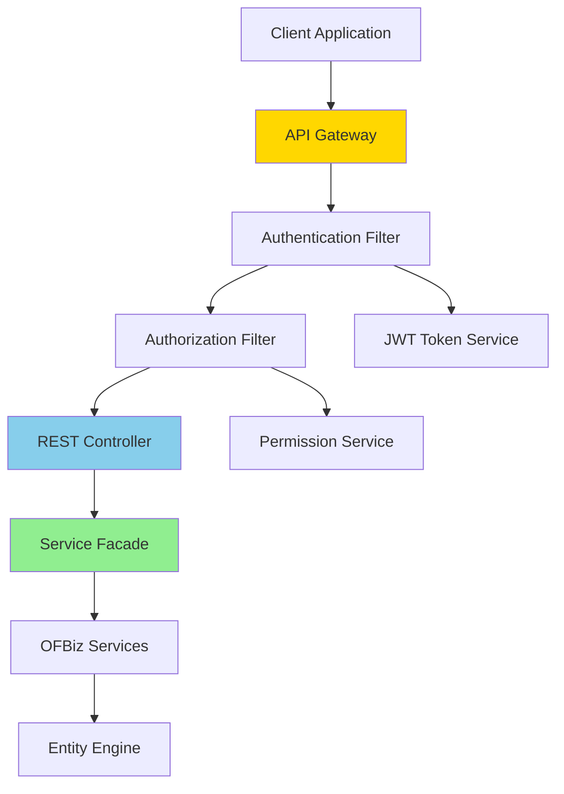
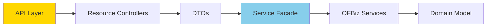

# REST API Architecture

**Purpose**: Documentation of REST API architecture for exposing OFBiz services as RESTful endpoints.

**Audience**: API Developers, Integration Architects, Frontend Developers

**Prerequisites**: 
- [Service Engine Overview](../02-framework-core/service-engine/overview.md)
- [Security Framework](../02-framework-core/security-framework/overview.md)

**Related Documents**: 
- [Event-Driven Integration](./event-driven-integration.md)
- [External Service Adapters](./external-service-adapters.md)

---

## Overview

OFBiz's REST API architecture exposes business services as RESTful endpoints, enabling integration with modern web and mobile applications, external systems, and microservices. The API follows REST principles with JSON payloads, JWT authentication, and comprehensive error handling.

## Visual Architecture

### REST API Architecture



**Diagram Description**: REST API architecture showing request flow through API gateway, authentication/authorization filters, REST controllers, service facade, and OFBiz services.

### API Layers



**Diagram Description**: API layers showing separation between REST resources, DTOs, service facade, and domain model.

## API Design

### RESTful Endpoints

**Resource-Based URLs**:
```
GET    /api/v1/products              - List products
GET    /api/v1/products/{id}         - Get product
POST   /api/v1/products              - Create product
PUT    /api/v1/products/{id}         - Update product
DELETE /api/v1/products/{id}         - Delete product

GET    /api/v1/orders                - List orders
GET    /api/v1/orders/{id}           - Get order
POST   /api/v1/orders                - Create order
PUT    /api/v1/orders/{id}/status    - Update order status

GET    /api/v1/parties               - List parties
GET    /api/v1/parties/{id}          - Get party
POST   /api/v1/parties               - Create party
```

### REST Controller Implementation

**Product Controller**:
```java
@RestController
@RequestMapping("/api/v1/products")
public class ProductController {
    
    @Autowired
    private LocalDispatcher dispatcher;
    
    @Autowired
    private Delegator delegator;
    
    @GetMapping
    public ResponseEntity<PagedResponse<ProductDTO>> listProducts(
            @RequestParam(defaultValue = "0") int page,
            @RequestParam(defaultValue = "20") int size,
            @RequestParam(required = false) String search) {
        
        try {
            // Build query
            EntityQuery query = EntityQuery.use(delegator)
                .from("Product")
                .orderBy("productName");
            
            if (search != null) {
                query.where(EntityCondition.makeCondition("productName", 
                    EntityOperator.LIKE, "%" + search + "%"));
            }
            
            // Get total count
            long total = query.queryCount();
            
            // Get page
            List<GenericValue> products = query
                .offset(page * size)
                .maxRows(size)
                .queryList();
            
            // Convert to DTOs
            List<ProductDTO> dtos = products.stream()
                .map(ProductDTO::fromGenericValue)
                .collect(Collectors.toList());
            
            PagedResponse<ProductDTO> response = new PagedResponse<>(dtos, page, size, total);
            return ResponseEntity.ok(response);
            
        } catch (GenericEntityException e) {
            return ResponseEntity.status(500).build();
        }
    }
    
    @GetMapping("/{productId}")
    public ResponseEntity<ProductDTO> getProduct(@PathVariable String productId) {
        try {
            GenericValue product = delegator.findOne("Product", 
                UtilMisc.toMap("productId", productId), false);
            
            if (product == null) {
                return ResponseEntity.notFound().build();
            }
            
            ProductDTO dto = ProductDTO.fromGenericValue(product);
            return ResponseEntity.ok(dto);
            
        } catch (GenericEntityException e) {
            return ResponseEntity.status(500).build();
        }
    }
    
    @PostMapping
    public ResponseEntity<ProductDTO> createProduct(
            @RequestBody @Valid ProductCreateRequest request,
            @AuthenticationPrincipal UserDetails userDetails) {
        
        try {
            Map<String, Object> context = request.toServiceContext();
            context.put("userLogin", getUserLogin(userDetails));
            
            Map<String, Object> result = dispatcher.runSync("createProduct", context);
            
            if (ServiceUtil.isSuccess(result)) {
                String productId = (String) result.get("productId");
                GenericValue product = delegator.findOne("Product", 
                    UtilMisc.toMap("productId", productId), false);
                
                ProductDTO dto = ProductDTO.fromGenericValue(product);
                return ResponseEntity.created(URI.create("/api/v1/products/" + productId))
                    .body(dto);
            } else {
                return ResponseEntity.badRequest().build();
            }
            
        } catch (Exception e) {
            return ResponseEntity.status(500).build();
        }
    }
    
    @PutMapping("/{productId}")
    public ResponseEntity<ProductDTO> updateProduct(
            @PathVariable String productId,
            @RequestBody @Valid ProductUpdateRequest request,
            @AuthenticationPrincipal UserDetails userDetails) {
        
        try {
            Map<String, Object> context = request.toServiceContext();
            context.put("productId", productId);
            context.put("userLogin", getUserLogin(userDetails));
            
            Map<String, Object> result = dispatcher.runSync("updateProduct", context);
            
            if (ServiceUtil.isSuccess(result)) {
                GenericValue product = delegator.findOne("Product", 
                    UtilMisc.toMap("productId", productId), false);
                
                ProductDTO dto = ProductDTO.fromGenericValue(product);
                return ResponseEntity.ok(dto);
            } else {
                return ResponseEntity.badRequest().build();
            }
            
        } catch (Exception e) {
            return ResponseEntity.status(500).build();
        }
    }
    
    @DeleteMapping("/{productId}")
    public ResponseEntity<Void> deleteProduct(
            @PathVariable String productId,
            @AuthenticationPrincipal UserDetails userDetails) {
        
        try {
            Map<String, Object> context = new HashMap<>();
            context.put("productId", productId);
            context.put("userLogin", getUserLogin(userDetails));
            
            Map<String, Object> result = dispatcher.runSync("deleteProduct", context);
            
            if (ServiceUtil.isSuccess(result)) {
                return ResponseEntity.noContent().build();
            } else {
                return ResponseEntity.badRequest().build();
            }
            
        } catch (Exception e) {
            return ResponseEntity.status(500).build();
        }
    }
}
```

### Data Transfer Objects (DTOs)

**ProductDTO**:
```java
@Data
public class ProductDTO {
    private String productId;
    private String productName;
    private String description;
    private String productTypeId;
    private BigDecimal price;
    private String currencyUomId;
    private Integer quantityOnHand;
    
    public static ProductDTO fromGenericValue(GenericValue product) {
        ProductDTO dto = new ProductDTO();
        dto.setProductId(product.getString("productId"));
        dto.setProductName(product.getString("productName"));
        dto.setDescription(product.getString("description"));
        dto.setProductTypeId(product.getString("productTypeId"));
        return dto;
    }
}

@Data
public class ProductCreateRequest {
    @NotBlank
    private String productName;
    
    private String description;
    
    @NotBlank
    private String productTypeId;
    
    private BigDecimal price;
    
    public Map<String, Object> toServiceContext() {
        Map<String, Object> context = new HashMap<>();
        context.put("productName", productName);
        context.put("description", description);
        context.put("productTypeId", productTypeId);
        return context;
    }
}
```

## Authentication & Authorization

### JWT Authentication

**JWT Configuration**:
```java
@Configuration
@EnableWebSecurity
public class SecurityConfig {
    
    @Bean
    public SecurityFilterChain filterChain(HttpSecurity http) throws Exception {
        http
            .csrf().disable()
            .authorizeHttpRequests(auth -> auth
                .requestMatchers("/api/auth/**").permitAll()
                .requestMatchers("/api/v1/**").authenticated()
            )
            .sessionManagement(session -> session
                .sessionCreationPolicy(SessionCreationPolicy.STATELESS)
            )
            .addFilterBefore(jwtAuthenticationFilter(), 
                UsernamePasswordAuthenticationFilter.class);
        
        return http.build();
    }
    
    @Bean
    public JWTAuthenticationFilter jwtAuthenticationFilter() {
        return new JWTAuthenticationFilter();
    }
}
```

**JWT Filter**:
```java
public class JWTAuthenticationFilter extends OncePerRequestFilter {
    
    @Autowired
    private JWTTokenProvider tokenProvider;
    
    @Override
    protected void doFilterInternal(HttpServletRequest request, 
            HttpServletResponse response, FilterChain filterChain) 
            throws ServletException, IOException {
        
        String token = extractToken(request);
        
        if (token != null && tokenProvider.validateToken(token)) {
            String username = tokenProvider.getUsernameFromToken(token);
            GenericValue userLogin = getUserLogin(username);
            
            if (userLogin != null) {
                Authentication authentication = new OFBizAuthenticationToken(userLogin);
                SecurityContextHolder.getContext().setAuthentication(authentication);
            }
        }
        
        filterChain.doFilter(request, response);
    }
    
    private String extractToken(HttpServletRequest request) {
        String bearerToken = request.getHeader("Authorization");
        if (bearerToken != null && bearerToken.startsWith("Bearer ")) {
            return bearerToken.substring(7);
        }
        return null;
    }
}
```

**Login Endpoint**:
```java
@RestController
@RequestMapping("/api/auth")
public class AuthController {
    
    @PostMapping("/login")
    public ResponseEntity<LoginResponse> login(@RequestBody LoginRequest request) {
        try {
            Map<String, Object> context = new HashMap<>();
            context.put("login.username", request.getUsername());
            context.put("login.password", request.getPassword());
            
            Map<String, Object> result = dispatcher.runSync("userLogin", context);
            
            if (ServiceUtil.isSuccess(result)) {
                GenericValue userLogin = (GenericValue) result.get("userLogin");
                String token = jwtTokenProvider.generateToken(userLogin);
                
                LoginResponse response = new LoginResponse();
                response.setToken(token);
                response.setUsername(userLogin.getString("userLoginId"));
                
                return ResponseEntity.ok(response);
            } else {
                return ResponseEntity.status(401).build();
            }
            
        } catch (Exception e) {
            return ResponseEntity.status(500).build();
        }
    }
}
```

## API Documentation

### OpenAPI/Swagger

**Configuration**:
```java
@Configuration
public class OpenAPIConfig {
    
    @Bean
    public OpenAPI customOpenAPI() {
        return new OpenAPI()
            .info(new Info()
                .title("OFBiz REST API")
                .version("1.0")
                .description("RESTful API for OFBiz ERP system")
                .contact(new Contact()
                    .name("API Support")
                    .email("api@example.com")))
            .addSecurityItem(new SecurityRequirement().addList("bearer-jwt"))
            .components(new Components()
                .addSecuritySchemes("bearer-jwt", new SecurityScheme()
                    .type(SecurityScheme.Type.HTTP)
                    .scheme("bearer")
                    .bearerFormat("JWT")));
    }
}
```

**Swagger Annotations**:
```java
@RestController
@RequestMapping("/api/v1/products")
@Tag(name = "Products", description = "Product management APIs")
public class ProductController {
    
    @Operation(summary = "Get product by ID", 
               description = "Returns a single product")
    @ApiResponses(value = {
        @ApiResponse(responseCode = "200", description = "Successful operation"),
        @ApiResponse(responseCode = "404", description = "Product not found"),
        @ApiResponse(responseCode = "401", description = "Unauthorized")
    })
    @GetMapping("/{productId}")
    public ResponseEntity<ProductDTO> getProduct(
            @Parameter(description = "Product ID") @PathVariable String productId) {
        // Implementation
    }
}
```

## Error Handling

### Global Exception Handler

```java
@RestControllerAdvice
public class GlobalExceptionHandler {
    
    @ExceptionHandler(GenericEntityException.class)
    public ResponseEntity<ErrorResponse> handleEntityException(GenericEntityException e) {
        ErrorResponse error = new ErrorResponse();
        error.setStatus(500);
        error.setMessage("Database error");
        error.setDetails(e.getMessage());
        return ResponseEntity.status(500).body(error);
    }
    
    @ExceptionHandler(GenericServiceException.class)
    public ResponseEntity<ErrorResponse> handleServiceException(GenericServiceException e) {
        ErrorResponse error = new ErrorResponse();
        error.setStatus(500);
        error.setMessage("Service error");
        error.setDetails(e.getMessage());
        return ResponseEntity.status(500).body(error);
    }
    
    @ExceptionHandler(MethodArgumentNotValidException.class)
    public ResponseEntity<ErrorResponse> handleValidationException(
            MethodArgumentNotValidException e) {
        ErrorResponse error = new ErrorResponse();
        error.setStatus(400);
        error.setMessage("Validation error");
        error.setDetails(e.getBindingResult().getAllErrors().stream()
            .map(ObjectError::getDefaultMessage)
            .collect(Collectors.joining(", ")));
        return ResponseEntity.badRequest().body(error);
    }
}

@Data
public class ErrorResponse {
    private int status;
    private String message;
    private String details;
    private LocalDateTime timestamp = LocalDateTime.now();
}
```

## API Versioning

### URL Versioning

```java
@RestController
@RequestMapping("/api/v1/products")
public class ProductControllerV1 {
    // Version 1 implementation
}

@RestController
@RequestMapping("/api/v2/products")
public class ProductControllerV2 {
    // Version 2 implementation with breaking changes
}
```

## Rate Limiting

```java
@Component
public class RateLimitingFilter extends OncePerRequestFilter {
    
    private final Map<String, RateLimiter> limiters = new ConcurrentHashMap<>();
    
    @Override
    protected void doFilterInternal(HttpServletRequest request, 
            HttpServletResponse response, FilterChain filterChain) 
            throws ServletException, IOException {
        
        String clientId = getClientId(request);
        RateLimiter limiter = limiters.computeIfAbsent(clientId, 
            k -> RateLimiter.create(100.0)); // 100 requests per second
        
        if (limiter.tryAcquire()) {
            filterChain.doFilter(request, response);
        } else {
            response.setStatus(429); // Too Many Requests
            response.getWriter().write("Rate limit exceeded");
        }
    }
}
```

## Best Practices

1. **Use DTOs**: Separate API models from domain models
2. **Validate Input**: Use Bean Validation annotations
3. **Handle Errors**: Provide meaningful error messages
4. **Document APIs**: Use OpenAPI/Swagger
5. **Version APIs**: Plan for breaking changes
6. **Secure APIs**: Use JWT authentication
7. **Rate Limit**: Protect against abuse
8. **Paginate**: Return large datasets in pages
9. **Cache**: Cache frequently accessed data
10. **Monitor**: Log API usage and errors

## Architecture Decisions

### Decision: RESTful API Design

**Context**: Need modern API for web/mobile applications.

**Decision**: Implement RESTful API following REST principles with JSON payloads.

**Consequences**:
- ✅ **Positive**: Standard, well-understood approach
- ✅ **Positive**: Easy to consume from any platform
- ✅ **Positive**: Stateless, scalable
- ❌ **Negative**: May require multiple requests for complex operations
- **Mitigation**: Provide batch endpoints for complex operations

## Official References

- [REST API Design Best Practices](https://restfulapi.net/)
- [OpenAPI Specification](https://swagger.io/specification/)
- [Spring REST Docs](https://spring.io/projects/spring-restdocs)

## Related Topics

- [Service Engine](../02-framework-core/service-engine/overview.md)
- [Security Framework](../02-framework-core/security-framework/overview.md)
- [Event-Driven Integration](./event-driven-integration.md)

---

**Next**: [Event-Driven Integration](./event-driven-integration.md)

**Up**: [Integration Architecture](./README.md)

**Home**: [Master Index](../00-INDEX.md)

---

**Document Metadata**:
- **Version**: 1.0
- **Last Updated**: December 2024
- **OFBiz Version**: Trunk (Latest)
- **Status**: Complete
