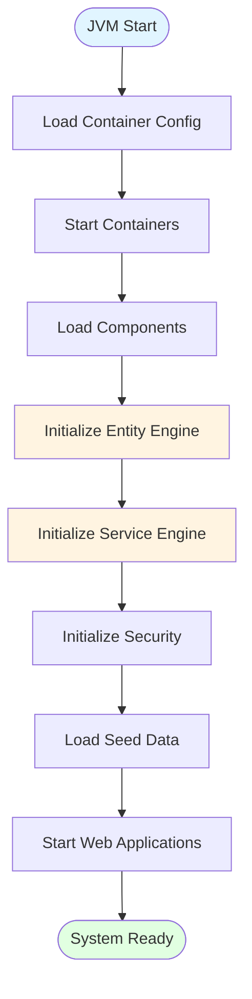
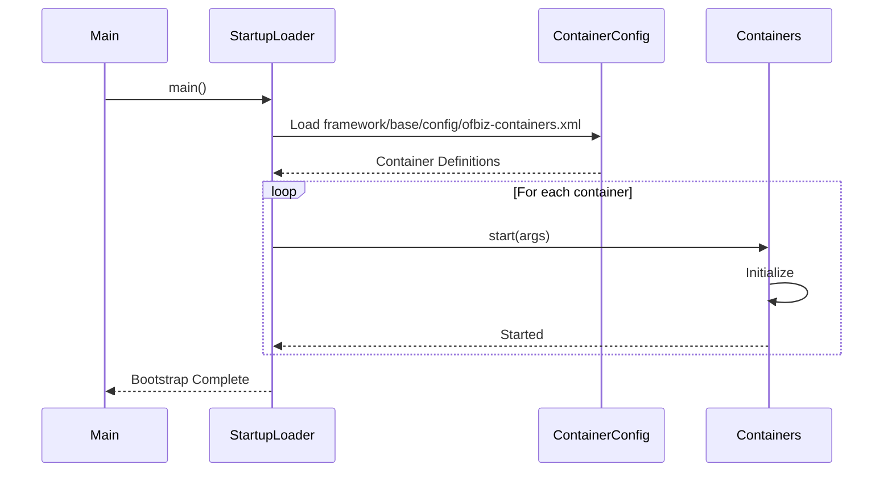
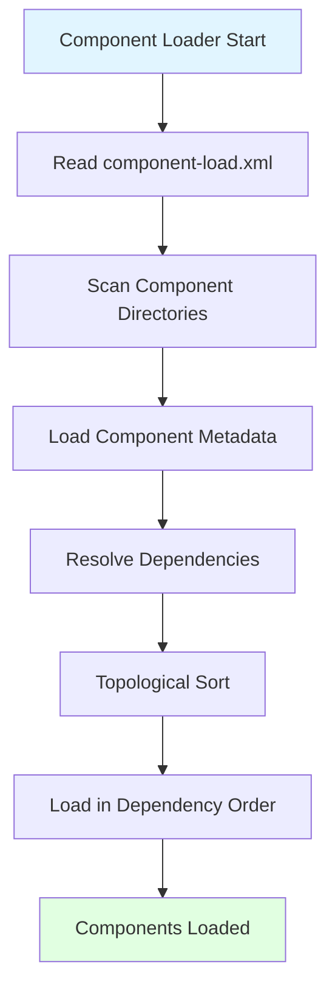
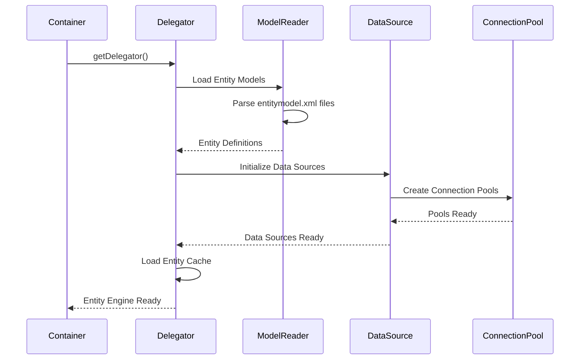
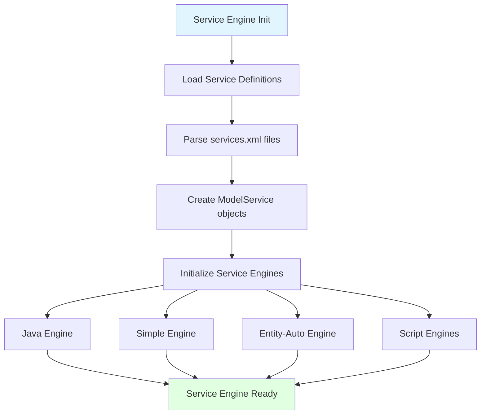
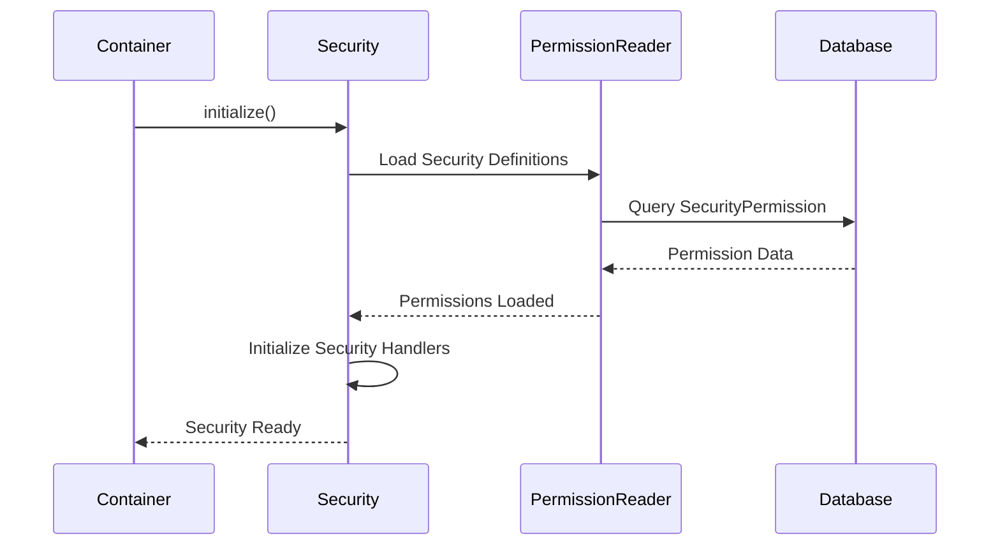
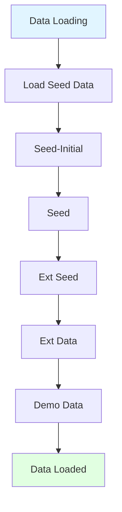
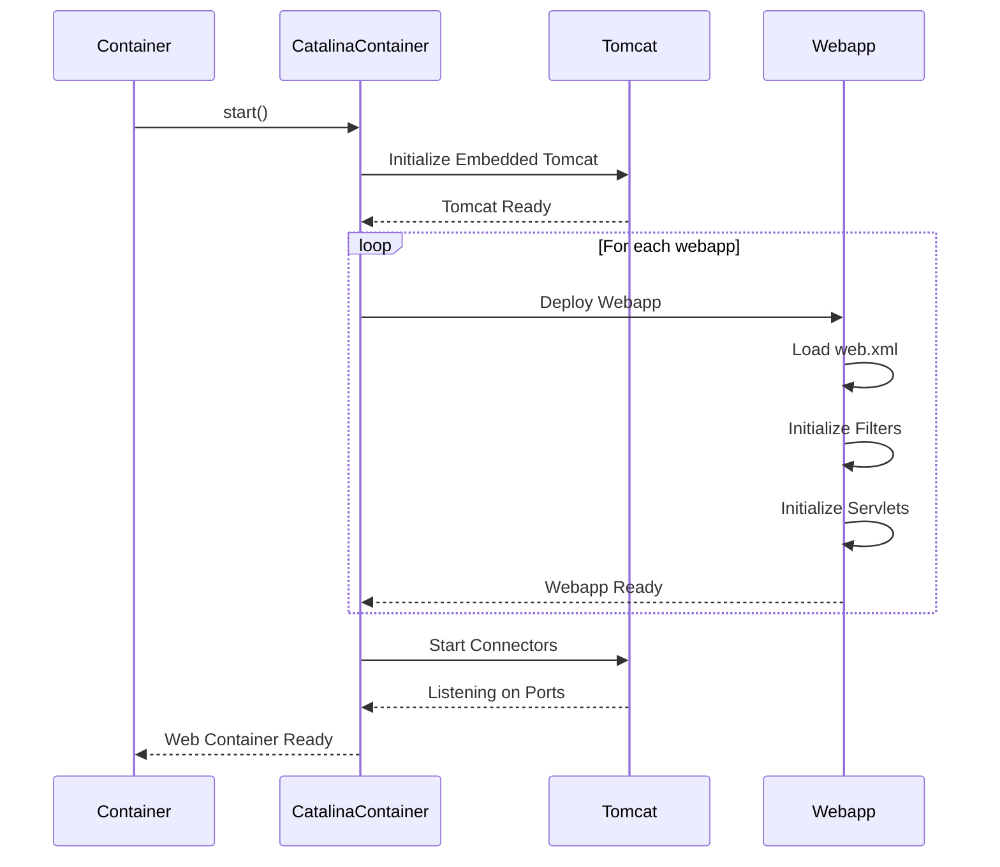
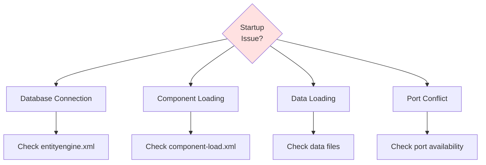

# OFBiz Bootstrap Sequence

**Document Type**: Runtime Architecture  
**Category**: System Initialization  
**Last Updated**: December 2024

---

## Overview

This document describes the complete bootstrap sequence of Apache OFBiz from JVM startup through component initialization and readiness for request processing. Understanding the bootstrap sequence is essential for troubleshooting startup issues and optimizing initialization time.

---

## Bootstrap Overview

### High-Level Bootstrap Flow



---

## Detailed Bootstrap Sequence

### Phase 1: Container Initialization



<details>
<summary><strong>StartupLoader.java - Main Entry Point</strong></summary>

**File**: `framework/start/src/main/java/org/apache/ofbiz/base/start/StartupLoader.java`

```java
public class StartupLoader {
    
    public static void main(String[] args) throws Exception {
        // Parse command line arguments
        Config config = new Config(args);
        
        // Initialize logging
        initializeLogging(config);
        
        // Load container configuration
        ContainerConfig containerConfig = ContainerConfig.getConfiguration("ofbiz-containers.xml");
        
        // Start containers in order
        List<Container> containers = new ArrayList<>();
        for (ContainerConfig.Configuration containerCfg : containerConfig.getConfigurations()) {
            Container container = loadContainer(containerCfg);
            container.start();
            containers.add(container);
        }
        
        // Register shutdown hook
        Runtime.getRuntime().addShutdownHook(new Thread(() -> {
            for (Container container : containers) {
                try {
                    container.stop();
                } catch (Exception e) {
                    Debug.logError(e, "Error stopping container", module);
                }
            }
        }));
        
        Debug.logInfo("OFBiz startup complete", module);
    }
}
```

</details>

### Phase 2: Component Loading



<details>
<summary><strong>Component Loading Process</strong></summary>

**File**: `framework/base/src/main/java/org/apache/ofbiz/base/component/ComponentConfig.java`

```java
public class ComponentConfig {
    
    public static void loadComponents() throws ComponentException {
        // Read component-load.xml
        Document document = UtilXml.readXmlDocument(
            "framework/base/config/component-load.xml");
        
        List<ComponentConfig> components = new ArrayList<>();
        
        // Load component definitions
        for (Element loadComponent : UtilXml.childElementList(document.getDocumentElement())) {
            String location = loadComponent.getAttribute("component-location");
            
            // Read ofbiz-component.xml from each component
            ComponentConfig config = new ComponentConfig(location);
            components.add(config);
        }
        
        // Resolve dependencies
        List<ComponentConfig> sorted = resolveDependencies(components);
        
        // Load components in order
        for (ComponentConfig component : sorted) {
            loadComponent(component);
        }
    }
    
    private static void loadComponent(ComponentConfig component) {
        Debug.logInfo("Loading component: " + component.getComponentName(), module);
        
        // Load entity definitions
        for (ResourceInfo entityResource : component.getEntityResourceInfos()) {
            ModelReader.loadEntityModel(entityResource.location);
        }
        
        // Load service definitions
        for (ResourceInfo serviceResource : component.getServiceResourceInfos()) {
            DispatchContext.loadServiceDefinitions(serviceResource.location);
        }
        
        // Load webapp definitions
        for (WebappInfo webappInfo : component.getWebappInfos()) {
            WebAppUtil.registerWebapp(webappInfo);
        }
    }
}
```

</details>

### Phase 3: Entity Engine Initialization



<details>
<summary><strong>Entity Engine Initialization</strong></summary>

**File**: `framework/entity/src/main/java/org/apache/ofbiz/entity/GenericDelegator.java`

```java
public class GenericDelegator implements Delegator {
    
    private void initialize() {
        Debug.logInfo("Initializing Entity Engine for delegator: " + delegatorName, module);
        
        // Load entity model
        this.modelReader = ModelReader.getModelReader(delegatorName);
        
        // Initialize data sources
        this.modelGroupReader = ModelGroupReader.getModelGroupReader(delegatorName);
        
        // Create connection pools
        for (String groupName : modelGroupReader.getGroupNames()) {
            String datasourceName = modelGroupReader.getDatasourceName(groupName);
            GenericHelperInfo helperInfo = getGroupHelperInfo(groupName);
            
            // Initialize connection pool
            GenericHelper helper = GenericHelperFactory.getHelper(helperInfo);
            this.helpers.put(groupName, helper);
        }
        
        // Initialize entity cache
        this.cache = new UtilCache<>("entity.default", 0, 0, true);
        
        Debug.logInfo("Entity Engine initialized successfully", module);
    }
}
```

</details>

### Phase 4: Service Engine Initialization



<details>
<summary><strong>Service Engine Initialization</strong></summary>

**File**: `framework/service/src/main/java/org/apache/ofbiz/service/GenericDispatcher.java`

```java
public class GenericDispatcher implements LocalDispatcher {
    
    private void initialize() {
        Debug.logInfo("Initializing Service Engine for dispatcher: " + name, module);
        
        // Load service definitions
        this.ctx = new DispatchContext(name, delegator);
        
        // Register service engines
        registerServiceEngines();
        
        // Initialize job manager
        this.jobManager = JobManager.getInstance(delegator);
        
        // Start async service executor
        this.asyncExecutor = Executors.newFixedThreadPool(
            UtilProperties.getPropertyAsInteger("serviceengine.properties", 
                "thread.pool.size", 50)
        );
        
        Debug.logInfo("Service Engine initialized successfully", module);
    }
    
    private void registerServiceEngines() {
        // Java engine
        ServiceEngine javaEngine = new JavaEngine(ctx);
        ctx.registerServiceEngine("java", javaEngine);
        
        // Simple engine (minilang)
        ServiceEngine simpleEngine = new SimpleEngine(ctx);
        ctx.registerServiceEngine("simple", simpleEngine);
        
        // Entity-auto engine
        ServiceEngine entityAutoEngine = new EntityAutoEngine(ctx);
        ctx.registerServiceEngine("entity-auto", entityAutoEngine);
        
        // Script engines (Groovy, etc.)
        ServiceEngine scriptEngine = new ScriptEngine(ctx);
        ctx.registerServiceEngine("groovy", scriptEngine);
    }
}
```

</details>

### Phase 5: Security Initialization



### Phase 6: Data Loading



<details>
<summary><strong>Data Loading Process</strong></summary>

**File**: `framework/entity/src/main/java/org/apache/ofbiz/entity/util/EntityDataLoader.java`

```java
public class EntityDataLoader {
    
    public static void loadData(Delegator delegator, String dataReaderName, List<String> dataTypes) {
        Debug.logInfo("Loading data for reader: " + dataReaderName, module);
        
        for (String dataType : dataTypes) {
            Debug.logInfo("Loading data type: " + dataType, module);
            
            // Get data files for this type
            List<URL> dataFiles = getDataFiles(dataReaderName, dataType);
            
            for (URL dataFile : dataFiles) {
                try {
                    Debug.logInfo("Loading data file: " + dataFile, module);
                    
                    // Parse XML data file
                    Document document = UtilXml.readXmlDocument(dataFile);
                    
                    // Load entities
                    List<GenericValue> entities = parseDataFile(delegator, document);
                    
                    // Store entities
                    delegator.storeAll(entities);
                    
                    Debug.logInfo("Loaded " + entities.size() + " records from " + dataFile, module);
                    
                } catch (Exception e) {
                    Debug.logError(e, "Error loading data file: " + dataFile, module);
                }
            }
        }
    }
}
```

</details>

### Phase 7: Web Application Startup



---

## Bootstrap Timeline

### Typical Startup Timeline

```mermaid
gantt
    title OFBiz Bootstrap Timeline
    dateFormat  s
    axisFormat %S
    
    section Initialization
    JVM Start           :0, 2s
    Load Containers     :2s, 1s
    
    section Component Loading
    Scan Components     :3s, 2s
    Load Entity Models  :5s, 3s
    Load Service Defs   :8s, 2s
    
    section Engine Init
    Entity Engine       :10s, 2s
    Service Engine      :12s, 2s
    Security Init       :14s, 1s
    
    section Data Loading
    Seed Data           :15s, 5s
    
    section Web Apps
    Deploy Webapps      :20s, 5s
    Start Connectors    :25s, 1s
    
    section Ready
    System Ready        :26s, 0s
```

---

## Startup Configuration

### Container Configuration

<details>
<summary><strong>ofbiz-containers.xml</strong></summary>

**File**: `framework/base/config/ofbiz-containers.xml`

```xml
<ofbiz-containers>
    <!-- Component Container - Loads all components -->
    <container name="component-container" 
               class="org.apache.ofbiz.base.container.ComponentContainer"/>
    
    <!-- Entity Engine Container -->
    <container name="delegator-container" 
               class="org.apache.ofbiz.entity.DelegatorContainer"/>
    
    <!-- Service Engine Container -->
    <container name="service-container" 
               class="org.apache.ofbiz.service.ServiceContainer">
        <property name="thread-pool-size" value="50"/>
        <property name="purge-job-days" value="30"/>
    </container>
    
    <!-- Catalina (Tomcat) Container -->
    <container name="catalina-container" 
               class="org.apache.ofbiz.catalina.container.CatalinaContainer">
        <property name="default-server" value="default-server"/>
        <property name="apps-context-reloadable" value="false"/>
        <property name="apps-cross-context" value="false"/>
        <property name="apps-distributable" value="false"/>
    </container>
</ofbiz-containers>
```

</details>

### Component Load Order

<details>
<summary><strong>component-load.xml</strong></summary>

**File**: `framework/base/config/component-load.xml`

```xml
<component-loader>
    <!-- Framework components (loaded first) -->
    <load-component component-location="framework/base"/>
    <load-component component-location="framework/entity"/>
    <load-component component-location="framework/service"/>
    <load-component component-location="framework/security"/>
    <load-component component-location="framework/webapp"/>
    <load-component component-location="framework/widget"/>
    
    <!-- Application components -->
    <load-component component-location="applications/party"/>
    <load-component component-location="applications/product"/>
    <load-component component-location="applications/order"/>
    <load-component component-location="applications/accounting"/>
    
    <!-- Plugin components (loaded last) -->
    <load-component component-location="plugins"/>
</component-loader>
```

</details>

---

## Troubleshooting Startup Issues

### Common Startup Problems



### Startup Logging

Enable detailed startup logging:

```properties
# In framework/base/config/debug.properties
log4j2.logger.startup.name=org.apache.ofbiz.base.start
log4j2.logger.startup.level=DEBUG

log4j2.logger.component.name=org.apache.ofbiz.base.component
log4j2.logger.component.level=DEBUG

log4j2.logger.entity.name=org.apache.ofbiz.entity
log4j2.logger.entity.level=INFO

log4j2.logger.service.name=org.apache.ofbiz.service
log4j2.logger.service.level=INFO
```

---

## Official References

- [Apache OFBiz Installation Guide](https://cwiki.apache.org/confluence/display/OFBIZ/Installation)
- [OFBiz Framework Documentation](https://cwiki.apache.org/confluence/display/OFBIZ/Framework+Introduction)

---

## Related Documentation

- [Request Lifecycle](request-lifecycle.md)
- [Thread Model](thread-model.md)
- [Classloading Architecture](classloading-architecture.md)
- [JVM Tuning](jvm-tuning.md)

---

## Summary

OFBiz bootstrap follows a well-defined sequence: container initialization, component loading, entity engine setup, service engine initialization, security configuration, data loading, and web application deployment. Understanding this sequence helps troubleshoot startup issues and optimize initialization time. The entire process typically takes 20-30 seconds on modern hardware with seed data.
