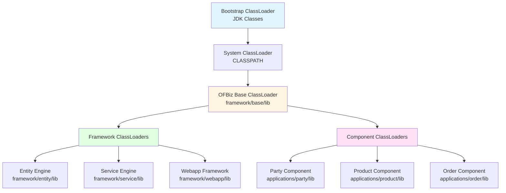
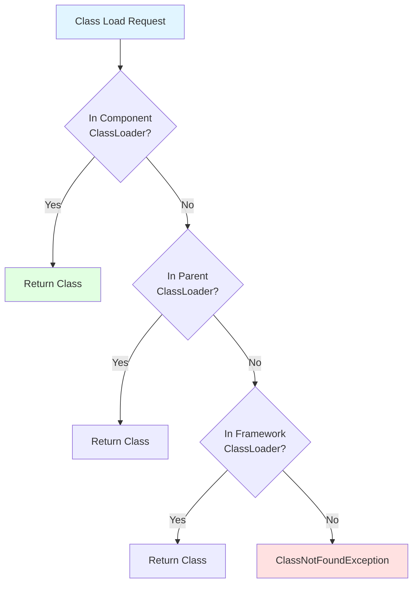
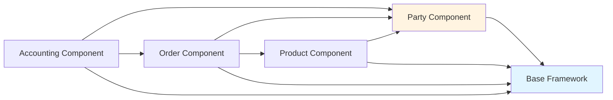
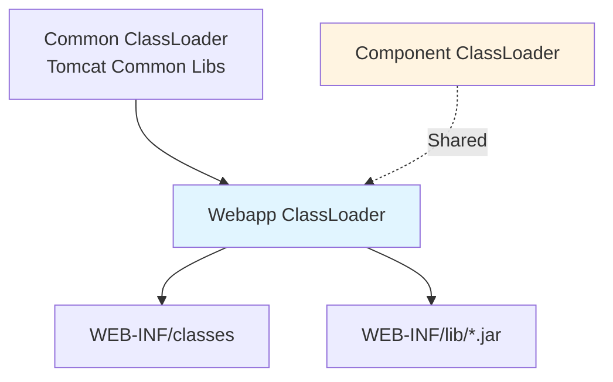
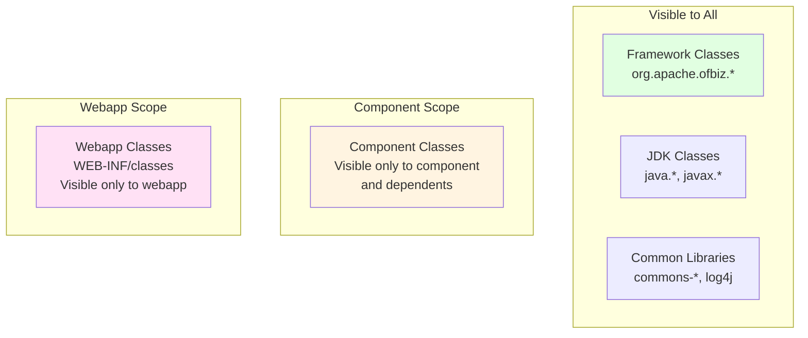
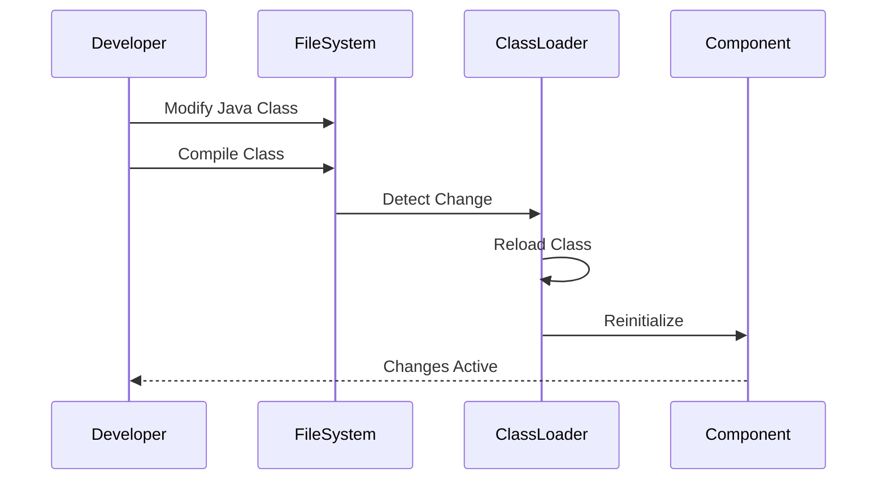
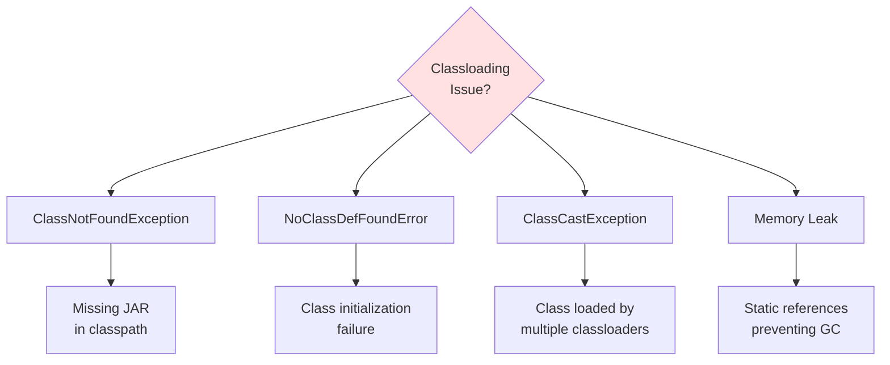
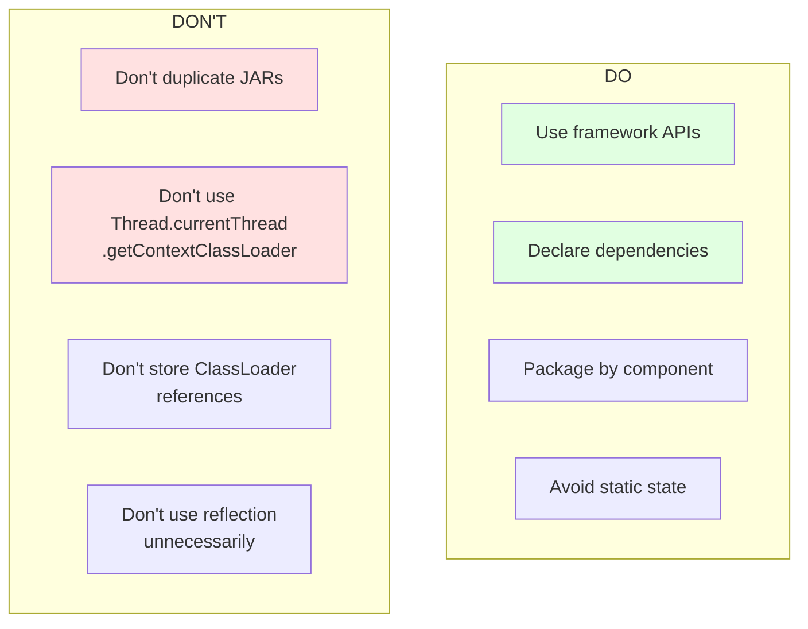

# Classloading Architecture

**Document Type**: Runtime Architecture  
**Category**: Classloading and Isolation  
**Last Updated**: December 2024

---

## Overview

OFBiz uses a component-based classloading architecture that provides isolation between components while allowing controlled sharing of classes. This document describes the classloader hierarchy, component isolation mechanisms, and classloading best practices.

---

## Classloader Hierarchy

### Classloader Structure



---

## Component Classloading

### Component Isolation



<details>
<summary><strong>Component ClassLoader Implementation</strong></summary>

**File**: `framework/base/src/main/java/org/apache/ofbiz/base/component/ComponentLoaderConfig.java`

```java
public class ComponentClassLoader extends URLClassLoader {
    
    private final String componentName;
    private final List<ComponentClassLoader> dependencies;
    
    public ComponentClassLoader(String componentName, URL[] urls, ClassLoader parent) {
        super(urls, parent);
        this.componentName = componentName;
        this.dependencies = new ArrayList<>();
    }
    
    @Override
    protected Class<?> loadClass(String name, boolean resolve) throws ClassNotFoundException {
        // Check if already loaded
        Class<?> c = findLoadedClass(name);
        if (c != null) {
            return c;
        }
        
        // Try to load from this component first
        try {
            c = findClass(name);
            if (resolve) {
                resolveClass(c);
            }
            return c;
        } catch (ClassNotFoundException e) {
            // Not found in this component
        }
        
        // Try dependent components
        for (ComponentClassLoader dependency : dependencies) {
            try {
                c = dependency.loadClass(name, resolve);
                return c;
            } catch (ClassNotFoundException e) {
                // Not found in dependency
            }
        }
        
        // Delegate to parent
        return super.loadClass(name, resolve);
    }
    
    public void addDependency(ComponentClassLoader dependency) {
        this.dependencies.add(dependency);
    }
}
```

</details>

### Component Dependencies



<details>
<summary><strong>Component Dependency Configuration</strong></summary>

**File**: `applications/order/ofbiz-component.xml`

```xml
<ofbiz-component name="order">
    <!-- Component dependencies -->
    <depends-on component-name="party"/>
    <depends-on component-name="product"/>
    <depends-on component-name="accounting"/>
    
    <!-- Classpath resources -->
    <classpath type="jar" location="build/lib/*"/>
    <classpath type="jar" location="lib/*"/>
    
    <!-- Entity resources -->
    <entity-resource type="model" reader-name="main" 
                     loader="main" location="entitydef/entitymodel.xml"/>
    
    <!-- Service resources -->
    <service-resource type="model" loader="main" 
                     location="servicedef/services.xml"/>
</ofbiz-component>
```

</details>

---

## Webapp Classloading

### Webapp ClassLoader Hierarchy



<details>
<summary><strong>Webapp ClassLoader Configuration</strong></summary>

**File**: `applications/order/webapp/ordermgr/WEB-INF/web.xml`

```xml
<web-app>
    <!-- Webapp context parameters -->
    <context-param>
        <param-name>mainDecoratorLocation</param-name>
        <param-value>component://order/widget/ordermgr/CommonScreens.xml</param-value>
    </context-param>
    
    <!-- Servlet configuration -->
    <servlet>
        <servlet-name>ControlServlet</servlet-name>
        <servlet-class>org.apache.ofbiz.webapp.control.ControlServlet</servlet-class>
        <load-on-startup>1</load-on-startup>
    </servlet>
    
    <!-- Filter configuration -->
    <filter>
        <filter-name>ContextFilter</filter-name>
        <filter-class>org.apache.ofbiz.webapp.control.ContextFilter</filter-class>
    </filter>
</web-app>
```

**Classloading Order**:
1. WEB-INF/classes
2. WEB-INF/lib/*.jar
3. Component classloader
4. Framework classloader
5. System classloader

</details>

---

## Class Visibility

### Class Sharing Rules



### Package Visibility

<details>
<summary><strong>Package Visibility Examples</strong></summary>

**Globally Visible** (framework packages):
```java
// These are visible to all components
import org.apache.ofbiz.entity.Delegator;
import org.apache.ofbiz.service.LocalDispatcher;
import org.apache.ofbiz.base.util.UtilMisc;
import org.apache.ofbiz.security.Security;
```

**Component-Scoped** (only visible to component and dependents):
```java
// Order component classes
package org.apache.ofbiz.order.order;

// Only visible to:
// - order component itself
// - components that depend on order (e.g., accounting)
// NOT visible to:
// - party component
// - product component (unless they depend on order)
```

**Webapp-Scoped** (only visible within webapp):
```java
// Webapp-specific classes in WEB-INF/classes
package com.company.webapp.order;

// Only visible within this specific webapp
// NOT visible to other webapps or components
```

</details>

---

## Dynamic Class Loading

### Hot Deployment



<details>
<summary><strong>Hot Deployment Configuration</strong></summary>

**File**: `framework/catalina/ofbiz-component.xml`

```xml
<webapp name="ordermgr"
        title="Order Manager"
        server="default-server"
        location="webapp/ordermgr"
        mount-point="/ordermgr"
        app-bar-display="true">
    
    <!-- Enable hot deployment for development -->
    <property name="reloadable" value="true"/>
    
    <!-- Watch for changes every 5 seconds -->
    <property name="backgroundProcessorDelay" value="5"/>
</webapp>
```

**Note**: Hot deployment should be disabled in production for performance:
```xml
<property name="reloadable" value="false"/>
```

</details>

---

## Classloading Issues

### Common Problems



### Troubleshooting

<details>
<summary><strong>Debugging Classloading Issues</strong></summary>

**Enable Classloading Logging**:

```properties
# In framework/base/config/debug.properties
log4j2.logger.classloader.name=org.apache.ofbiz.base.component
log4j2.logger.classloader.level=DEBUG
```

**Check Class Source**:

```java
// Find which classloader loaded a class
public static void printClassLoaderInfo(Class<?> clazz) {
    ClassLoader cl = clazz.getClassLoader();
    System.out.println("Class: " + clazz.getName());
    System.out.println("ClassLoader: " + cl);
    System.out.println("ClassLoader hierarchy:");
    
    while (cl != null) {
        System.out.println("  - " + cl.getClass().getName());
        cl = cl.getParent();
    }
    
    // Print class location
    ProtectionDomain pd = clazz.getProtectionDomain();
    CodeSource cs = pd.getCodeSource();
    if (cs != null) {
        System.out.println("Loaded from: " + cs.getLocation());
    }
}
```

**Detect Duplicate Classes**:

```bash
# Find duplicate JARs in classpath
find . -name "*.jar" -exec basename {} \; | sort | uniq -d
```

</details>

---

## Best Practices

### Classloading Guidelines



<details>
<summary><strong>Best Practice Examples</strong></summary>

**GOOD: Use framework APIs**
```java
// Use OFBiz utility classes
import org.apache.ofbiz.base.util.UtilMisc;
import org.apache.ofbiz.base.util.UtilValidate;

Map<String, Object> context = UtilMisc.toMap("key", "value");
```

**BAD: Duplicate libraries**
```
applications/order/lib/commons-lang3.jar  ❌
applications/party/lib/commons-lang3.jar  ❌
framework/base/lib/commons-lang3.jar      ✓ (only here)
```

**GOOD: Proper dependency declaration**
```xml
<ofbiz-component name="accounting">
    <depends-on component-name="party"/>
    <depends-on component-name="order"/>
</ofbiz-component>
```

**BAD: Storing classloader references**
```java
// Don't do this
private static ClassLoader savedClassLoader;

public void someMethod() {
    savedClassLoader = Thread.currentThread().getContextClassLoader(); // ❌
}
```

</details>

---

## Performance Considerations

### Classloading Performance

```mermaid
gantt
    title Class Loading Timeline
    dateFormat  SSS
    axisFormat %L
    
    section First Load
    Find Class File     :0, 10ms
    Read Bytecode       :10ms, 20ms
    Verify Bytecode     :30ms, 15ms
    Define Class        :45ms, 5ms
    Initialize Class    :50ms, 30ms
    
    section Subsequent
    Return Cached       :80ms, 1ms
```

**Optimization Tips**:
- Classes are cached after first load
- Minimize static initializers
- Lazy-load heavy dependencies
- Use class data sharing (CDS) in production

---

## Official References

- [Java ClassLoader Documentation](https://docs.oracle.com/javase/8/docs/api/java/lang/ClassLoader.html)
- [Tomcat ClassLoader HOW-TO](https://tomcat.apache.org/tomcat-9.0-doc/class-loader-howto.html)

---

## Related Documentation

- [Bootstrap Sequence](bootstrap-sequence.md)
- [Thread Model](thread-model.md)
- [JVM Tuning](jvm-tuning.md)
- [Component Architecture](../01-system-overview/modular-architecture.md)

---

## Summary

OFBiz uses a hierarchical classloading architecture with component isolation. Each component has its own classloader that can see framework classes and declared dependencies. Webapp classloaders provide additional isolation for web applications. Understanding classloader hierarchy and visibility rules is essential for avoiding classloading issues and building modular applications. Follow best practices: declare dependencies explicitly, avoid duplicate JARs, and use framework APIs consistently.
