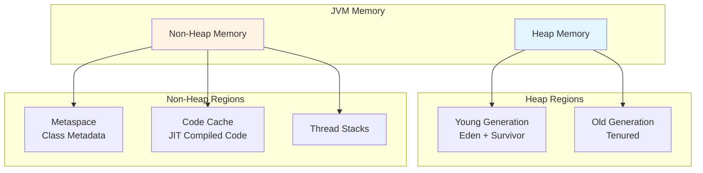
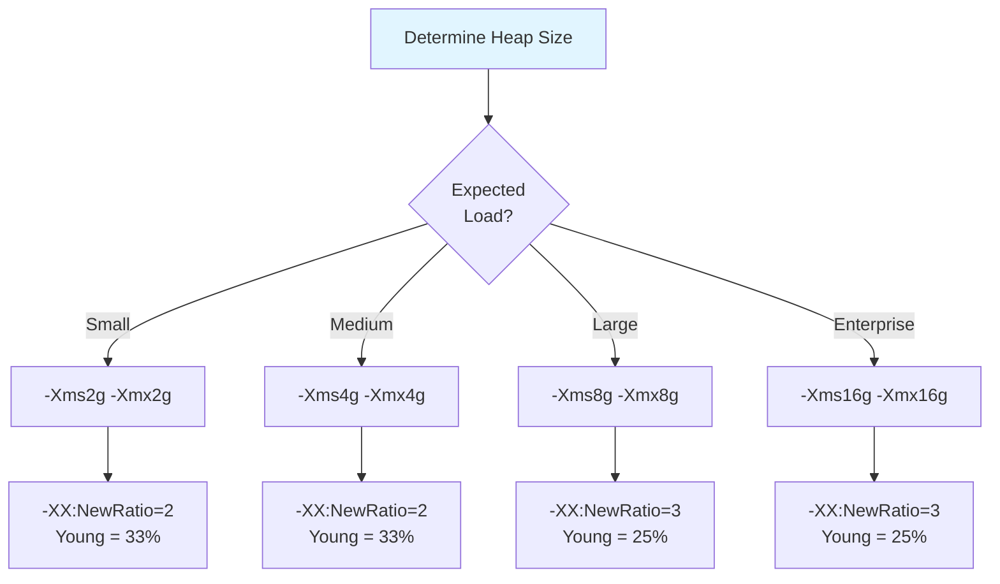
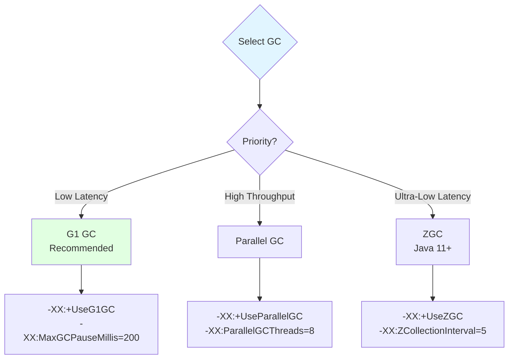
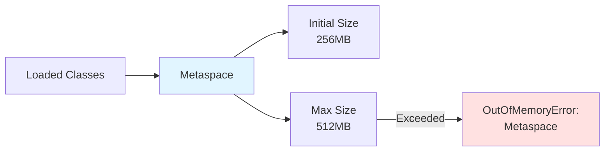
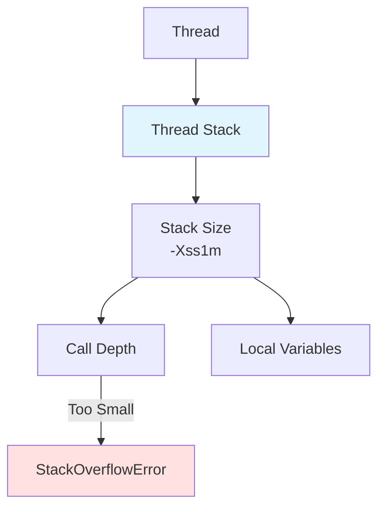
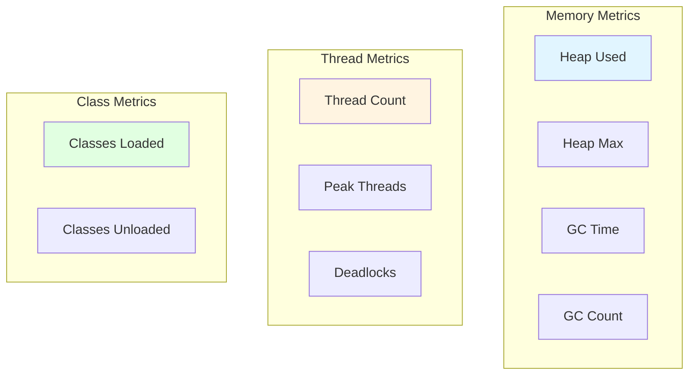
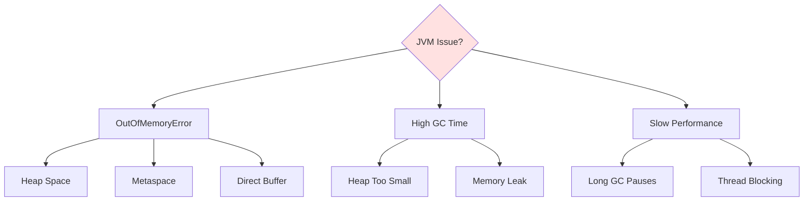

# JVM Tuning and Configuration

**Document Type**: Runtime Architecture  
**Category**: Performance Optimization  
**Last Updated**: December 2024

---

## Overview

This document provides JVM tuning guidelines for Apache OFBiz, including heap sizing, garbage collection configuration, and performance monitoring. Proper JVM configuration is essential for optimal performance and stability.

---

## JVM Memory Architecture

### Memory Regions



---

## Heap Configuration

### Heap Sizing Guidelines



<details>
<summary><strong>Recommended JVM Settings by Deployment Size</strong></summary>

**Small Deployment** (< 100 concurrent users):
```bash
# In framework/start/src/main/resources/start.properties
java.vm.args=-Xms2g -Xmx2g \
  -XX:NewRatio=2 \
  -XX:+UseG1GC \
  -XX:MaxGCPauseMillis=200 \
  -XX:+HeapDumpOnOutOfMemoryError \
  -XX:HeapDumpPath=runtime/logs/heap-dump.hprof
```

**Medium Deployment** (100-500 concurrent users):
```bash
java.vm.args=-Xms4g -Xmx4g \
  -XX:NewRatio=2 \
  -XX:+UseG1GC \
  -XX:MaxGCPauseMillis=200 \
  -XX:G1HeapRegionSize=8m \
  -XX:+HeapDumpOnOutOfMemoryError \
  -XX:HeapDumpPath=runtime/logs/heap-dump.hprof
```

**Large Deployment** (500-2000 concurrent users):
```bash
java.vm.args=-Xms8g -Xmx8g \
  -XX:NewRatio=3 \
  -XX:+UseG1GC \
  -XX:MaxGCPauseMillis=200 \
  -XX:G1HeapRegionSize=16m \
  -XX:InitiatingHeapOccupancyPercent=45 \
  -XX:+HeapDumpOnOutOfMemoryError \
  -XX:HeapDumpPath=runtime/logs/heap-dump.hprof
```

**Enterprise Deployment** (2000+ concurrent users):
```bash
java.vm.args=-Xms16g -Xmx16g \
  -XX:NewRatio=3 \
  -XX:+UseG1GC \
  -XX:MaxGCPauseMillis=200 \
  -XX:G1HeapRegionSize=32m \
  -XX:InitiatingHeapOccupancyPercent=45 \
  -XX:ConcGCThreads=4 \
  -XX:ParallelGCThreads=8 \
  -XX:+HeapDumpOnOutOfMemoryError \
  -XX:HeapDumpPath=runtime/logs/heap-dump.hprof
```

</details>

---

## Garbage Collection

### GC Algorithm Selection



### G1 GC Configuration (Recommended)


<details>
<summary><strong>G1 GC Tuning Parameters</strong></summary>

```bash
# G1 GC Configuration
-XX:+UseG1GC                              # Enable G1 GC
-XX:MaxGCPauseMillis=200                  # Target max pause time (ms)
-XX:G1HeapRegionSize=16m                  # Region size (1-32MB)
-XX:InitiatingHeapOccupancyPercent=45    # When to start concurrent marking
-XX:G1ReservePercent=10                   # Reserve heap percentage
-XX:ConcGCThreads=4                       # Concurrent GC threads
-XX:ParallelGCThreads=8                   # Parallel GC threads

# GC Logging (Java 8)
-Xloggc:runtime/logs/gc.log
-XX:+PrintGCDetails
-XX:+PrintGCDateStamps
-XX:+PrintGCTimeStamps
-XX:+UseGCLogFileRotation
-XX:NumberOfGCLogFiles=10
-XX:GCLogFileSize=100M

# GC Logging (Java 11+)
-Xlog:gc*:file=runtime/logs/gc.log:time,uptime,level,tags:filecount=10,filesize=100M
```

**Parameter Explanations**:
- `MaxGCPauseMillis`: Target for GC pause time (not guaranteed)
- `G1HeapRegionSize`: Size of heap regions (auto-calculated if not set)
- `InitiatingHeapOccupancyPercent`: Heap occupancy to trigger concurrent marking
- `ConcGCThreads`: Threads for concurrent marking (typically cores/4)
- `ParallelGCThreads`: Threads for stop-the-world phases (typically cores)

</details>

---

## Metaspace Configuration

### Metaspace Sizing



<details>
<summary><strong>Metaspace Configuration</strong></summary>

```bash
# Metaspace settings
-XX:MetaspaceSize=256m           # Initial metaspace size
-XX:MaxMetaspaceSize=512m        # Maximum metaspace size
-XX:CompressedClassSpaceSize=256m # Compressed class space

# Monitor metaspace usage
-XX:+TraceClassLoading           # Log class loading
-XX:+TraceClassUnloading         # Log class unloading
```

**Sizing Guidelines**:
- Start with 256MB initial, 512MB max
- Monitor actual usage with JMX
- Increase if seeing metaspace OOM errors
- OFBiz typically uses 200-400MB metaspace

</details>

---

## Thread Configuration

### Thread Stack Size



<details>
<summary><strong>Thread Configuration</strong></summary>

```bash
# Thread stack size
-Xss1m                           # 1MB per thread stack (default)

# For deep recursion or large local variables
-Xss2m                           # 2MB per thread stack

# Calculate total thread memory
# Total = (Number of Threads) × (Stack Size)
# Example: 500 threads × 1MB = 500MB
```

**Thread Memory Calculation**:
```
Tomcat threads:     200 × 1MB = 200MB
Async service:       50 × 1MB =  50MB
Job scheduler:       20 × 1MB =  20MB
Database pool:      250 × 1MB = 250MB
                    ─────────────────
Total thread memory:           520MB
```

</details>

---

## Performance Monitoring

### JMX Configuration

<details>
<summary><strong>Enable JMX Monitoring</strong></summary>

```bash
# JMX configuration for remote monitoring
-Dcom.sun.management.jmxremote
-Dcom.sun.management.jmxremote.port=9999
-Dcom.sun.management.jmxremote.authenticate=false
-Dcom.sun.management.jmxremote.ssl=false
-Djava.rmi.server.hostname=localhost

# For production, enable authentication
-Dcom.sun.management.jmxremote.authenticate=true
-Dcom.sun.management.jmxremote.password.file=/path/to/jmxremote.password
-Dcom.sun.management.jmxremote.access.file=/path/to/jmxremote.access
```

**Connect with JConsole**:
```bash
jconsole localhost:9999
```

**Connect with VisualVM**:
```bash
jvisualvm --openjmx localhost:9999
```

</details>

### Key Metrics to Monitor



---

## Diagnostic Tools

### Heap Dump Analysis

<details>
<summary><strong>Generate and Analyze Heap Dumps</strong></summary>

**Automatic Heap Dump on OOM**:
```bash
-XX:+HeapDumpOnOutOfMemoryError
-XX:HeapDumpPath=runtime/logs/heap-dump.hprof
```

**Manual Heap Dump**:
```bash
# Get Java process ID
jps -l

# Generate heap dump
jmap -dump:live,format=b,file=heap-dump.hprof <pid>
```

**Analyze with Eclipse MAT**:
1. Download Eclipse Memory Analyzer Tool
2. Open heap dump file
3. Run "Leak Suspects Report"
4. Analyze dominator tree

**Analyze with jhat** (built-in):
```bash
jhat -J-Xmx4g heap-dump.hprof
# Open browser to http://localhost:7000
```

</details>

### Thread Dump Analysis

<details>
<summary><strong>Generate and Analyze Thread Dumps</strong></summary>

**Generate Thread Dump**:
```bash
# Method 1: jstack
jstack <pid> > thread-dump.txt

# Method 2: kill signal (Linux)
kill -3 <pid>  # Output to console/log

# Method 3: JMX
jconsole -> Threads -> Detect Deadlock
```

**Analyze Thread Dump**:
```bash
# Look for deadlocks
grep -A 10 "Found one Java-level deadlock" thread-dump.txt

# Find blocked threads
grep "BLOCKED" thread-dump.txt

# Count thread states
grep "java.lang.Thread.State" thread-dump.txt | sort | uniq -c
```

</details>

---

## Production Configuration

### Complete Production JVM Settings

<details>
<summary><strong>Production-Ready Configuration</strong></summary>

**File**: `framework/start/src/main/resources/start.properties`

```properties
# Heap Configuration
java.vm.args=-Xms8g -Xmx8g

# GC Configuration (G1)
java.vm.args=-XX:+UseG1GC \
  -XX:MaxGCPauseMillis=200 \
  -XX:G1HeapRegionSize=16m \
  -XX:InitiatingHeapOccupancyPercent=45 \
  -XX:ConcGCThreads=4 \
  -XX:ParallelGCThreads=8

# Metaspace
java.vm.args=-XX:MetaspaceSize=256m \
  -XX:MaxMetaspaceSize=512m

# Thread Stack
java.vm.args=-Xss1m

# GC Logging (Java 11+)
java.vm.args=-Xlog:gc*:file=runtime/logs/gc.log:time,uptime,level,tags:filecount=10,filesize=100M

# Heap Dump on OOM
java.vm.args=-XX:+HeapDumpOnOutOfMemoryError \
  -XX:HeapDumpPath=runtime/logs/heap-dump.hprof

# JMX (with authentication)
java.vm.args=-Dcom.sun.management.jmxremote \
  -Dcom.sun.management.jmxremote.port=9999 \
  -Dcom.sun.management.jmxremote.authenticate=true \
  -Dcom.sun.management.jmxremote.ssl=true \
  -Dcom.sun.management.jmxremote.password.file=/path/to/jmxremote.password \
  -Dcom.sun.management.jmxremote.access.file=/path/to/jmxremote.access

# Performance Options
java.vm.args=-XX:+UseStringDeduplication \
  -XX:+OptimizeStringConcat \
  -XX:+UseCompressedOops

# Diagnostic Options (disable in production if not needed)
java.vm.args=-XX:+UnlockDiagnosticVMOptions \
  -XX:+LogVMOutput \
  -XX:LogFile=runtime/logs/jvm.log
```

</details>

---

## Troubleshooting

### Common JVM Issues



<details>
<summary><strong>Troubleshooting Guide</strong></summary>

**OutOfMemoryError: Java heap space**
- Increase heap size: `-Xmx`
- Analyze heap dump for memory leaks
- Check for large object allocations

**OutOfMemoryError: Metaspace**
- Increase metaspace: `-XX:MaxMetaspaceSize`
- Check for classloader leaks
- Review hot deployment settings

**High GC Time (> 10% of total time)**
- Increase heap size
- Tune GC parameters
- Analyze heap dump for memory leaks
- Review object creation patterns

**Long GC Pauses (> 1 second)**
- Switch to G1 GC or ZGC
- Reduce `MaxGCPauseMillis` target
- Increase heap size
- Review large object allocations

</details>

---

## Official References

- [Java HotSpot VM Options](https://www.oracle.com/java/technologies/javase/vmoptions-jsp.html)
- [G1 GC Tuning Guide](https://www.oracle.com/technical-resources/articles/java/g1gc.html)
- [JVM Performance Tuning](https://docs.oracle.com/en/java/javase/11/gctuning/)

---

## Related Documentation

- [Bootstrap Sequence](bootstrap-sequence.md)
- [Thread Model](thread-model.md)
- [Classloading Architecture](classloading-architecture.md)
- [Performance Characteristics](../09-quality-attributes/performance-characteristics.md)

---

## Summary

Proper JVM tuning is essential for OFBiz performance. Use G1 GC for balanced latency and throughput, size heap based on expected load (4-16GB typical), configure metaspace for class metadata (256-512MB), and enable monitoring with JMX. Monitor key metrics: heap usage, GC time, thread count, and class loading. Generate heap dumps for memory analysis and thread dumps for concurrency issues. Start with recommended settings and tune based on actual workload characteristics.
