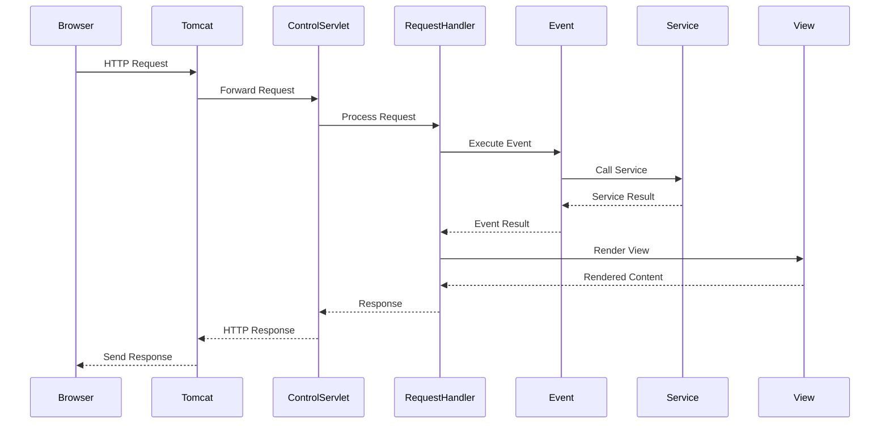
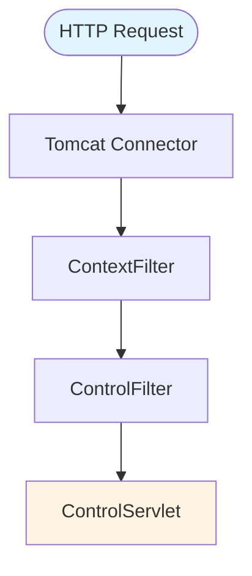
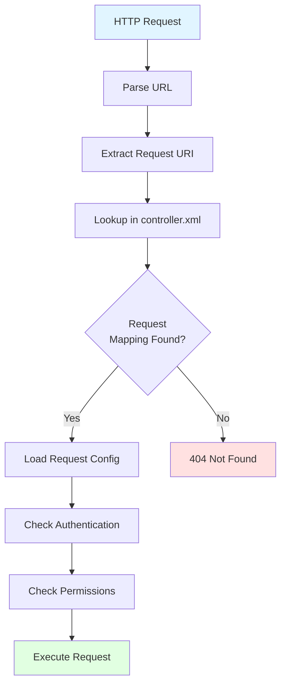
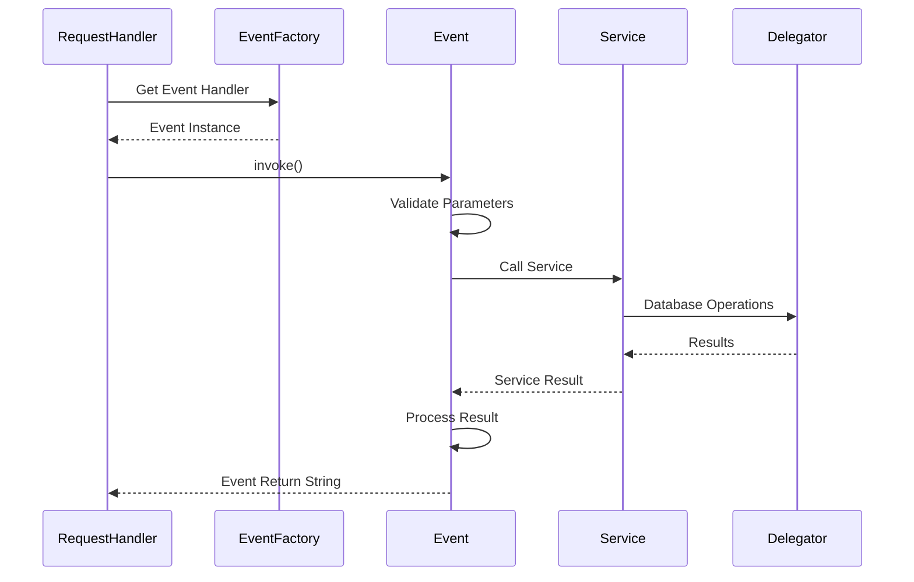
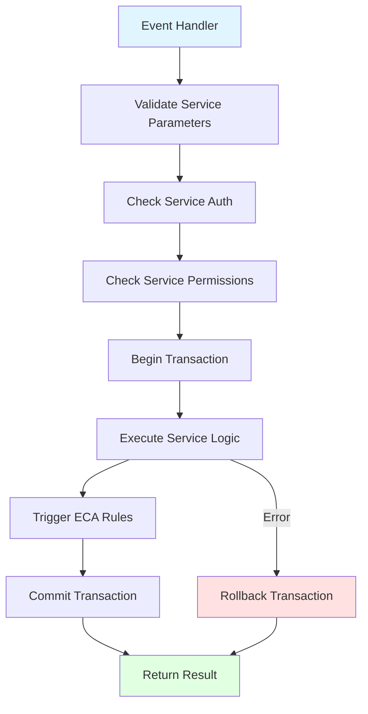
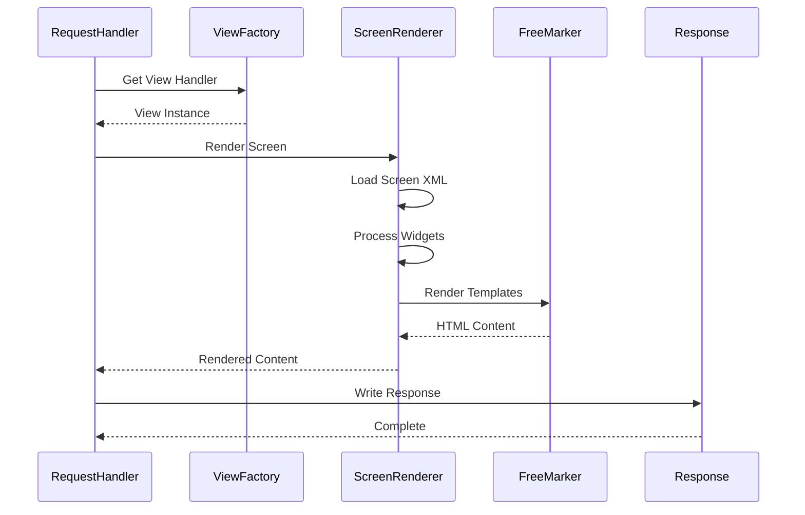
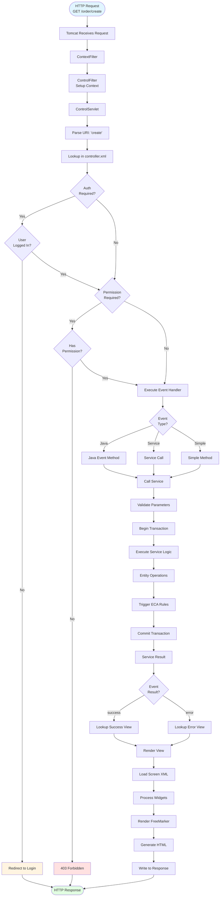
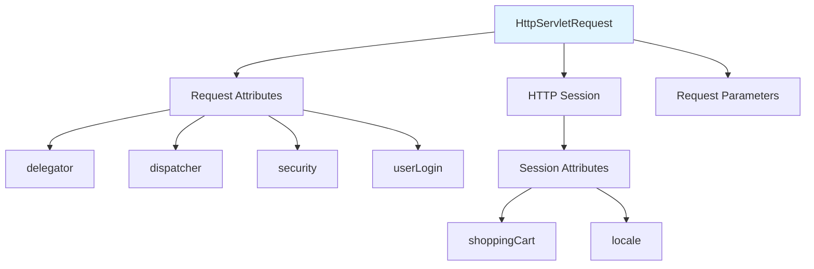

# HTTP Request Lifecycle

**Document Type**: Runtime Architecture  
**Category**: Request Processing  
**Last Updated**: December 2024

---

## Overview

This document describes the complete lifecycle of an HTTP request in Apache OFBiz, from the moment it arrives at the web server through all processing layers until the response is returned to the client.

---

## Request Lifecycle Overview

### High-Level Request Flow



---

## Detailed Request Processing

### Phase 1: Request Reception



<details>
<summary><strong>ControlServlet - Main Entry Point</strong></summary>

**File**: `framework/webapp/src/main/java/org/apache/ofbiz/webapp/control/ControlServlet.java`

```java
public class ControlServlet extends HttpServlet {
    
    @Override
    public void doGet(HttpServletRequest request, HttpServletResponse response) 
            throws ServletException, IOException {
        doPost(request, response);
    }
    
    @Override
    public void doPost(HttpServletRequest request, HttpServletResponse response) 
            throws ServletException, IOException {
        
        // Get request handler
        RequestHandler requestHandler = RequestHandler.getRequestHandler(getServletContext());
        
        try {
            // Process the request
            requestHandler.doRequest(request, response, null, null, null);
            
        } catch (RequestHandlerException e) {
            Debug.logError(e, "Error processing request", module);
            throw new ServletException(e);
        }
    }
}
```

</details>

### Phase 2: Request Mapping



<details>
<summary><strong>Request Mapping Process</strong></summary>

**File**: `framework/webapp/src/main/java/org/apache/ofbiz/webapp/control/RequestHandler.java`

```java
public class RequestHandler {
    
    public void doRequest(HttpServletRequest request, HttpServletResponse response,
                         String chain, GenericValue userLogin, Delegator delegator) 
            throws RequestHandlerException {
        
        // Get request URI
        String requestUri = RequestHandler.getRequestUri(request.getPathInfo());
        
        // Lookup request map in controller.xml
        ConfigXMLReader.RequestMap requestMap = controllerConfig.getRequestMapMap().get(requestUri);
        
        if (requestMap == null) {
            throw new RequestHandlerException("Unknown request: " + requestUri);
        }
        
        // Check security
        if (requestMap.securityAuth) {
            if (!checkLogin(request, response)) {
                return; // Redirect to login
            }
        }
        
        // Check permissions
        if (requestMap.securityPermission != null) {
            if (!checkPermission(request, requestMap.securityPermission)) {
                throw new RequestHandlerException("Permission denied");
            }
        }
        
        // Execute request
        String eventReturn = runEvent(request, response, requestMap);
        
        // Render response
        renderResponse(request, response, requestMap, eventReturn);
    }
}
```

</details>

### Phase 3: Event Execution



<details>
<summary><strong>Event Types and Execution</strong></summary>

**Java Event Handler**:

```java
// Java event handler
public class OrderEvents {
    
    public static String createOrder(HttpServletRequest request, HttpServletResponse response) {
        Delegator delegator = (Delegator) request.getAttribute("delegator");
        LocalDispatcher dispatcher = (LocalDispatcher) request.getAttribute("dispatcher");
        GenericValue userLogin = (GenericValue) request.getSession().getAttribute("userLogin");
        
        try {
            // Get parameters from request
            String orderTypeId = request.getParameter("orderTypeId");
            String currencyUom = request.getParameter("currencyUom");
            
            // Prepare service context
            Map<String, Object> serviceContext = UtilHttp.getParameterMap(request);
            serviceContext.put("userLogin", userLogin);
            
            // Call service
            Map<String, Object> result = dispatcher.runSync("createOrder", serviceContext);
            
            if (ServiceUtil.isSuccess(result)) {
                String orderId = (String) result.get("orderId");
                request.setAttribute("orderId", orderId);
                request.setAttribute("_EVENT_MESSAGE_", "Order created successfully: " + orderId);
                return "success";
            } else {
                request.setAttribute("_ERROR_MESSAGE_", ServiceUtil.getErrorMessage(result));
                return "error";
            }
            
        } catch (GenericServiceException e) {
            Debug.logError(e, "Error creating order", module);
            request.setAttribute("_ERROR_MESSAGE_", e.getMessage());
            return "error";
        }
    }
}
```

**Service Event Handler**:

```xml
<!-- In controller.xml -->
<request-map uri="createOrder">
    <security https="true" auth="true"/>
    <event type="service" invoke="createOrder"/>
    <response name="success" type="view" value="OrderCreated"/>
    <response name="error" type="view" value="OrderForm"/>
</request-map>
```

</details>

### Phase 4: Service Invocation



<details>
<summary><strong>Service Execution Flow</strong></summary>

**File**: `framework/service/src/main/java/org/apache/ofbiz/service/ServiceDispatcher.java`

```java
public Map<String, Object> runSync(String serviceName, Map<String, ?> context) 
        throws ServiceException {
    
    ModelService model = ctx.getModelService(serviceName);
    
    // Validate parameters
    Map<String, Object> validated = model.makeValid(context, ModelService.IN_PARAM);
    
    // Check authentication
    if (model.auth && validated.get("userLogin") == null) {
        throw new ServiceAuthException("User login required");
    }
    
    // Check permissions
    if (model.permissionServiceName != null) {
        Map<String, Object> permResult = runSync(model.permissionServiceName, validated);
        if (!ServiceUtil.isSuccess(permResult)) {
            throw new ServiceAuthException("Permission denied");
        }
    }
    
    // Begin transaction
    boolean beganTransaction = false;
    try {
        if (model.useTransaction) {
            beganTransaction = TransactionUtil.begin();
        }
        
        // Get service engine
        GenericEngine engine = ctx.getGenericEngine(model.engineName);
        
        // Run service
        Map<String, Object> result = engine.runSync(serviceName, model, validated);
        
        // Trigger ECA rules
        ctx.getEcaHandler().evalRules(serviceName, validated, result, "return", false);
        
        // Commit transaction
        if (beganTransaction) {
            TransactionUtil.commit();
        }
        
        return result;
        
    } catch (Exception e) {
        if (beganTransaction) {
            TransactionUtil.rollback();
        }
        throw new ServiceException(e);
    }
}
```

</details>

### Phase 5: View Rendering



<details>
<summary><strong>View Rendering Process</strong></summary>

**File**: `framework/webapp/src/main/java/org/apache/ofbiz/webapp/view/ViewHandler.java`

```java
public interface ViewHandler {
    
    void render(String name, String page, String info, String contentType,
                String encoding, HttpServletRequest request, HttpServletResponse response) 
                throws ViewHandlerException;
}

// Screen view handler
public class ScreenViewHandler implements ViewHandler {
    
    @Override
    public void render(String name, String page, String info, String contentType,
                      String encoding, HttpServletRequest request, HttpServletResponse response) 
                      throws ViewHandlerException {
        
        try {
            // Set content type
            response.setContentType(contentType);
            response.setCharacterEncoding(encoding);
            
            // Get screen renderer
            ScreenRenderer screens = new ScreenRenderer(response.getWriter(), 
                request, response);
            
            // Render screen
            screens.render(page);
            
        } catch (Exception e) {
            throw new ViewHandlerException("Error rendering screen", e);
        }
    }
}
```

</details>

---

## Complete Request Flow Diagram

### End-to-End Request Processing



---

## Request Context

### Context Objects Available



<details>
<summary><strong>Accessing Context Objects</strong></summary>

```java
// In event handler or service
public static String myEventHandler(HttpServletRequest request, HttpServletResponse response) {
    // Get framework objects
    Delegator delegator = (Delegator) request.getAttribute("delegator");
    LocalDispatcher dispatcher = (LocalDispatcher) request.getAttribute("dispatcher");
    Security security = (Security) request.getAttribute("security");
    
    // Get user login
    GenericValue userLogin = (GenericValue) request.getSession().getAttribute("userLogin");
    
    // Get request parameters
    String orderId = request.getParameter("orderId");
    
    // Get session attributes
    ShoppingCart cart = (ShoppingCart) request.getSession().getAttribute("shoppingCart");
    Locale locale = UtilHttp.getLocale(request);
    
    // Set request attributes for view
    request.setAttribute("orderId", orderId);
    request.setAttribute("_EVENT_MESSAGE_", "Success message");
    
    return "success";
}
```

</details>

---

## Performance Considerations

### Request Processing Time

```mermaid
gantt
    title Typical Request Processing Timeline
    dateFormat  SSS
    axisFormat %L
    
    section Network
    Request Arrival     :0, 5ms
    
    section Servlet
    Filter Chain        :5ms, 10ms
    ControlServlet      :15ms, 5ms
    
    section Processing
    Request Mapping     :20ms, 5ms
    Security Check      :25ms, 10ms
    Event Execution     :35ms, 20ms
    Service Call        :55ms, 50ms
    Database Query      :105ms, 30ms
    
    section Rendering
    View Rendering      :135ms, 40ms
    FreeMarker          :175ms, 25ms
    
    section Response
    Send Response       :200ms, 10ms
```

---

## Official References

- [Apache OFBiz Request Handling](https://cwiki.apache.org/confluence/display/OFBIZ/Request+Handling)
- [Controller Configuration](https://cwiki.apache.org/confluence/display/OFBIZ/Controller+Configuration)

---

## Related Documentation

- [Webapp Framework Overview](../02-framework-core/webapp-framework/overview.md)
- [Request Pipeline](../02-framework-core/webapp-framework/request-pipeline.md)
- [Service Engine](../02-framework-core/service-engine/overview.md)
- [Widget Framework](../02-framework-core/widget-framework/overview.md)

---

## Summary

An HTTP request in OFBiz flows through multiple layers: Tomcat connector, servlet filters, ControlServlet, request mapping, security checks, event execution, service invocation, and view rendering. The entire process typically takes 100-300ms depending on business logic complexity and database operations. Understanding this flow is essential for debugging, performance optimization, and custom development.
