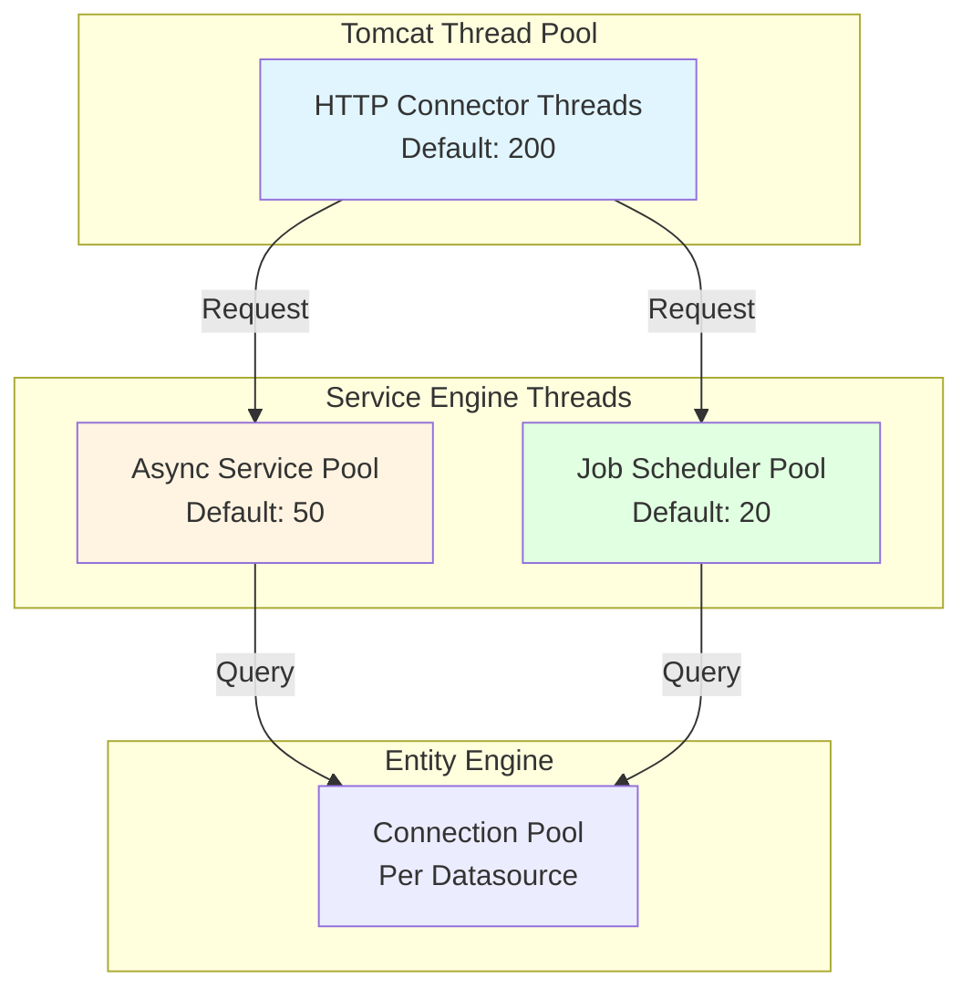
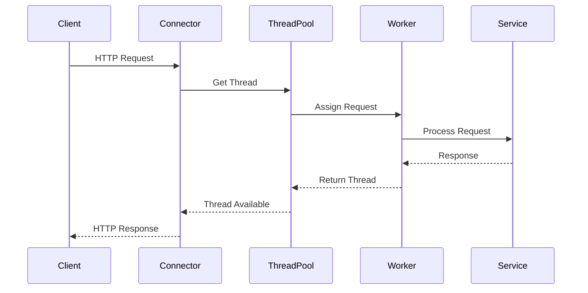
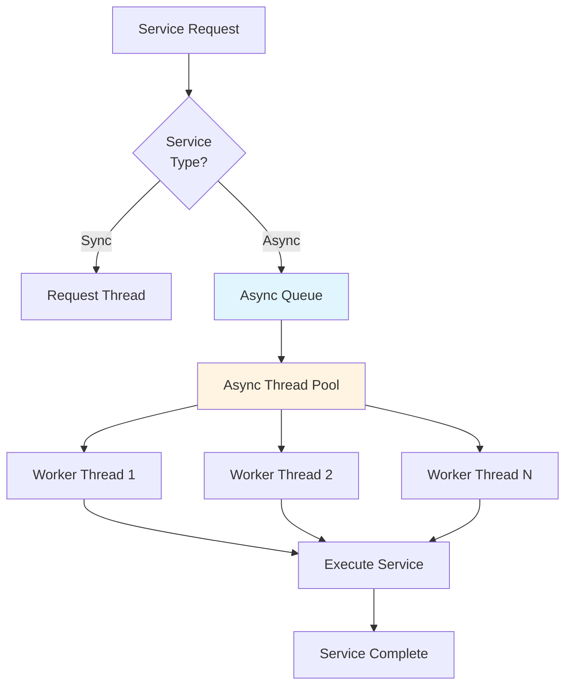
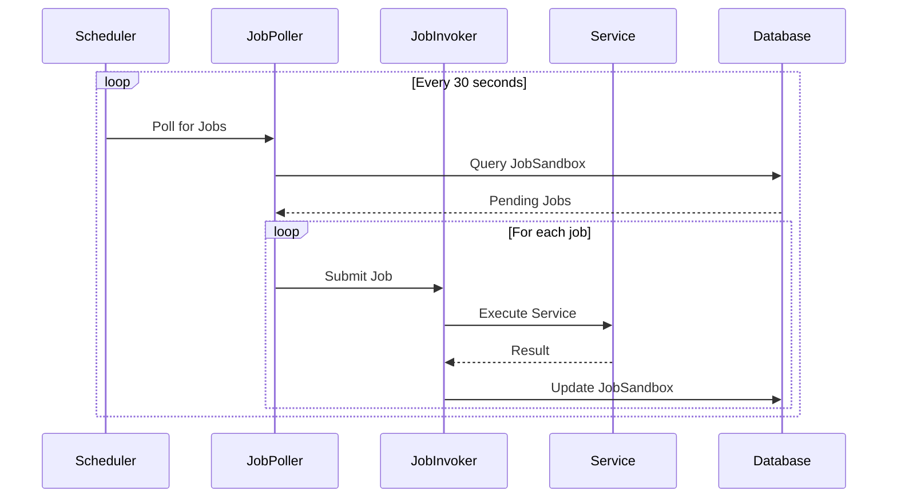
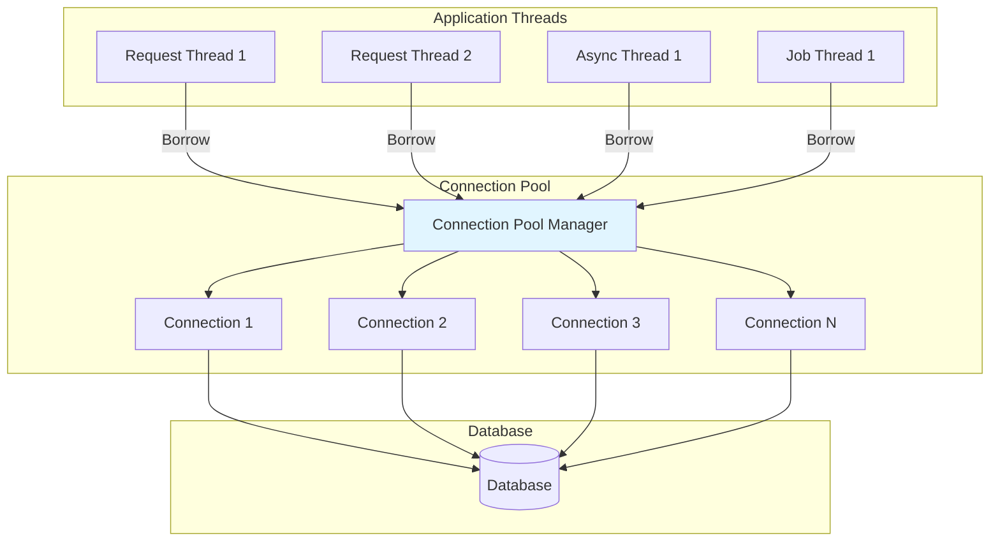
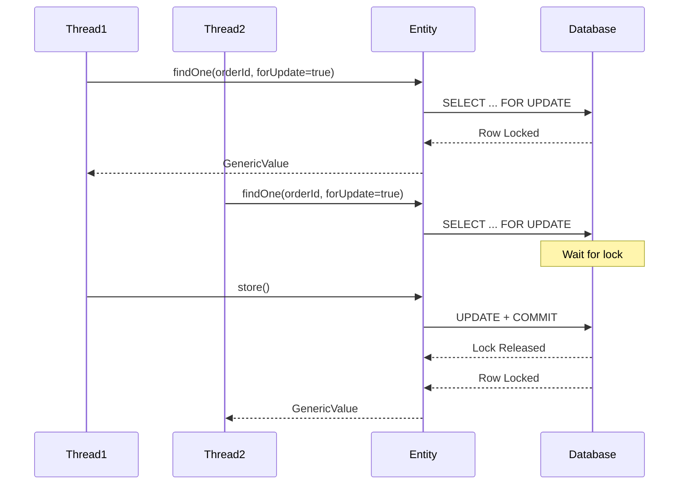
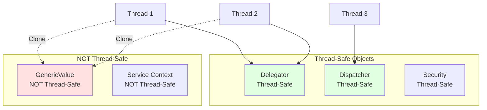
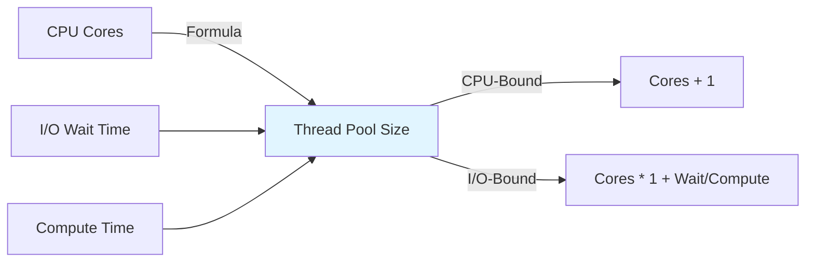

# Thread Model and Concurrency

**Document Type**: Runtime Architecture  
**Category**: Threading and Concurrency  
**Last Updated**: December 2024

---

## Overview

This document describes OFBiz's threading model, including request handling threads, async service execution, job scheduling, and concurrency patterns. Understanding the thread model is essential for performance tuning and avoiding concurrency issues.

---

## Thread Architecture

### Thread Pools Overview



---

## Request Handling Threads

### Tomcat Connector Threads



<details>
<summary><strong>Tomcat Thread Configuration</strong></summary>

**File**: `framework/catalina/ofbiz-component.xml`

```xml
<property name="maxThreads" value="200"/>
<property name="minSpareThreads" value="25"/>
<property name="maxSpareThreads" value="75"/>
<property name="acceptCount" value="100"/>
<property name="connectionTimeout" value="20000"/>
```

**Tuning Guidelines**:
- `maxThreads`: Maximum concurrent requests (default: 200)
- `minSpareThreads`: Minimum idle threads (default: 25)
- `acceptCount`: Queue size when all threads busy (default: 100)
- `connectionTimeout`: Socket timeout in milliseconds (default: 20000)

</details>

---

## Async Service Execution

### Async Service Thread Pool



<details>
<summary><strong>Async Service Configuration</strong></summary>

**File**: `framework/service/config/serviceengine.properties`

```properties
# Async service thread pool
thread.pool.size=50
thread.pool.ttl=120000

# Job scheduler pool
job.pool.size=20
job.pool.ttl=120000

# Service semaphore settings
service.semaphore.wait=300
service.semaphore.sleep=500
```

**Configuration Parameters**:
- `thread.pool.size`: Number of async service threads
- `thread.pool.ttl`: Thread time-to-live in milliseconds
- `job.pool.size`: Number of job scheduler threads
- `service.semaphore.wait`: Max wait time for service lock
- `service.semaphore.sleep`: Sleep time between lock attempts

</details>

### Async Service Implementation

<details>
<summary><strong>Async Service Execution</strong></summary>

**File**: `framework/service/src/main/java/org/apache/ofbiz/service/GenericAsyncEngine.java`

```java
public class GenericAsyncEngine implements GenericEngine {
    
    private ExecutorService executor;
    
    public GenericAsyncEngine(ServiceDispatcher dispatcher) {
        int poolSize = UtilProperties.getPropertyAsInteger(
            "serviceengine.properties", "thread.pool.size", 50);
        
        this.executor = Executors.newFixedThreadPool(poolSize, 
            new ThreadFactory() {
                private AtomicInteger counter = new AtomicInteger(0);
                
                @Override
                public Thread newThread(Runnable r) {
                    Thread thread = new Thread(r);
                    thread.setName("OFBiz-AsyncService-" + counter.incrementAndGet());
                    thread.setDaemon(true);
                    return thread;
                }
            });
    }
    
    @Override
    public void runAsync(String localName, ModelService modelService, 
                        Map<String, Object> context) throws GenericServiceException {
        
        executor.submit(() -> {
            try {
                Debug.logInfo("Executing async service: " + localName, module);
                
                // Execute service in worker thread
                Map<String, Object> result = runSync(localName, modelService, context);
                
                if (ServiceUtil.isError(result)) {
                    Debug.logError("Async service error: " + 
                        ServiceUtil.getErrorMessage(result), module);
                }
                
            } catch (Exception e) {
                Debug.logError(e, "Error in async service execution", module);
            }
        });
    }
}
```

</details>

---

## Job Scheduler Threads

### Job Execution Model



<details>
<summary><strong>Job Scheduler Implementation</strong></summary>

**File**: `framework/service/src/main/java/org/apache/ofbiz/service/job/JobManager.java`

```java
public class JobManager {
    
    private ScheduledExecutorService pollExecutor;
    private ExecutorService jobExecutor;
    
    public JobManager(Delegator delegator) {
        // Polling thread
        this.pollExecutor = Executors.newSingleThreadScheduledExecutor();
        
        // Job execution threads
        int poolSize = UtilProperties.getPropertyAsInteger(
            "serviceengine.properties", "job.pool.size", 20);
        this.jobExecutor = Executors.newFixedThreadPool(poolSize);
        
        // Start polling
        pollExecutor.scheduleWithFixedDelay(
            new JobPoller(delegator, jobExecutor),
            0, 30, TimeUnit.SECONDS
        );
    }
    
    private class JobPoller implements Runnable {
        
        @Override
        public void run() {
            try {
                // Query pending jobs
                List<GenericValue> jobs = delegator.findByAnd("JobSandbox",
                    UtilMisc.toMap("statusId", "SERVICE_PENDING"),
                    UtilMisc.toList("runTime"), false);
                
                for (GenericValue job : jobs) {
                    // Submit job for execution
                    jobExecutor.submit(new JobInvoker(job));
                }
                
            } catch (Exception e) {
                Debug.logError(e, "Error polling jobs", module);
            }
        }
    }
}
```

</details>

---

## Database Connection Threads

### Connection Pool Architecture



<details>
<summary><strong>Connection Pool Configuration</strong></summary>

**File**: `framework/entity/config/entityengine.xml`

```xml
<datasource name="localderby"
            helper-class="org.apache.ofbiz.entity.datasource.GenericHelperDAO"
            schema-name="org.apache.ofbiz"
            field-type-name="derby"
            check-on-start="true"
            add-missing-on-start="true"
            use-pk-constraint-names="false"
            use-indices-unique="false"
            alias-view-columns="false">
    
    <read-data reader-name="seed"/>
    <read-data reader-name="demo"/>
    
    <inline-jdbc
            jdbc-driver="org.apache.derby.jdbc.EmbeddedDriver"
            jdbc-uri="jdbc:derby:runtime/data/derby/ofbiz;create=true"
            jdbc-username="ofbiz"
            jdbc-password="ofbiz"
            isolation-level="ReadCommitted"
            pool-minsize="2"
            pool-maxsize="250"
            time-between-eviction-runs-millis="600000"/>
</datasource>
```

**Pool Parameters**:
- `pool-minsize`: Minimum connections (default: 2)
- `pool-maxsize`: Maximum connections (default: 250)
- `time-between-eviction-runs-millis`: Idle connection cleanup interval

</details>

---

## Concurrency Patterns

### Entity Locking



<details>
<summary><strong>Pessimistic Locking Example</strong></summary>

```java
public static Map<String, Object> updateOrderWithLock(DispatchContext dctx, Map<String, ?> context) {
    Delegator delegator = dctx.getDelegator();
    String orderId = (String) context.get("orderId");
    
    try {
        // Begin transaction
        boolean beganTransaction = TransactionUtil.begin();
        
        try {
            // Lock the order row
            GenericValue orderHeader = delegator.findOne("OrderHeader", 
                true, // forUpdate = true (pessimistic lock)
                UtilMisc.toMap("orderId", orderId));
            
            if (orderHeader == null) {
                return ServiceUtil.returnError("Order not found");
            }
            
            // Update order
            orderHeader.set("statusId", "ORDER_APPROVED");
            orderHeader.set("lastModifiedDate", UtilDateTime.nowTimestamp());
            orderHeader.store();
            
            // Commit transaction (releases lock)
            TransactionUtil.commit(beganTransaction);
            
            return ServiceUtil.returnSuccess();
            
        } catch (Exception e) {
            TransactionUtil.rollback(beganTransaction, "Error updating order", e);
            return ServiceUtil.returnError("Error: " + e.getMessage());
        }
        
    } catch (GenericTransactionException e) {
        return ServiceUtil.returnError("Transaction error: " + e.getMessage());
    }
}
```

</details>

### Optimistic Locking

<details>
<summary><strong>Optimistic Locking with Version Field</strong></summary>

```java
public static Map<String, Object> updateOrderOptimistic(DispatchContext dctx, Map<String, ?> context) {
    Delegator delegator = dctx.getDelegator();
    String orderId = (String) context.get("orderId");
    Long expectedVersion = (Long) context.get("version");
    
    try {
        // Read current version
        GenericValue orderHeader = delegator.findOne("OrderHeader", 
            false, UtilMisc.toMap("orderId", orderId));
        
        Long currentVersion = orderHeader.getLong("version");
        
        // Check version
        if (!currentVersion.equals(expectedVersion)) {
            return ServiceUtil.returnError("Order was modified by another user. Please refresh and try again.");
        }
        
        // Update with new version
        orderHeader.set("statusId", "ORDER_APPROVED");
        orderHeader.set("version", currentVersion + 1);
        orderHeader.set("lastModifiedDate", UtilDateTime.nowTimestamp());
        orderHeader.store();
        
        return ServiceUtil.returnSuccess();
        
    } catch (GenericEntityException e) {
        return ServiceUtil.returnError("Error: " + e.getMessage());
    }
}
```

</details>

---

## Thread Safety

### Thread-Safe Patterns



<details>
<summary><strong>Thread Safety Guidelines</strong></summary>

**Thread-Safe Objects** (can be shared):
- `Delegator` - Entity engine interface
- `LocalDispatcher` - Service dispatcher
- `Security` - Security manager
- `ModelReader` - Entity model reader
- `DispatchContext` - Service context

**NOT Thread-Safe** (must not be shared):
- `GenericValue` - Entity value object
- `Map<String, Object>` - Service context
- `HttpServletRequest` - Request object
- `HttpServletResponse` - Response object

**Best Practices**:
```java
// GOOD: Each thread gets its own GenericValue
GenericValue order1 = delegator.findOne("OrderHeader", ...);
GenericValue order2 = order1.clone(); // Safe to use in another thread

// BAD: Sharing GenericValue between threads
GenericValue sharedOrder = delegator.findOne("OrderHeader", ...);
executor.submit(() -> sharedOrder.set("statusId", "APPROVED")); // NOT SAFE!
```

</details>

---

## Performance Tuning

### Thread Pool Sizing



**Sizing Guidelines**:

```properties
# CPU-bound tasks (minimal I/O)
thread.pool.size = number_of_cores + 1

# I/O-bound tasks (database, network)
thread.pool.size = number_of_cores * (1 + wait_time / compute_time)

# Example: 8 cores, 80% I/O wait
# thread.pool.size = 8 * (1 + 0.8 / 0.2) = 8 * 5 = 40
```

---

## Monitoring Threads

### Thread Monitoring

<details>
<summary><strong>Thread Monitoring Service</strong></summary>

```java
public static Map<String, Object> getThreadPoolStats(DispatchContext dctx, Map<String, ?> context) {
    Map<String, Object> stats = new HashMap<>();
    
    // Get thread pool executor
    ThreadPoolExecutor executor = (ThreadPoolExecutor) getAsyncExecutor();
    
    stats.put("poolSize", executor.getPoolSize());
    stats.put("activeCount", executor.getActiveCount());
    stats.put("queueSize", executor.getQueue().size());
    stats.put("completedTaskCount", executor.getCompletedTaskCount());
    stats.put("largestPoolSize", executor.getLargestPoolSize());
    
    Map<String, Object> result = ServiceUtil.returnSuccess();
    result.put("stats", stats);
    return result;
}
```

</details>

---

## Official References

- [Java Concurrency in Practice](https://jcip.net/)
- [Apache Tomcat Threading](https://tomcat.apache.org/tomcat-9.0-doc/config/http.html)

---

## Related Documentation

- [Bootstrap Sequence](bootstrap-sequence.md)
- [Request Lifecycle](request-lifecycle.md)
- [JVM Tuning](jvm-tuning.md)
- [Service Engine](../02-framework-core/service-engine/overview.md)

---

## Summary

OFBiz uses multiple thread pools: Tomcat connector threads for HTTP requests (default: 200), async service threads (default: 50), and job scheduler threads (default: 20). Database connections are pooled separately (default max: 250). Understanding thread safety, proper locking strategies, and thread pool sizing is essential for building scalable, concurrent applications. Monitor thread pool utilization and adjust sizes based on workload characteristics.
